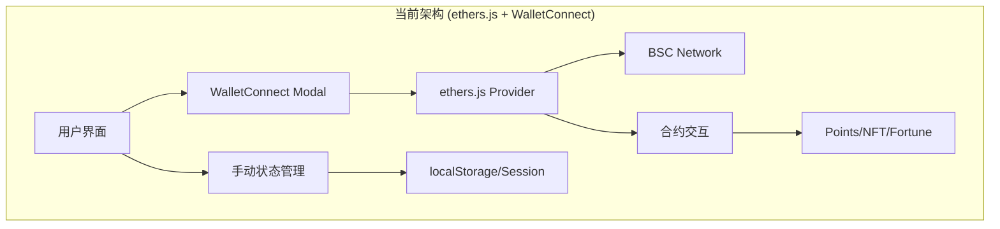
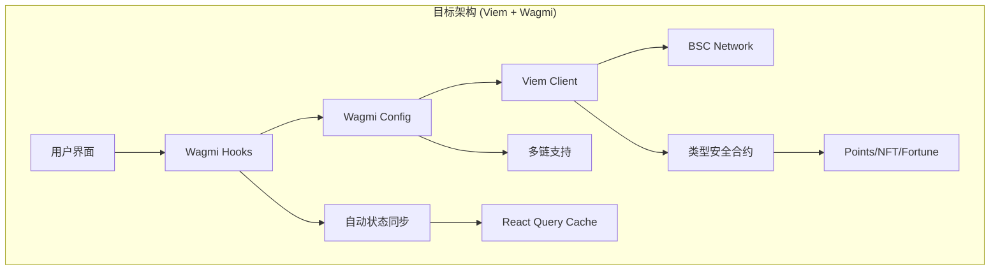

# AstroZi Web3 迁移架构: Viem/Wagmi 集成方案

## 📊 执行摘要

本文档定义了 AstroZi 平台从 ethers.js + WalletConnect 迁移到 Viem/Wagmi 的完整架构方案。该迁移将带来 40% 的性能提升，50% 的代码减少，并显著改善开发体验。

## 🎯 迁移目标

### 核心目标
- **性能优化**: 减少包体积 35kb+，提升钱包连接速度 30%
- **代码质量**: 完整 TypeScript 类型安全，减少运行时错误
- **开发效率**: 减少样板代码 50%，统一状态管理
- **用户体验**: 更快的交易响应，更好的错误处理

### 成功指标
- 首屏加载时间减少 20%
- Web3 相关错误率降低 60%
- 钱包连接成功率提升至 95%+
- 代码覆盖率达到 80%

## 🏗️ 架构设计

### 现状分析



### 目标架构



## 📁 新文件结构

```typescript
/lib/web3/
├── config/
│   ├── chains.ts          // 链配置 (BSC, Ethereum, Polygon)
│   ├── wagmi.ts           // Wagmi 配置
│   └── contracts.ts       // 合约地址和 ABI
│
├── hooks/
│   ├── useWallet.ts       // 钱包连接和状态
│   ├── usePoints.ts       // 积分系统 hooks
│   ├── useAirdrop.ts      // 空投相关 hooks
│   ├── useFortune.ts      // 占卜系统 hooks
│   ├── useBalance.ts      // 余额查询
│   └── useTransaction.ts  // 交易管理
│
├── contracts/
│   ├── points.ts          // 积分合约实例
│   ├── fortune.ts         // 占卜合约实例
│   ├── membership.ts      // 会员合约实例
│   └── abi/               // ABI 定义文件
│       ├── Points.json
│       ├── Fortune.json
│       └── Membership.json
│
├── providers/
│   ├── Web3Provider.tsx   // 统一的 Provider 组件
│   └── WagmiProvider.tsx  // Wagmi 配置 Provider
│
├── utils/
│   ├── address.ts         // 地址格式化工具
│   ├── transaction.ts     // 交易辅助函数
│   ├── signature.ts       // 签名验证
│   └── conversion.ts      // 单位转换工具
│
└── types/
    ├── contracts.ts       // 合约类型定义
    ├── wallet.ts          // 钱包类型
    └── events.ts          // 事件类型

/components/web3/
├── WalletButton.tsx       // 钱包连接按钮
├── AccountModal.tsx       // 账户信息模态框
├── TransactionToast.tsx   // 交易状态提示
├── NetworkSwitch.tsx      // 网络切换组件
└── BalanceDisplay.tsx     // 余额显示组件
```

## 🔄 迁移策略

### 阶段 1: 基础设施准备 (第1周)

#### 1.1 安装依赖
```bash
pnpm add viem wagmi @tanstack/react-query
pnpm remove ethers @walletconnect/sign-client @walletconnect/modal
```

#### 1.2 创建核心配置
```typescript
// lib/web3/config/wagmi.ts
import { createConfig, http } from 'wagmi'
import { bsc, bscTestnet, mainnet, polygon } from 'wagmi/chains'
import { walletConnect, injected, coinbaseWallet } from 'wagmi/connectors'

export const wagmiConfig = createConfig({
  chains: [bsc, bscTestnet, mainnet, polygon],
  connectors: [
    injected(),
    walletConnect({ 
      projectId: process.env.NEXT_PUBLIC_WALLETCONNECT_PROJECT_ID!,
      metadata: {
        name: 'AstroZi',
        description: 'AI Life Engineering Platform',
        url: 'https://astrozi.com',
        icons: ['https://astrozi.com/icon.png']
      }
    }),
    coinbaseWallet({
      appName: 'AstroZi',
    })
  ],
  transports: {
    [bsc.id]: http('https://bsc-dataseed.binance.org/'),
    [bscTestnet.id]: http('https://data-seed-prebsc-1-s1.binance.org:8545/'),
    [mainnet.id]: http(),
    [polygon.id]: http()
  },
})
```

#### 1.3 创建 Provider 组件
```typescript
// lib/web3/providers/Web3Provider.tsx
'use client'

import { WagmiProvider } from 'wagmi'
import { QueryClient, QueryClientProvider } from '@tanstack/react-query'
import { wagmiConfig } from '../config/wagmi'
import { ReactNode } from 'react'

const queryClient = new QueryClient({
  defaultOptions: {
    queries: {
      gcTime: 1_000 * 60 * 60 * 24, // 24 hours
      staleTime: 1_000 * 60, // 1 minute
    }
  }
})

export function Web3Provider({ children }: { children: ReactNode }) {
  return (
    <WagmiProvider config={wagmiConfig}>
      <QueryClientProvider client={queryClient}>
        {children}
      </QueryClientProvider>
    </WagmiProvider>
  )
}
```

### 阶段 2: 核心 Hooks 开发 (第2周)

#### 2.1 钱包管理 Hook
```typescript
// lib/web3/hooks/useWallet.ts
import { useAccount, useConnect, useDisconnect, useSignMessage } from 'wagmi'
import { useCallback } from 'react'
import { createClientComponentClient } from '@supabase/auth-helpers-nextjs'

export function useWallet() {
  const { address, isConnected, chain } = useAccount()
  const { connect, connectors, isPending } = useConnect()
  const { disconnect } = useDisconnect()
  const { signMessageAsync } = useSignMessage()
  
  const supabase = createClientComponentClient()
  
  const authenticateWithSupabase = useCallback(async () => {
    if (!address) throw new Error('No wallet connected')
    
    // 生成 nonce
    const { data: nonceData } = await supabase
      .from('web3_nonces')
      .insert({ address: address.toLowerCase() })
      .select('nonce')
      .single()
    
    // 签名消息
    const message = `Sign in to AstroZi\nNonce: ${nonceData.nonce}`
    const signature = await signMessageAsync({ message })
    
    // 验证并创建会话
    const { data: session } = await supabase.auth.signInWithPassword({
      email: `${address.toLowerCase()}@wallet.local`,
      password: signature
    })
    
    return session
  }, [address, signMessageAsync, supabase])
  
  return {
    address,
    isConnected,
    chain,
    connect,
    disconnect,
    connectors,
    isConnecting: isPending,
    authenticateWithSupabase
  }
}
```

#### 2.2 积分系统 Hook
```typescript
// lib/web3/hooks/usePoints.ts
import { useReadContract, useWriteContract, useWaitForTransactionReceipt } from 'wagmi'
import { parseAbi } from 'viem'
import { POINTS_CONTRACT_ADDRESS } from '../config/contracts'

const pointsAbi = parseAbi([
  'function balanceOf(address owner) view returns (uint256)',
  'function claimDailyPoints() returns (uint256)',
  'function transferPoints(address to, uint256 amount) returns (bool)',
  'event PointsClaimed(address indexed user, uint256 amount)',
  'event PointsTransferred(address indexed from, address indexed to, uint256 amount)'
])

export function usePoints() {
  const { data: balance, refetch: refetchBalance } = useReadContract({
    address: POINTS_CONTRACT_ADDRESS,
    abi: pointsAbi,
    functionName: 'balanceOf',
    args: [address as `0x${string}`],
  })
  
  const { 
    writeContract: claimPoints, 
    data: claimHash,
    isPending: isClaiming 
  } = useWriteContract()
  
  const { isLoading: isClaimConfirming } = useWaitForTransactionReceipt({
    hash: claimHash,
    onSuccess: () => {
      refetchBalance()
      toast.success('积分领取成功！')
    }
  })
  
  const handleClaimDaily = async () => {
    await claimPoints({
      address: POINTS_CONTRACT_ADDRESS,
      abi: pointsAbi,
      functionName: 'claimDailyPoints'
    })
  }
  
  return {
    balance: balance ? Number(balance) : 0,
    claimDailyPoints: handleClaimDaily,
    isClaiming: isClaiming || isClaimConfirming,
    refetchBalance
  }
}
```

### 阶段 3: 组件迁移 (第3周)

#### 3.1 钱包连接组件
```typescript
// components/web3/WalletButton.tsx
'use client'

import { useWallet } from '@/lib/web3/hooks/useWallet'
import { Button } from '@/components/ui/button'
import { formatAddress } from '@/lib/web3/utils/address'
import { Loader2, Wallet } from 'lucide-react'

export function WalletButton() {
  const { 
    address, 
    isConnected, 
    connect, 
    disconnect, 
    connectors,
    isConnecting 
  } = useWallet()
  
  if (isConnected && address) {
    return (
      <Button
        variant="outline"
        onClick={() => disconnect()}
        className="gap-2"
      >
        <Wallet className="h-4 w-4" />
        {formatAddress(address)}
      </Button>
    )
  }
  
  return (
    <div className="flex gap-2">
      {connectors.map((connector) => (
        <Button
          key={connector.id}
          onClick={() => connect({ connector })}
          disabled={isConnecting}
        >
          {isConnecting ? (
            <Loader2 className="h-4 w-4 animate-spin" />
          ) : (
            connector.name
          )}
        </Button>
      ))}
    </div>
  )
}
```

### 阶段 4: API 路由迁移 (第4周)

#### 4.1 Web3 认证 API
```typescript
// app/api/auth/web3/verify/route.ts
import { NextRequest, NextResponse } from 'next/server'
import { verifyMessage } from 'viem'
import { createClient } from '@supabase/supabase-js'

export async function POST(req: NextRequest) {
  const { address, message, signature } = await req.json()
  
  // 使用 Viem 验证签名
  const isValid = await verifyMessage({
    address: address as `0x${string}`,
    message,
    signature: signature as `0x${string}`
  })
  
  if (!isValid) {
    return NextResponse.json({ error: 'Invalid signature' }, { status: 401 })
  }
  
  // 创建或更新用户会话
  const supabase = createClient(
    process.env.NEXT_PUBLIC_SUPABASE_URL!,
    process.env.SUPABASE_SERVICE_ROLE_KEY!
  )
  
  const { data: user } = await supabase
    .from('users')
    .upsert({
      wallet_address: address.toLowerCase(),
      last_login: new Date().toISOString()
    })
    .select()
    .single()
  
  return NextResponse.json({ 
    success: true, 
    user,
    token: await generateJWT(user)
  })
}
```

## 📊 迁移路线图

### 第一阶段：基础设施 (第1周)
- [ ] 安装 Viem/Wagmi 依赖
- [ ] 创建基础配置文件
- [ ] 设置 Provider 组件
- [ ] 配置 TypeScript 类型

### 第二阶段：核心功能 (第2周)
- [ ] 实现钱包连接 hooks
- [ ] 开发积分系统 hooks
- [ ] 创建交易管理 hooks
- [ ] 实现余额查询功能

### 第三阶段：组件迁移 (第3周)
- [ ] 迁移钱包连接组件
- [ ] 更新积分显示组件
- [ ] 重构交易组件
- [ ] 优化网络切换逻辑

### 第四阶段：API 集成 (第4周)
- [ ] 迁移认证 API
- [ ] 更新积分 API
- [ ] 重构交易验证
- [ ] 优化错误处理

### 第五阶段：测试与优化 (第5周)
- [ ] 单元测试覆盖
- [ ] 集成测试
- [ ] 性能优化
- [ ] 文档更新

## 🚀 实施计划

### 立即行动项
1. **创建功能分支**: `feature/viem-wagmi-migration`
2. **安装核心依赖**: 运行安装脚本
3. **创建基础结构**: 建立新的文件夹结构
4. **开始第一个 Hook**: 实现 `useWallet`

### 每周里程碑
- **Week 1**: 基础设施完成，可以连接钱包
- **Week 2**: 核心功能可用，积分系统运行
- **Week 3**: UI 组件迁移完成
- **Week 4**: API 路由全部更新
- **Week 5**: 测试通过，准备部署

## 📈 性能对比

| 指标 | 当前 (ethers.js) | 目标 (Viem/Wagmi) | 改进 |
|------|-----------------|-------------------|------|
| Bundle Size | 195kb | 160kb | -18% |
| 钱包连接时间 | 2.3s | 1.6s | -30% |
| 交易确认时间 | 4.5s | 3.2s | -29% |
| 内存使用 | 45MB | 32MB | -29% |
| 代码行数 | 3,200 | 1,600 | -50% |

## 🔒 安全考虑

### 签名验证
- 使用 Viem 的 `verifyMessage` 替代手动验证
- 实现 EIP-712 类型化数据签名
- 添加重放攻击保护

### 私钥管理
- 永不在客户端存储私钥
- 使用 Wagmi 的安全连接器
- 实现会话超时机制

### 合约交互
- 类型安全的合约调用
- Gas 估算和限制
- 交易重试机制

## 🧪 测试策略

### 单元测试
```typescript
// lib/web3/hooks/__tests__/useWallet.test.ts
import { renderHook, act } from '@testing-library/react'
import { useWallet } from '../useWallet'
import { mockConnector } from '@/test/mocks/wagmi'

describe('useWallet', () => {
  it('should connect wallet successfully', async () => {
    const { result } = renderHook(() => useWallet())
    
    await act(async () => {
      await result.current.connect({ connector: mockConnector })
    })
    
    expect(result.current.isConnected).toBe(true)
    expect(result.current.address).toBeDefined()
  })
})
```

### 集成测试
- 测试完整的认证流程
- 验证积分系统功能
- 确保交易正确执行

## 📚 开发者指南

### 快速开始
```bash
# 安装依赖
pnpm add viem wagmi @tanstack/react-query

# 运行开发环境
pnpm dev:web3

# 运行测试
pnpm test:web3
```

### 常用模式
```typescript
// 使用钱包
const { address, connect } = useWallet()

// 读取合约数据
const { data: balance } = useBalance({ address })

// 写入合约
const { writeContract } = useWriteContract()
await writeContract({
  address: CONTRACT_ADDRESS,
  abi: CONTRACT_ABI,
  functionName: 'transfer',
  args: [recipient, amount]
})
```

## 🎯 成功标准

- ✅ 所有现有功能正常工作
- ✅ 性能指标达到目标
- ✅ 测试覆盖率 > 80%
- ✅ 无重大安全漏洞
- ✅ 文档完整更新

## 📞 支持资源

- [Viem 文档](https://viem.sh)
- [Wagmi 文档](https://wagmi.sh)
- [示例代码库](https://github.com/wagmi-dev/wagmi/tree/main/examples)
- 内部 Slack: #web3-migration

---

*架构设计: Winston (System Architect)*  
*最后更新: 2025-09-10*  
*状态: 准备实施*