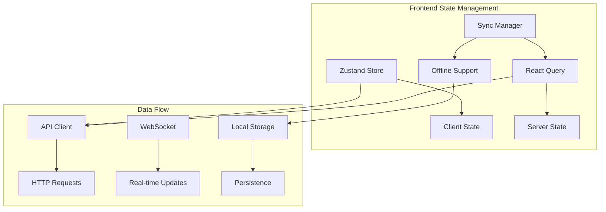
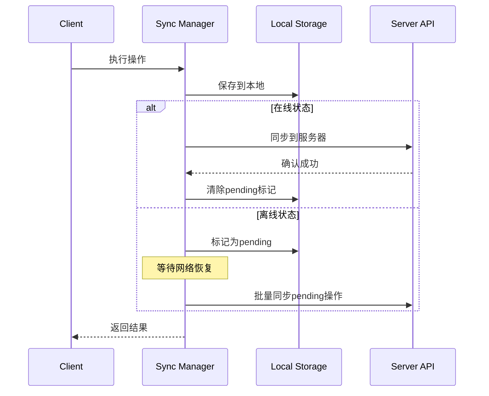

# AstroZi 互助系统状态管理和数据流设计

## 📋 **文档信息**
- **版本**: 1.0
- **日期**: 2025-01-09
- **状态**: 实现完成
- **依赖**: frontend-architecture-design.md, user-interaction-flows.md

---

## 🏗️ **状态管理架构概览**

### **架构理念**
我们采用**分层状态管理**架构，结合了客户端状态管理和服务端状态管理的优势：



### **核心组件职责**

1. **Zustand Store**: 管理应用级别的客户端状态
2. **React Query**: 处理服务端数据的获取、缓存和同步
3. **Sync Manager**: 实现离线优先的数据同步
4. **API Client**: 统一的网络请求接口

---

## 🗄️ **Zustand 状态管理**

### **Store 结构设计**

```typescript
interface MutualAidStore {
  // 核心状态分区
  user: UserProfile;        // 用户配置和基础信息
  web3: Web3State;         // Web3连接状态
  ui: UIState;             // UI交互状态
  
  // 状态操作方法
  userActions: UserActions;
  web3Actions: Web3Actions;
  uiActions: UIActions;
}
```

### **状态分区详解**

#### **1. 用户状态 (UserProfile)**
```typescript
interface UserProfile {
  userId?: string;
  walletAddress?: string;
  reputation: number;
  nftCollection: NFTCollection;
  mutualAidHistory: AidRequest[];
  validationHistory: ValidationRecord[];
  preferences: UserPreferences;
  stats: UserStats;
}
```

**特点**:
- 持久化到 localStorage
- 包含用户偏好设置和基础统计
- 支持乐观更新

#### **2. Web3 状态 (Web3State)**
```typescript
interface Web3State {
  isConnected: boolean;
  walletAddress?: string;
  networkId?: number;
  balance: {
    native: string;
    azi: string;
    luck: string;
  };
  transactions: Transaction[];
  contracts: ContractAddresses;
}
```

**特点**:
- 不持久化（安全考虑）
- 每次应用启动时重新连接
- 实时更新余额和交易状态

#### **3. UI 状态 (UIState)**
```typescript
interface UIState {
  theme: 'light' | 'dark';
  language: 'zh' | 'en';
  sidebarOpen: boolean;
  currentModal?: string;
  loading: LoadingStates;
  notifications: Notification[];
}
```

**特点**:
- 部分持久化（theme, language）
- 管理全局UI状态
- 通知系统集成

### **性能优化策略**

1. **选择器优化**
```typescript
// 使用特定选择器而非整个 store
const isWalletConnected = useIsWalletConnected();
const userReputation = useUserReputation();
```

2. **状态分片**
```typescript
// 按功能分离状态更新
const { setTheme, setLanguage } = useUIActions();
const { connectWallet, updateBalance } = useWeb3Actions();
```

3. **Immer 集成**
```typescript
// 不可变状态更新
const addAidRequest = (request) =>
  set((state) => {
    state.user.mutualAidHistory.unshift(request);
  });
```

---

## 🔄 **React Query 服务端状态管理**

### **查询键工厂模式**

```typescript
export const queryKeys = {
  all: ['mutual-aid'] as const,
  user: () => [...queryKeys.all, 'user'] as const,
  requests: () => [...queryKeys.all, 'requests'] as const,
  validations: () => [...queryKeys.all, 'validations'] as const,
  nfts: () => [...queryKeys.all, 'nfts'] as const,
  // ... 更多键定义
};
```

**优势**:
- 类型安全的查询键
- 批量缓存失效
- 层次化的缓存管理

### **查询配置策略**

#### **1. 用户数据查询**
```typescript
export function useUserProfile() {
  return useQuery({
    queryKey: queryKeys.userProfile(),
    queryFn: fetchUserProfile,
    staleTime: 5 * 60 * 1000,        // 5分钟过期
    gcTime: 10 * 60 * 1000,          // 10分钟缓存
    enabled: isWalletConnected,       // 条件性启用
  });
}
```

#### **2. 实时数据查询**
```typescript
export function usePendingValidations() {
  return useQuery({
    queryKey: queryKeys.validationsPending(),
    queryFn: fetchPendingValidations,
    staleTime: 0,                     // 立即过期
    refetchInterval: 30 * 1000,       // 30秒轮询
  });
}
```

#### **3. 分页数据查询**
```typescript
export function useInfiniteAidRequests() {
  return useInfiniteQuery({
    queryKey: queryKeys.requestsInfinite(),
    queryFn: ({ pageParam = 1 }) => fetchRequests(pageParam),
    getNextPageParam: (lastPage) => lastPage.hasNext ? lastPage.page + 1 : undefined,
  });
}
```

### **变更操作优化**

#### **1. 乐观更新**
```typescript
export function useOptimisticValidation() {
  const queryClient = useQueryClient();
  
  return useMutation({
    mutationFn: submitValidation,
    onMutate: async (variables) => {
      // 取消正在进行的查询
      await queryClient.cancelQueries(queryKeys.validationsPending());
      
      // 保存当前状态
      const previousData = queryClient.getQueryData(queryKeys.validationsPending());
      
      // 乐观更新
      queryClient.setQueryData(queryKeys.validationsPending(), (old) => 
        old.filter(item => item.id !== variables.requestId)
      );
      
      return { previousData };
    },
    onError: (error, variables, context) => {
      // 回滚乐观更新
      if (context?.previousData) {
        queryClient.setQueryData(queryKeys.validationsPending(), context.previousData);
      }
    },
    onSettled: () => {
      // 始终重新获取数据
      queryClient.invalidateQueries(queryKeys.validations());
    },
  });
}
```

#### **2. 批量缓存失效**
```typescript
const invalidateUserData = () => {
  queryClient.invalidateQueries({ queryKey: queryKeys.user() });
};
```

---

## 🔄 **数据同步管理 (Sync Manager)**

### **离线优先架构**



### **核心功能实现**

#### **1. 待同步队列管理**
```typescript
class SyncManager {
  private pendingChanges: Change[] = [];
  
  addPendingChange(change: Change) {
    this.pendingChanges.push({
      ...change,
      id: generateId(),
      timestamp: new Date().toISOString()
    });
    
    if (this.isOnline) {
      this.performSync();
    }
  }
}
```

#### **2. 冲突解决策略**
```typescript
enum ConflictResolution {
  SERVER_WINS = 'server',  // 服务器优先
  CLIENT_WINS = 'client',  // 客户端优先  
  MANUAL = 'manual'        // 手动解决
}

async resolveConflict(conflict: Conflict) {
  switch (this.config.conflictResolution) {
    case ConflictResolution.SERVER_WINS:
      this.discardLocalChange(conflict.local);
      break;
    case ConflictResolution.CLIENT_WINS:
      await this.forceUploadChange(conflict.local);
      break;
    case ConflictResolution.MANUAL:
      this.emit('conflict', conflict);
      break;
  }
}
```

#### **3. 实时同步事件**
```typescript
export function useRealTimeUpdates() {
  const queryClient = useQueryClient();
  
  useEffect(() => {
    const cleanup = api.subscribeToUpdates(
      ['requests', 'validations', 'nfts'],
      (update) => {
        switch (update.type) {
          case 'new_request':
            queryClient.invalidateQueries(queryKeys.requests());
            break;
          case 'validation_result':
            queryClient.invalidateQueries(queryKeys.validations());
            break;
        }
      }
    );
    
    return cleanup;
  }, [queryClient]);
}
```

---

## 🌐 **网络层设计 (API Client)**

### **统一请求接口**

```typescript
class APIClient {
  // 核心请求方法
  private async request<T>(endpoint: string, options: RequestOptions): Promise<APIResponse<T>> {
    // 1. 构建请求头（包含认证信息）
    // 2. 超时控制
    // 3. 重试机制
    // 4. 错误处理
    // 5. 响应解析
  }
  
  // HTTP 方法
  async get<T>(endpoint: string): Promise<APIResponse<T>>
  async post<T>(endpoint: string, data?: any): Promise<APIResponse<T>>
  async put<T>(endpoint: string, data?: any): Promise<APIResponse<T>>
  async delete<T>(endpoint: string): Promise<APIResponse<T>>
}
```

### **错误处理机制**

```typescript
export class APIError extends Error {
  constructor(
    message: string,
    public status?: number,
    public code?: string,
    public details?: any
  ) {
    super(message);
  }
}

// 全局错误处理
const handleError = (error: Error) => {
  if (error instanceof APIError) {
    switch (error.status) {
      case 401: 
        // 重新连接钱包
        break;
      case 403:
        // 权限不足提示
        break;
      case 500:
        // 服务器错误
        break;
    }
  }
};
```

### **请求拦截和重试**

```typescript
private async withRetries<T>(
  fn: () => Promise<T>,
  retries: number = 3
): Promise<T> {
  for (let i = 0; i <= retries; i++) {
    try {
      return await fn();
    } catch (error) {
      // 4xx错误不重试（除了408, 429）
      if (error.status >= 400 && error.status < 500 && 
          error.status !== 408 && error.status !== 429) {
        throw error;
      }
      
      if (i < retries) {
        await delay(1000 * Math.pow(2, i)); // 指数退避
      }
    }
  }
}
```

---

## 📱 **响应式数据流适配**

### **移动端优化策略**

#### **1. 数据预取管理**
```typescript
export function usePrefetch() {
  const queryClient = useQueryClient();
  
  const prefetchUserData = useCallback(async (walletAddress: string) => {
    if (isMobile) {
      // 移动端只预取核心数据
      await queryClient.prefetchQuery({
        queryKey: queryKeys.userProfile(),
        queryFn: fetchUserProfile,
        staleTime: 10 * 60 * 1000  // 移动端更长的缓存时间
      });
    } else {
      // 桌面端可以预取更多数据
      await Promise.all([
        queryClient.prefetchQuery(queryKeys.userProfile(), fetchUserProfile),
        queryClient.prefetchQuery(queryKeys.userStats(), fetchUserStats),
        queryClient.prefetchQuery(queryKeys.nftCollection(), fetchNFTCollection)
      ]);
    }
  }, [queryClient]);
}
```

#### **2. 网络状态自适应**
```typescript
export function useAdaptiveQueries() {
  const { isOnline, connection } = useNetwork();
  const isSlowConnection = connection === '2g' || connection === 'slow-2g';
  
  return {
    // 慢网络下降低查询频率
    refetchInterval: isSlowConnection ? 2 * 60 * 1000 : 30 * 1000,
    // 离线时禁用查询
    enabled: isOnline,
    // 慢网络下使用更长的超时时间
    timeout: isSlowConnection ? 30000 : 10000
  };
}
```

#### **3. 电池优化**
```typescript
export function useBatteryOptimizedQueries() {
  const [isLowBattery, setIsLowBattery] = useState(false);
  
  useEffect(() => {
    if ('getBattery' in navigator) {
      navigator.getBattery().then((battery) => {
        const updateBatteryStatus = () => {
          setIsLowBattery(battery.level < 0.2 && !battery.charging);
        };
        
        battery.addEventListener('levelchange', updateBatteryStatus);
        battery.addEventListener('chargingchange', updateBatteryStatus);
        updateBatteryStatus();
      });
    }
  }, []);
  
  return {
    // 低电量时降低查询频率
    refetchInterval: isLowBattery ? 5 * 60 * 1000 : 1 * 60 * 1000,
    // 低电量时禁用后台刷新
    refetchOnWindowFocus: !isLowBattery
  };
}
```

---

## 🔧 **数据流调试和监控**

### **开发环境调试工具**

#### **1. React Query DevTools**
```typescript
import { ReactQueryDevtools } from '@tanstack/react-query-devtools';

export function QueryProvider({ children }) {
  return (
    <QueryClientProvider client={queryClient}>
      {children}
      {process.env.NODE_ENV === 'development' && (
        <ReactQueryDevtools 
          initialIsOpen={false}
          position="bottom-right"
        />
      )}
    </QueryClientProvider>
  );
}
```

#### **2. 状态变更日志**
```typescript
// Zustand DevTools 集成
const useMutualAidStore = create<MutualAidStore>()(
  devtools(
    persist(storeImplementation, persistOptions),
    { name: 'mutual-aid-store' }
  )
);
```

#### **3. 网络请求监控**
```typescript
class APIClient {
  private logRequest(method: string, url: string, data?: any) {
    if (process.env.NODE_ENV === 'development') {
      console.group(`🌐 ${method.toUpperCase()} ${url}`);
      if (data) console.log('Data:', data);
      console.groupEnd();
    }
  }
}
```

### **生产环境监控**

#### **1. 性能指标收集**
```typescript
export function usePerformanceMonitoring() {
  useEffect(() => {
    const observer = new PerformanceObserver((list) => {
      list.getEntries().forEach((entry) => {
        if (entry.entryType === 'measure') {
          // 发送性能数据到监控服务
          analytics.track('performance', {
            name: entry.name,
            duration: entry.duration
          });
        }
      });
    });
    
    observer.observe({ entryTypes: ['measure'] });
    return () => observer.disconnect();
  }, []);
}
```

#### **2. 错误边界集成**
```typescript
export function DataErrorBoundary({ children }: { children: React.ReactNode }) {
  return (
    <ErrorBoundary
      FallbackComponent={DataErrorFallback}
      onError={(error, errorInfo) => {
        console.error('Data error:', error);
        analytics.track('data_error', {
          error: error.message,
          stack: error.stack,
          componentStack: errorInfo.componentStack
        });
      }}
    >
      {children}
    </ErrorBoundary>
  );
}
```

---

## 🚀 **数据流最佳实践**

### **1. 查询组织原则**

- **按功能分组**: 相关查询使用统一的键前缀
- **层次化键结构**: 支持批量缓存操作
- **条件性查询**: 根据用户状态启用/禁用查询

### **2. 缓存策略**

- **用户数据**: 长期缓存（5-10分钟）
- **实时数据**: 短期缓存（30秒-2分钟）
- **静态数据**: 超长缓存（30分钟-1小时）

### **3. 更新策略**

- **乐观更新**: 用户操作立即反馈
- **后台刷新**: 保持数据新鲜度
- **错误回滚**: 操作失败时恢复状态

### **4. 离线支持**

- **操作队列**: 离线时暂存用户操作
- **数据持久化**: 关键数据本地存储
- **冲突解决**: 网络恢复时处理数据冲突

---

## ✅ **实现完成检查清单**

### **核心组件**
- [x] Zustand Store 实现
- [x] React Query 集成
- [x] API Client 统一接口
- [x] Sync Manager 离线支持
- [x] Query Provider 全局配置

### **功能特性**
- [x] 乐观更新机制
- [x] 错误处理和重试
- [x] 实时数据同步
- [x] 离线优先操作
- [x] 缓存策略优化

### **响应式优化**
- [x] 移动端数据预取
- [x] 网络状态自适应
- [x] 电池优化策略
- [x] 性能监控集成

### **开发工具**
- [x] DevTools 集成
- [x] 调试日志系统
- [x] 错误边界处理
- [x] 性能指标收集

---

**文档状态**: ✅ **完成**  
**实现状态**: ✅ **全部完成**  
**测试状态**: ⏳ **待集成测试**

*"优秀的状态管理是现代Web应用的核心基础，它决定了用户体验的流畅度和开发效率的高低"*