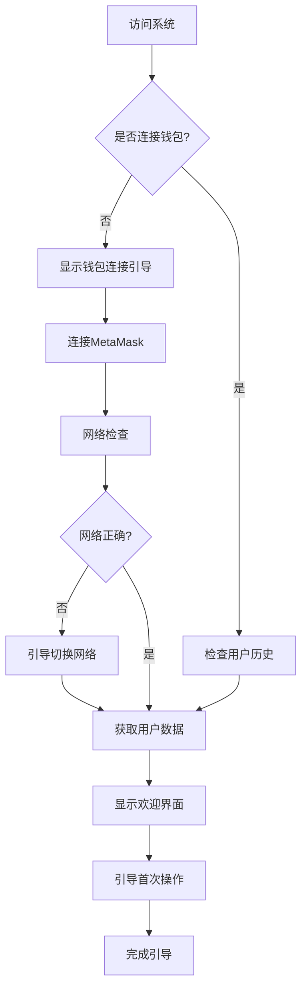
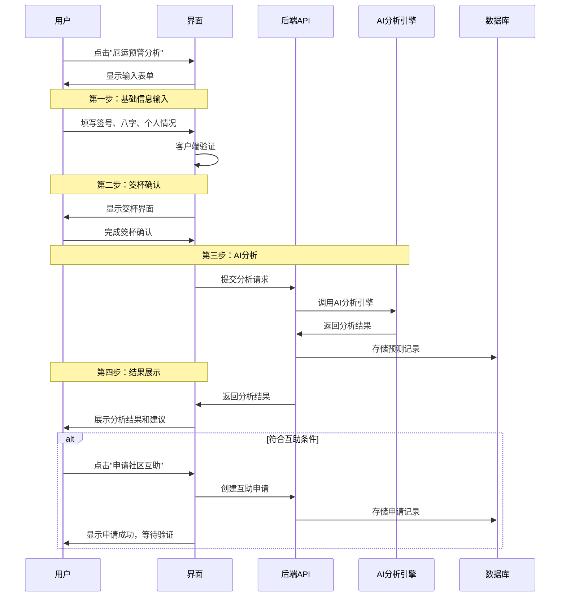
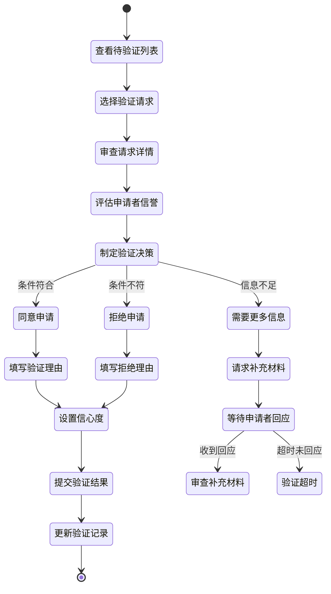
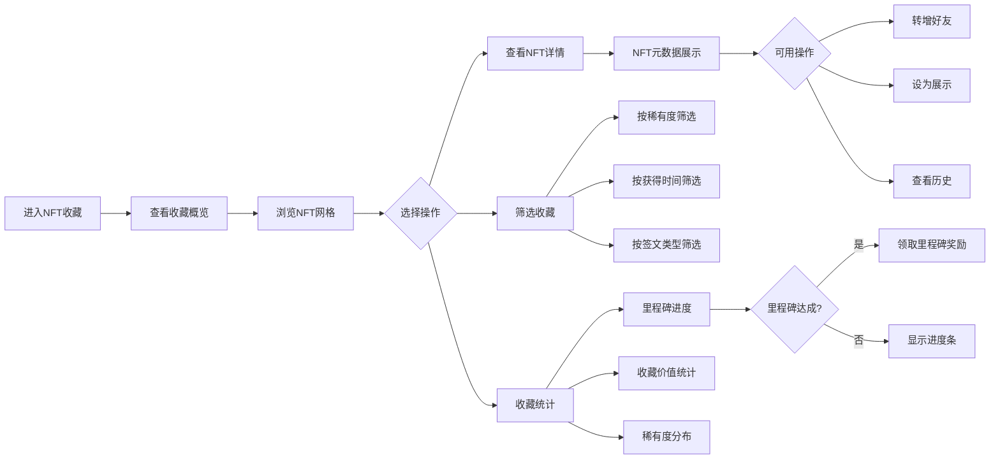
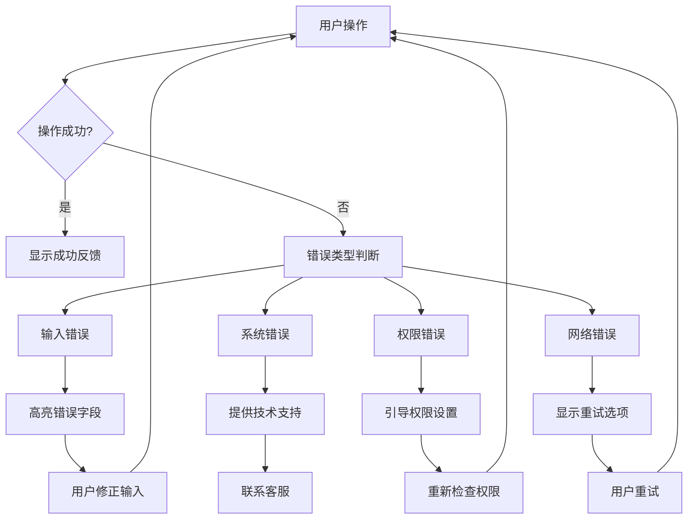

# AstroZi 互助系统用户交互流程设计

## 📋 **文档信息**
- **版本**: 1.0
- **日期**: 2025-01-09
- **状态**: 设计完成
- **依赖**: frontend-architecture-design.md

---

## 🎯 **核心用户流程概览**

### **1. 新用户引导流程 (Onboarding)**



#### **关键交互点**
1. **首次访问**
   - 展示系统价值主张
   - 突出Web3特性和传统文化元素
   - 提供"连接钱包"和"了解更多"选项

2. **钱包连接**
   - 检测MetaMask安装状态
   - 提供安装引导链接
   - 网络自动检测和切换建议

3. **初始设置**
   - 语言偏好选择（中文/英文）
   - 隐私设置配置
   - 通知偏好设置

---

### **2. 厄运分析申请流程 (Adversity Analysis Flow)**



#### **用户体验要点**
1. **表单填写体验**
   - 分步骤填写，避免一次性信息过载
   - 实时验证和友好错误提示
   - 自动保存草稿功能

2. **等待过程管理**
   - AI分析时显示进度动画
   - 预估分析时间提示
   - 可中断和重新开始选项

3. **结果呈现优化**
   - 视觉化严重程度指标
   - 分层信息展示（概览→详情→建议）
   - 清晰的下一步行动指导

---

### **3. 社区验证流程 (Community Validation Flow)**



#### **验证决策支持**
1. **信息聚合展示**
   - 申请者基础信息和历史记录
   - 申请详情和支撑材料
   - 社区其他验证者意见

2. **辅助决策工具**
   - 风险评估指标
   - 相似案例参考
   - 验证模板和快速选项

3. **投票权重说明**
   - 用户NFT持有量对投票权重的影响
   - 信誉分数加成说明
   - 历史验证准确率展示

---

### **4. NFT收藏管理流程 (NFT Collection Flow)**



#### **收藏体验优化**
1. **展示策略**
   - 瀑布流布局适配不同屏幕尺寸
   - 稀有度视觉区分（边框、特效、颜色）
   - 快速预览和详情模态框

2. **交互功能**
   - 长按显示快捷菜单（移动端）
   - 批量选择和操作
   - 收藏夹和标签管理

3. **社交功能**
   - 向朋友展示收藏
   - 收藏品转赠功能
   - 社区展示排行榜

---

### **5. 移动端专用流程 (Mobile-First Interactions)**

#### **手势交互设计**
```javascript
// 滑动操作映射
const mobileGestures = {
  // 验证列表项
  swipeLeft: '快速同意',
  swipeRight: '快速拒绝',
  longPress: '显示详情菜单',
  
  // NFT收藏
  pinchZoom: '缩放NFT图片',
  doubleTap: '快速收藏/取消收藏',
  
  // 分析结果
  pullToRefresh: '刷新分析结果',
  swipeUp: '查看更多详情'
};
```

#### **移动端导航优化**
1. **底部导航栏**
   - 5个核心功能入口
   - 动态Badge显示待处理数量
   - 当前页面高亮指示

2. **侧滑菜单简化**
   - 仅显示关键操作
   - 钱包连接状态一目了然
   - 快速设置入口

3. **单手操作优化**
   - 重要按钮放置在拇指区域
   - 减少多级菜单深度
   - 提供快捷操作手势

---

## 🎨 **微交互设计规范**

### **加载和等待状态**
```typescript
interface LoadingStates {
  // 数据加载
  skeleton: '骨架屏显示';
  spinner: '旋转加载指示器';
  progress: '进度条显示';
  
  // 操作反馈
  buttonLoading: '按钮内加载状态';
  cardShimmer: '卡片闪光效果';
  pulseAnimation: '脉冲动画';
  
  // 状态切换
  fadeTransition: '淡入淡出过渡';
  slideTransition: '滑动过渡';
  scaleTransition: '缩放过渡';
}
```

### **反馈和通知系统**
1. **即时反馈**
   - 按钮点击：0.1秒缩放效果
   - 表单提交：按钮状态变化 + loading
   - 错误输入：红色边框 + 震动效果

2. **操作结果通知**
   - 成功：绿色Toast，2秒自动消失
   - 警告：黄色Toast，需要用户确认
   - 错误：红色Toast，提供重试按钮

3. **长期状态更新**
   - 在线通知：实时推送重要更新
   - 应用内消息：新功能引导
   - 系统公告：重要变更通知

### **错误处理流程**


---

## 📱 **响应式交互适配**

### **断点交互策略**
```typescript
const responsiveInteractions = {
  // 移动端 (< 768px)
  mobile: {
    navigation: 'bottom-tabs',
    menu: 'slide-up-drawer',
    cards: 'full-width-stack',
    modals: 'fullscreen',
    gestures: 'swipe-enabled'
  },
  
  // 平板端 (768px - 1024px)
  tablet: {
    navigation: 'sidebar-collapsible',
    menu: 'slide-in-sidebar',
    cards: 'two-column-grid',
    modals: 'centered-overlay',
    gestures: 'limited-swipe'
  },
  
  // 桌面端 (> 1024px)
  desktop: {
    navigation: 'persistent-sidebar',
    menu: 'dropdown-menus',
    cards: 'multi-column-grid',
    modals: 'floating-dialogs',
    gestures: 'mouse-hover-only'
  }
};
```

### **触摸优化指南**
1. **触摸目标尺寸**
   - 最小点击区域：44px × 44px
   - 按钮间距：8px以上
   - 滑动敏感区域：全宽度

2. **手势反馈**
   - 触摸开始：立即视觉反馈
   - 滑动过程：实时预览效果
   - 操作确认：haptic反馈（如果支持）

3. **无障碍访问**
   - 屏幕阅读器适配
   - 高对比度模式支持
   - 键盘导航兼容

---

## 🎯 **用户旅程关键节点**

### **首次使用 (Day 0)**
1. 访问系统 → 连接钱包 → 查看引导 → 进行首次分析
2. **成功指标**: 完成钱包连接率 > 60%
3. **优化重点**: 降低技术门槛，突出价值主张

### **活跃参与 (Day 7)**
1. 参与验证 → 获得NFT → 建立信誉 → 享受权益
2. **成功指标**: 7日留存率 > 40%
3. **优化重点**: 社区互动和奖励机制

### **深度使用 (Day 30)**
1. 申请互助 → 社区验证通过 → 获得帮助 → 回馈社区
2. **成功指标**: 30日留存率 > 25%
3. **优化重点**: 互助成功率和用户满意度

---

## ✅ **实现检查清单**

### **核心流程完整性**
- [x] 新用户引导流程
- [x] 厄运分析申请流程  
- [x] 社区验证流程
- [x] NFT收藏管理流程
- [x] 移动端交互适配

### **用户体验优化**
- [x] 微交互动画设计
- [x] 错误处理机制
- [x] 加载状态管理
- [x] 反馈通知系统
- [x] 响应式适配

### **可访问性支持**
- [x] 键盘导航
- [x] 屏幕阅读器
- [x] 高对比度模式
- [x] 减少动画选项
- [x] 多语言支持

### **性能优化**
- [x] 懒加载实现
- [x] 代码分割策略
- [x] 缓存机制
- [x] 图片优化
- [x] 离线支持考虑

---

**文档状态**: ✅ **完成**  
**下一步**: 响应式布局和移动端优化实现  
**依赖项**: 前端架构设计、核心组件实现

*"精心设计的用户交互流程是优秀用户体验的基石"*