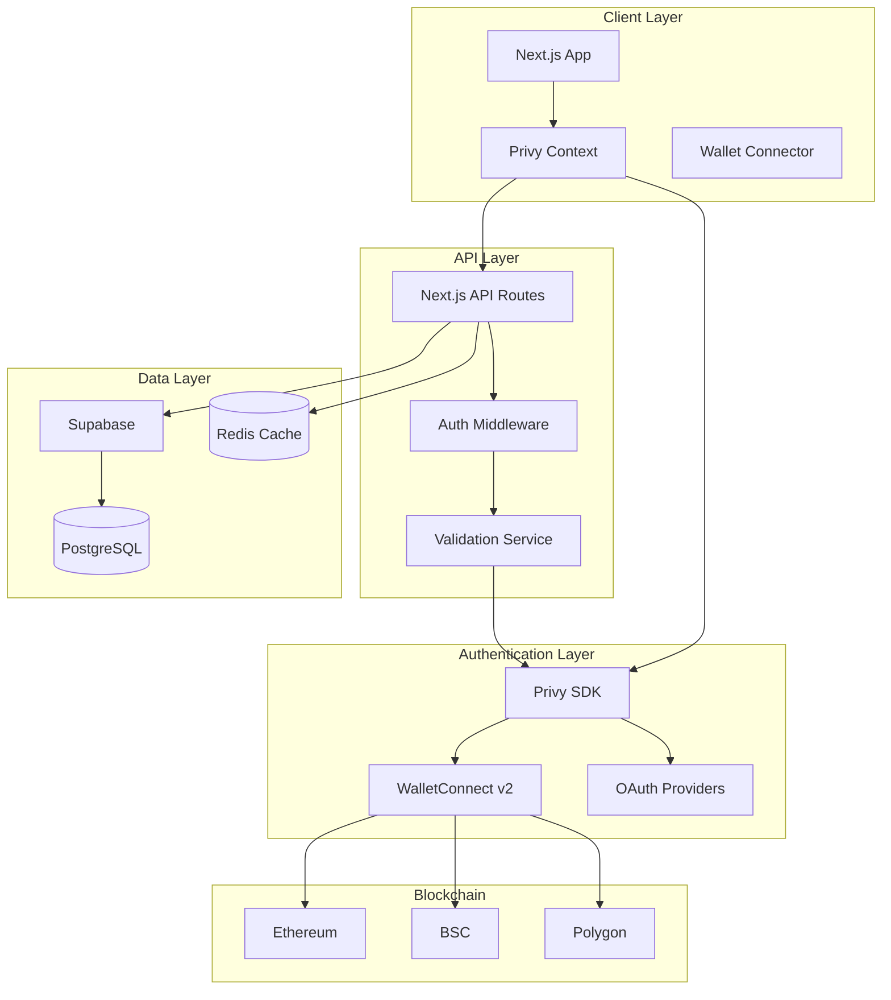
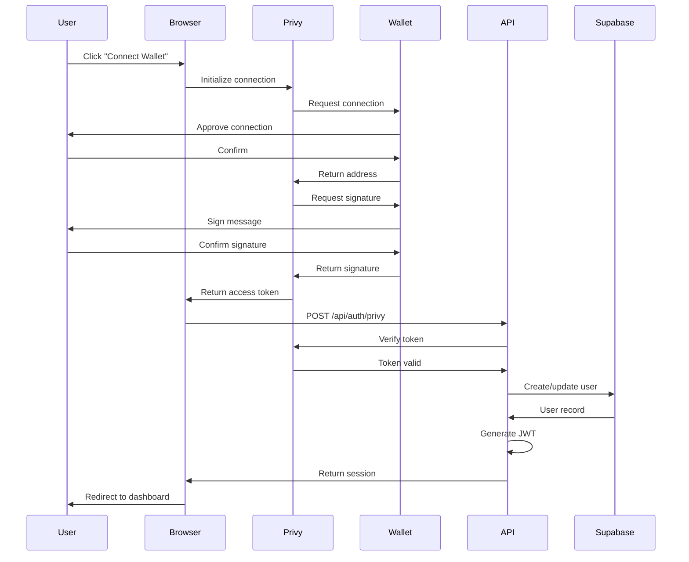
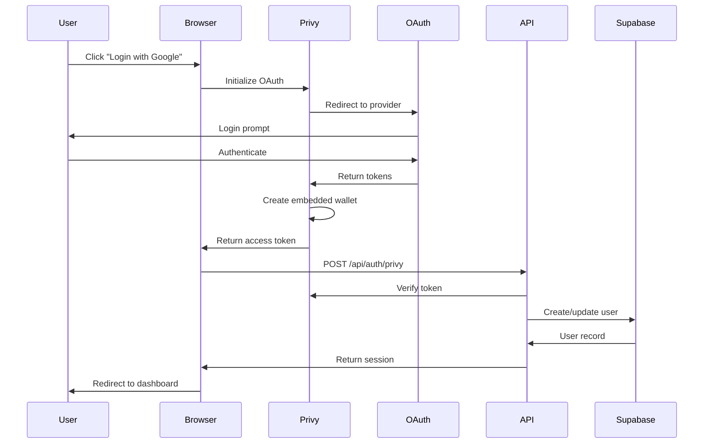

# Login System Architecture Document

## 1. System Overview

Note: As of this iteration, the login surface is simplified to two clear choices for users:

- WalletConnect for Web3 wallet login
- Privy for Web2 social login (only Web2 entry)

Email/password and direct Supabase OAuth flows are deprecated in the UI in favor of Privy’s social login. Privy verification on the server establishes a Supabase session for RLS access.

### 1.1 Architecture Principles
- **Decentralized First**: Prioritize Web3 wallet authentication
- **Security by Design**: Zero-knowledge of passwords, cryptographic verification
- **Scalability**: Horizontally scalable, stateless design
- **User Experience**: Seamless authentication across Web3 and Web2
- **Modularity**: Loosely coupled components for flexibility

### 1.2 High-Level Architecture



## 2. Component Architecture

### 2.1 Frontend Components

#### 2.1.1 Authentication Components
```typescript
/components/auth/
├── LoginButton.tsx          // Main login trigger
├── WalletModal.tsx          // Wallet selection modal
├── SocialButtons.tsx        // Social login options
├── AccountDropdown.tsx      // Connected account display
├── NetworkSelector.tsx      // Chain switching
└── AuthGuard.tsx           // Route protection
```

#### 2.1.2 Context Providers
```typescript
/contexts/
├── PrivyContext.tsx         // Privy authentication state
├── WalletContext.tsx        // Wallet connection state
└── SessionContext.tsx       // Supabase session state
```

### 2.2 Backend Architecture

#### 2.2.1 API Routes Structure
```typescript
/app/api/auth/
├── privy/
│   └── route.ts            // Privy token verification
├── session/
│   └── route.ts            // Session management
├── link/
│   └── route.ts            // Account linking
├── logout/
│   └── route.ts            // Logout handling
└── migrate/
    └── route.ts            // Email to Web3 migration
```

#### 2.2.2 Service Layer
```typescript
/lib/services/
├── auth-service.ts          // Core authentication logic
├── privy-verification.ts    // Privy token validation
├── session-manager.ts       // JWT session handling
├── user-service.ts          // User CRUD operations
└── migration-service.ts     // Account migration logic
```

### 2.3 Database Architecture

#### 2.3.1 Schema Design
```sql
-- Core user table
CREATE TABLE users (
    id UUID PRIMARY KEY DEFAULT gen_random_uuid(),
    privy_did TEXT UNIQUE NOT NULL,
    wallet_address TEXT UNIQUE,
    ens_name TEXT,
    avatar_url TEXT,
    username TEXT,
    created_at TIMESTAMPTZ DEFAULT NOW(),
    updated_at TIMESTAMPTZ DEFAULT NOW(),
    last_sign_in TIMESTAMPTZ,
    metadata JSONB DEFAULT '{}'::jsonb
);

-- Linked accounts for multi-provider support
CREATE TABLE linked_accounts (
    id UUID PRIMARY KEY DEFAULT gen_random_uuid(),
    user_id UUID REFERENCES users(id) ON DELETE CASCADE,
    provider TEXT NOT NULL,
    provider_account_id TEXT NOT NULL,
    provider_metadata JSONB,
    linked_at TIMESTAMPTZ DEFAULT NOW(),
    is_primary BOOLEAN DEFAULT FALSE,
    UNIQUE(provider, provider_account_id)
);

-- Session management
CREATE TABLE user_sessions (
    id UUID PRIMARY KEY DEFAULT gen_random_uuid(),
    user_id UUID REFERENCES users(id) ON DELETE CASCADE,
    privy_access_token TEXT,
    supabase_jwt TEXT NOT NULL,
    refresh_token TEXT,
    device_info JSONB,
    ip_address INET,
    user_agent TEXT,
    expires_at TIMESTAMPTZ NOT NULL,
    created_at TIMESTAMPTZ DEFAULT NOW(),
    last_activity TIMESTAMPTZ DEFAULT NOW()
);

-- User credits and subscription
CREATE TABLE user_credits (
    user_id UUID PRIMARY KEY REFERENCES users(id) ON DELETE CASCADE,
    free_credits INTEGER DEFAULT 10,
    paid_credits INTEGER DEFAULT 0,
    total_used INTEGER DEFAULT 0,
    subscription_tier TEXT DEFAULT 'free',
    subscription_expires_at TIMESTAMPTZ,
    updated_at TIMESTAMPTZ DEFAULT NOW()
);

-- Authentication logs for security
CREATE TABLE auth_logs (
    id UUID PRIMARY KEY DEFAULT gen_random_uuid(),
    user_id UUID REFERENCES users(id) ON DELETE SET NULL,
    event_type TEXT NOT NULL,
    provider TEXT,
    ip_address INET,
    user_agent TEXT,
    metadata JSONB,
    success BOOLEAN DEFAULT TRUE,
    error_message TEXT,
    created_at TIMESTAMPTZ DEFAULT NOW()
);

-- Indexes for performance
CREATE INDEX idx_users_wallet_address ON users(wallet_address);
CREATE INDEX idx_users_privy_did ON users(privy_did);
CREATE INDEX idx_linked_accounts_user_id ON linked_accounts(user_id);
CREATE INDEX idx_sessions_user_id ON user_sessions(user_id);
CREATE INDEX idx_sessions_expires_at ON user_sessions(expires_at);
CREATE INDEX idx_auth_logs_user_id ON auth_logs(user_id);
CREATE INDEX idx_auth_logs_created_at ON auth_logs(created_at);
```

#### 2.3.2 Row Level Security (RLS)
```sql
-- Enable RLS
ALTER TABLE users ENABLE ROW LEVEL SECURITY;
ALTER TABLE linked_accounts ENABLE ROW LEVEL SECURITY;
ALTER TABLE user_sessions ENABLE ROW LEVEL SECURITY;
ALTER TABLE user_credits ENABLE ROW LEVEL SECURITY;

-- User policies
CREATE POLICY "Users can view own profile" ON users
    FOR SELECT USING (auth.uid() = id);

CREATE POLICY "Users can update own profile" ON users
    FOR UPDATE USING (auth.uid() = id);

-- Linked accounts policies
CREATE POLICY "Users can view own linked accounts" ON linked_accounts
    FOR SELECT USING (auth.uid() = user_id);

CREATE POLICY "Users can manage own linked accounts" ON linked_accounts
    FOR ALL USING (auth.uid() = user_id);

-- Session policies
CREATE POLICY "Users can view own sessions" ON user_sessions
    FOR SELECT USING (auth.uid() = user_id);

-- Credits policies
CREATE POLICY "Users can view own credits" ON user_credits
    FOR SELECT USING (auth.uid() = user_id);
```

## 3. Authentication Flow

### 3.1 Wallet Authentication Flow



### 3.2 Social Authentication Flow



## 4. Security Architecture

### 4.1 Security Layers

#### 4.1.1 Authentication Security
- **Message Signing**: EIP-4361 standard for wallet authentication
- **Nonce Generation**: Unique nonces prevent replay attacks
- **Token Validation**: Server-side verification of all tokens
- **Rate Limiting**: Prevent brute force attempts

#### 4.1.2 Session Security
- **JWT Tokens**: Short-lived access tokens (15 minutes)
- **Refresh Tokens**: Longer-lived refresh tokens (7 days)
- **Token Rotation**: Automatic rotation on refresh
- **Secure Storage**: HttpOnly cookies for tokens

#### 4.1.3 Network Security
- **HTTPS Only**: All communication encrypted
- **CORS Policy**: Strict origin validation
- **CSP Headers**: Content Security Policy enforcement
- **API Rate Limiting**: Per-user and per-IP limits

### 4.2 Security Implementation

```typescript
// Middleware security checks
export async function authMiddleware(req: Request) {
  // 1. Validate JWT
  const token = getTokenFromRequest(req);
  if (!token) throw new UnauthorizedError();
  
  // 2. Verify with Privy
  const privyUser = await verifyPrivyToken(token);
  if (!privyUser) throw new InvalidTokenError();
  
  // 3. Check session validity
  const session = await getSession(privyUser.id);
  if (!session || isExpired(session)) {
    throw new SessionExpiredError();
  }
  
  // 4. Rate limiting
  const rateLimitOk = await checkRateLimit(req);
  if (!rateLimitOk) throw new RateLimitError();
  
  // 5. Log authentication event
  await logAuthEvent(privyUser.id, 'api_access', req);
  
  return { user: privyUser, session };
}
```

## 5. Data Flow Architecture

### 5.1 State Management

```typescript
// Global state architecture
interface AuthState {
  // User state
  user: User | null;
  isAuthenticated: boolean;
  isLoading: boolean;
  
  // Wallet state
  walletAddress: string | null;
  chainId: number | null;
  balance: BigNumber | null;
  
  // Session state
  accessToken: string | null;
  refreshToken: string | null;
  expiresAt: Date | null;
  
  // Actions
  login: () => Promise<void>;
  logout: () => Promise<void>;
  refresh: () => Promise<void>;
}
```

### 5.2 Caching Strategy

```typescript
// Redis caching layers
interface CacheStrategy {
  // User data cache (5 minutes)
  userCache: {
    key: `user:${userId}`;
    ttl: 300;
  };
  
  // Session cache (15 minutes)
  sessionCache: {
    key: `session:${sessionId}`;
    ttl: 900;
  };
  
  // Rate limit cache (1 hour)
  rateLimitCache: {
    key: `ratelimit:${userId}:${endpoint}`;
    ttl: 3600;
  };
}
```

## 6. Integration Architecture

### 6.1 Privy Integration

```typescript
// Privy configuration
const privyConfig = {
  appId: process.env.PRIVY_APP_ID,
  
  // Wallet configuration
  walletConnectProjectId: process.env.WALLETCONNECT_PROJECT_ID,
  supportedChains: [1, 56, 137], // Ethereum, BSC, Polygon
  
  // OAuth configuration
  oauth: {
    google: { clientId: process.env.GOOGLE_CLIENT_ID },
    twitter: { clientId: process.env.TWITTER_CLIENT_ID },
    discord: { clientId: process.env.DISCORD_CLIENT_ID },
    github: { clientId: process.env.GITHUB_CLIENT_ID },
    apple: { clientId: process.env.APPLE_CLIENT_ID },
  },
  
  // Embedded wallet settings
  embeddedWallets: {
    createOnLogin: true,
    requireUserPasswordOnCreate: false,
  },
};
```

### 6.2 Supabase Integration

```typescript
// Supabase client configuration
const supabaseConfig = {
  url: process.env.SUPABASE_URL,
  anonKey: process.env.SUPABASE_ANON_KEY,
  
  // Custom JWT generation
  jwt: {
    secret: process.env.SUPABASE_JWT_SECRET,
    exp: 900, // 15 minutes
  },
  
  // Database connection
  db: {
    schema: 'public',
    autoRefreshToken: true,
    persistSession: true,
  },
};
```

## 7. Performance Optimization

### 7.1 Frontend Optimization
- **Code Splitting**: Lazy load authentication components
- **Bundle Optimization**: Separate vendor chunks
- **Caching**: Service worker for static assets
- **Preloading**: Prefetch authentication resources

### 7.2 Backend Optimization
- **Connection Pooling**: Database connection reuse
- **Query Optimization**: Indexed queries, pagination
- **Caching Layer**: Redis for frequent data
- **CDN**: Static assets and API responses

### 7.3 Performance Metrics
```typescript
// Performance monitoring
interface PerformanceMetrics {
  authenticationTime: number;      // Target: < 2s
  walletConnectionTime: number;    // Target: < 3s
  sessionCreationTime: number;     // Target: < 500ms
  apiResponseTime: number;         // Target: < 200ms
  databaseQueryTime: number;       // Target: < 50ms
}
```

## 8. Scalability Architecture

### 8.1 Horizontal Scaling
- **Load Balancing**: Distribute traffic across instances
- **Auto-scaling**: Scale based on CPU/memory usage
- **Database Replication**: Read replicas for queries
- **Cache Distribution**: Redis cluster for caching

### 8.2 Microservices Architecture (Future)
```yaml
services:
  auth-service:
    responsibilities:
      - Token validation
      - Session management
      - User authentication
    
  wallet-service:
    responsibilities:
      - Wallet connections
      - Transaction signing
      - Balance queries
    
  user-service:
    responsibilities:
      - User profiles
      - Account linking
      - Preferences
```

## 9. Monitoring and Observability

### 9.1 Logging Architecture
```typescript
// Structured logging
interface LogEntry {
  timestamp: string;
  level: 'info' | 'warn' | 'error';
  service: string;
  userId?: string;
  sessionId?: string;
  event: string;
  metadata: Record<string, any>;
}
```

### 9.2 Metrics Collection
- **Authentication Metrics**: Success rate, failure reasons
- **Performance Metrics**: Response times, throughput
- **User Metrics**: Active users, retention
- **System Metrics**: CPU, memory, disk usage

### 9.3 Alerting Rules
- Authentication failures > 10% in 5 minutes
- API response time > 1 second
- Database connection pool exhausted
- Session creation failures

## 10. Disaster Recovery

### 10.1 Backup Strategy
- **Database**: Daily backups, 30-day retention
- **User Data**: Real-time replication
- **Configuration**: Version controlled
- **Secrets**: Encrypted backup storage

### 10.2 Recovery Procedures
- **RTO (Recovery Time Objective)**: 1 hour
- **RPO (Recovery Point Objective)**: 15 minutes
- **Failover**: Automatic to standby region
- **Rollback**: Blue-green deployment support

---

**Document Version**: 1.0.0  
**Last Updated**: 2024  
**Status**: In Implementation  
**Owner**: AstroZi Architecture Team
