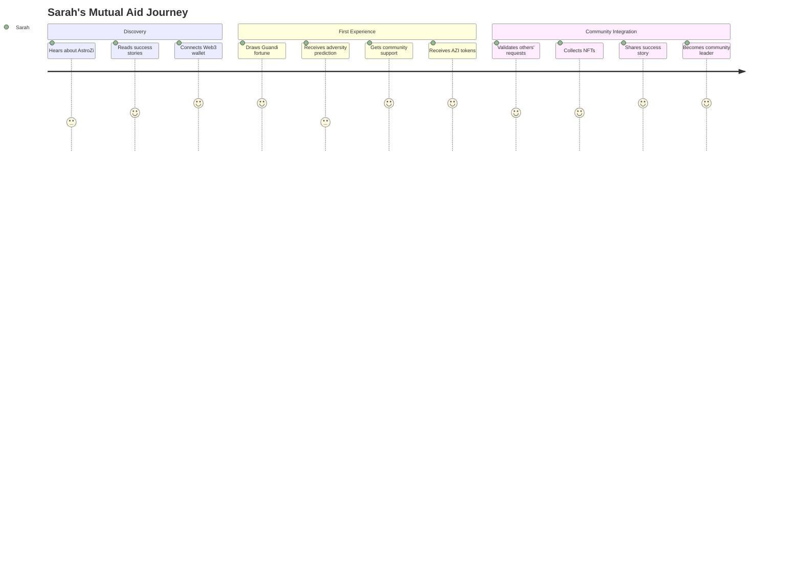
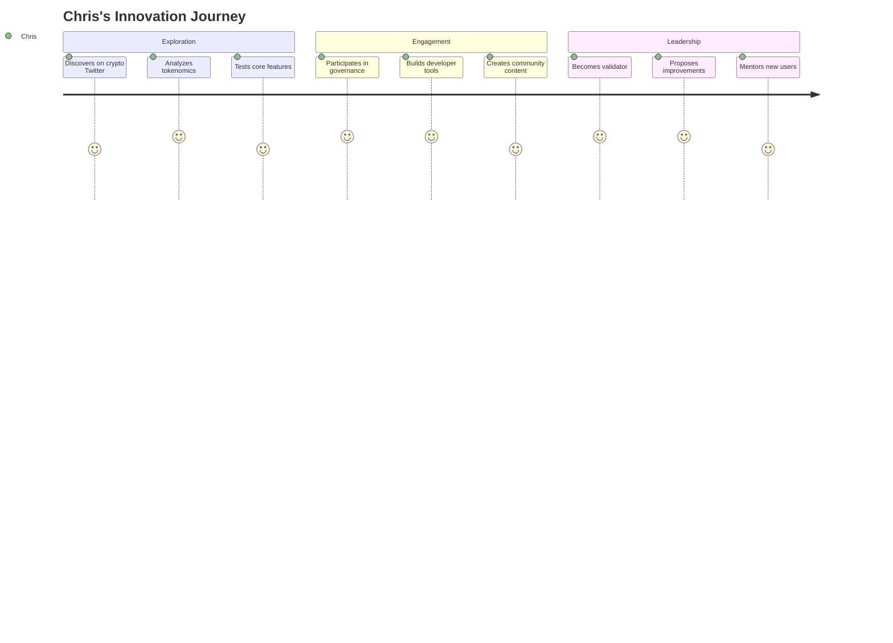
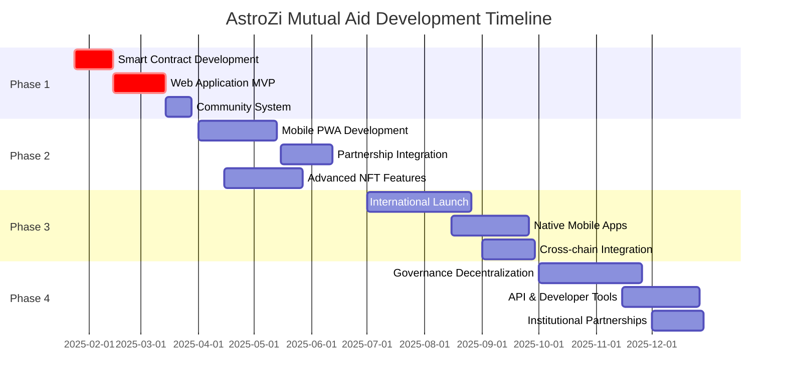

# AstroZi Mutual Aid System - Product Requirements Document (PRD)

## Document Information
- **Product**: AstroZi Web3 Life Engineering Platform - Mutual Aid Token System
- **Version**: 1.0
- **Date**: 2025-01-10
- **Owner**: Product Team Lead
- **Contributors**: UX Team, Business Development, Technical Lead
- **Status**: Active Development

---

## Table of Contents
1. [Executive Summary](#executive-summary)
2. [Product Vision & Strategy](#product-vision--strategy)
3. [Market Analysis](#market-analysis)
4. [User Personas & Journeys](#user-personas--journeys)
5. [Product Features](#product-features)
6. [User Experience Design](#user-experience-design)
7. [Business Model](#business-model)
8. [Success Metrics](#success-metrics)
9. [Roadmap & Milestones](#roadmap--milestones)
10. [Risk Assessment](#risk-assessment)

---

## Executive Summary

### 🎯 **Product Mission**
Transform AstroZi from a traditional fortune-telling platform into the world's first Web3 mutual assistance ecosystem, where AI-powered adversity predictions trigger real community support through blockchain-based token distributions.

### 🚀 **Value Proposition**
**For Users**: Receive both spiritual guidance and tangible financial support during life's difficult moments, backed by transparent blockchain technology and community validation.

**For Community**: Participate in a meaningful social network where traditional wisdom meets modern technology to create real-world impact.

**For Business**: Generate sustainable revenue through multiple streams while building the world's most innovative Web3 social impact platform.

### 📊 **Key Success Indicators**
- **User Adoption**: 10,000+ active users within 6 months
- **Community Engagement**: 80%+ user satisfaction with mutual aid experience  
- **Financial Impact**: $100,000+ in mutual aid distributed in first year
- **Business Growth**: 300% increase in user retention through community features

---

## Product Vision & Strategy

### 🌟 **Vision Statement**
*"Building bridges between ancient wisdom and modern community support, creating a world where no one faces adversity alone."*

### 🎯 **Strategic Objectives**

#### **Short-term (3-6 months)**
- Launch MVP with core mutual aid functionality
- Establish active community of 1,000+ users
- Validate AI adversity prediction accuracy
- Build trust through transparent token distributions

#### **Medium-term (6-12 months)**  
- Scale to 10,000+ active participants
- Launch advanced NFT collection and trading features
- Implement cross-chain interoperability
- Establish partnerships with wellness and mental health organizations

#### **Long-term (1-2 years)**
- Become the leading Web3 social impact platform in Asia
- Launch global expansion beyond Chinese-speaking markets
- Build ecosystem of integrated wellness and financial services
- Create industry standard for blockchain-based mutual aid

### 🏆 **Competitive Differentiation**

| **Traditional Fortune Telling** | **Generic Web3 Projects** | **AstroZi Mutual Aid** |
|--------------------------------|---------------------------|------------------------|
| ❌ Entertainment only | ❌ No social impact | ✅ Real community support |
| ❌ One-time interaction | ❌ Speculative tokens | ✅ Utility-driven economics |
| ❌ No community | ❌ Complex user experience | ✅ Intuitive cultural interface |
| ❌ No measurable outcomes | ❌ No emotional connection | ✅ Measurable life impact |

---

## Market Analysis

### 📈 **Market Opportunity**

#### **Total Addressable Market (TAM)**
- **Global Fortune-telling Market**: $12.8 billion (2024)
- **Web3 Social Impact**: $2.3 billion and growing 45% annually
- **Chinese-speaking Digital Population**: 1.2 billion potential users

#### **Serviceable Addressable Market (SAM)**
- **Web3-aware Asian users**: ~50 million
- **Traditional astrology enthusiasts**: ~200 million
- **Social impact investors**: $715 billion globally

#### **Serviceable Obtainable Market (SOM)**
- **Target Year 1**: 10,000 active users
- **Revenue Potential**: $500K-$2M annually
- **Market Share**: 0.02% of digital fortune-telling market

### 🎭 **User Demographics**

#### **Primary Users (70%)**
- **Age**: 25-45 years old
- **Gender**: 60% female, 40% male  
- **Income**: $30K-$80K annually
- **Tech Savvy**: Moderate to high Web3 familiarity
- **Cultural**: Chinese, Taiwanese, Hong Kong, Singapore
- **Interests**: Personal development, spiritual growth, financial wellness

#### **Secondary Users (30%)**
- **Age**: 18-35 years old
- **Demographics**: Web3 enthusiasts, crypto investors
- **Motivation**: Innovation adoption, community participation
- **Geographic**: Global, English-speaking markets

### 🔍 **Market Trends**
- **Mental Health Awareness**: 40% increase in wellness app usage
- **Web3 Mainstream Adoption**: 150% growth in non-crypto Web3 applications  
- **Community-driven Platforms**: 60% preference for peer-to-peer support
- **Cultural Heritage Tech**: Growing appreciation for traditional wisdom in digital formats

---

## User Personas & Journeys

### 👤 **Primary Persona: "Seeking Sarah" (Spiritual Seeker)**

**Demographics**:
- Age: 32, Marketing Manager in Taipei
- Income: $45K annually
- Tech Level: Uses crypto wallets, familiar with DeFi

**Pain Points**:
- Faces career uncertainty and relationship challenges
- Seeks guidance but finds traditional fortune-telling lacks actionable support
- Wants community connection but values privacy
- Concerned about financial stability during transitions

**Goals & Motivations**:
- Receive meaningful guidance for life decisions  
- Find emotional and financial support during difficult times
- Connect with like-minded community members
- Build long-term financial resilience

**User Journey**:


### 👥 **Secondary Persona: "Crypto Chris" (Web3 Innovator)**

**Demographics**:
- Age: 28, Software Developer in Singapore  
- Income: $60K annually
- Tech Level: DeFi power user, NFT collector

**Motivations**:
- Discovers innovative Web3 applications
- Values social impact and community building
- Interested in tokenomics and NFT mechanics
- Appreciates cultural bridge-building

**User Journey**:


### 🌏 **User Journey Map: Complete Mutual Aid Experience**

#### **Phase 1: Discovery & Onboarding (Days 1-7)**
```
Day 1: User discovers AstroZi through social media/referral
Day 2: Creates account, connects Web3 wallet
Day 3: Completes profile with birth information
Day 4: First Guandi fortune slip drawing
Day 5: Receives adversity prediction and explanation
Day 6: Joins community Discord/Telegram
Day 7: First mutual aid token distribution (if eligible)
```

#### **Phase 2: Community Integration (Weeks 2-4)**
```
Week 2: Validates 3-5 community mutual aid requests
Week 3: Collects first NFT, learns about collection bonuses  
Week 4: Refers first friend, receives referral rewards
```

#### **Phase 3: Power User Evolution (Months 2-6)**
```
Month 2: Achieves NFT collection milestone, unlocks extra features
Month 3: Becomes trusted community validator with higher voting weight
Month 4: Participates in governance discussions and proposals
Month 6: Potential community moderator or ambassador role
```

---

## Product Features

### 🔮 **Core Feature Set**

#### **1. AI-Enhanced Adversity Prediction**
**Description**: Combines Guandi fortune slips, Bazi (八字), and Ziwei (紫微) analysis to predict potential difficulties and their severity.

**User Value**: 
- Receive early warning of potential challenges
- Understand the spiritual and practical context of difficulties
- Get personalized advice for navigating adversity

**Key Capabilities**:
- Multi-modal AI analysis combining traditional systems
- Severity scoring (1-10 scale) with clear explanations
- Personalized recommendations and coping strategies
- Historical accuracy tracking and continuous improvement

**Success Criteria**:
- 70%+ user satisfaction with prediction relevance
- <3 seconds analysis response time
- 60%+ prediction accuracy validation by users after 30 days

#### **2. Community-Validated Mutual Aid**
**Description**: Blockchain-based token distribution system where community members validate adversity claims through NFT-weighted voting.

**User Value**:
- Receive tangible financial support during difficult times
- Participate in transparent, fraud-resistant mutual aid
- Build trust through community-driven validation

**Key Capabilities**:
- NFT-holder voting system with reputation weighting
- Transparent request and validation process
- Automated token distribution upon community approval
- Anti-fraud measures and reputation scoring

**Success Criteria**:
- <24 hours average validation time
- <5% fraud rate through community validation
- 90%+ user satisfaction with fairness and transparency

#### **3. Collectible Fortune NFTs with Utility**
**Description**: Generated NFTs based on fortune slip results with collection bonuses and community governance rights.

**User Value**:
- Own unique digital assets representing personal fortune journey
- Unlock exclusive features and rewards through collection
- Participate in community governance with voting rights

**Key Capabilities**:
- Rarity-based NFT generation (Common 89%, Epic 9%, Legendary 2%)
- Collection milestone rewards (5 NFTs = extra readings, 10+ = premium features)
- Transferable NFTs enabling gifting and community support
- Governance voting weight based on NFT collection

**Success Criteria**:
- 40%+ user collection rate (users collecting 2+ NFTs)
- 25%+ NFT transfer rate (indicating community gifting)
- 80%+ satisfaction with NFT utility and rewards

#### **4. Transparent Community Governance**
**Description**: Decentralized decision-making system where community members propose and vote on platform improvements.

**User Value**:
- Shape the platform's future development
- Ensure community interests are represented
- Build long-term investment in platform success

**Key Capabilities**:
- Community proposal submission and discussion
- NFT-weighted voting on platform changes
- Transparent implementation of approved proposals
- Regular community feedback and suggestion integration

**Success Criteria**:
- 30%+ community participation in governance votes
- 10+ community-proposed improvements implemented annually
- 85%+ satisfaction with community voice in platform development

### 🌟 **Advanced Feature Set**

#### **5. Social Support Network**
**Description**: Features enabling peer-to-peer emotional support, mentorship, and community building beyond financial aid.

**Key Capabilities**:
- Anonymous peer support matching
- Community-driven advice forums
- Mentorship program pairing
- Success story sharing platform

#### **6. Integration Ecosystem**
**Description**: Partnerships and integrations with wellness, financial, and spiritual service providers.

**Key Capabilities**:
- Mental health counselor network integration
- Financial planning service connections
- Traditional medicine practitioner referrals
- Educational content and workshop access

#### **7. Cross-Platform Portability**
**Description**: Enable users to use their AstroZi reputation and NFTs across partner platforms and services.

**Key Capabilities**:
- Cross-chain NFT compatibility
- Reputation score portability
- Partner platform privilege access
- Universal community identity

---

## User Experience Design

### 🎨 **Design Principles**

#### **Cultural Sensitivity**
- **Traditional Aesthetics**: Incorporate classical Chinese design elements
- **Respectful Innovation**: Balance modern UX with traditional spiritual context
- **Multi-lingual Support**: Seamless Chinese (Traditional/Simplified) and English experience

#### **Trust & Transparency**
- **Clear Communication**: Plain language explanations of all processes
- **Visible Verification**: Show community validation processes transparently  
- **Data Privacy**: Emphasize user control over personal spiritual information

#### **Accessibility & Inclusion**
- **Web3 Onboarding**: Gradual introduction to blockchain concepts
- **Mobile-First**: Optimized for mobile use across all demographics
- **Economic Accessibility**: Low-cost participation with meaningful free features

### 📱 **Key User Interface Flows**

#### **New User Onboarding Flow**
```
1. Landing Page → Value Proposition & Social Proof
2. Account Creation → Email/Social login + Web3 wallet connection
3. Profile Setup → Birth information for accurate readings
4. Tutorial → Interactive guide through first fortune drawing
5. First Reading → Guided experience with explanation
6. Community Introduction → Discord/Telegram invitation
7. NFT Collection → First NFT minting celebration
```

#### **Mutual Aid Request Flow**
```
1. Adversity Prediction → AI analysis results with severity score
2. Eligibility Check → Clear explanation of mutual aid criteria
3. Request Submission → Detailed form with context and evidence
4. Community Review → Transparent voting process display
5. Result Notification → Approval/denial with explanation
6. Token Distribution → Automatic blockchain transaction
7. Gratitude Expression → Thank community and share outcome
```

#### **Community Validation Flow**
```
1. New Request Notification → Alert for NFT holders
2. Request Review → Detailed information and user history
3. Voting Interface → Simple approve/reject with reasoning
4. Collective Decision → Real-time vote tracking
5. Outcome Implementation → Automatic execution of community decision
6. Reputation Update → Validator reputation score adjustment
```

### 🎯 **Mobile-First Design Strategy**

#### **Core Mobile Experiences**
- **Quick Fortune Reading**: One-tap access to daily guidance
- **Instant Community Updates**: Push notifications for mutual aid opportunities
- **Seamless Wallet Integration**: Native Web3 wallet connectivity
- **Offline Capability**: Cache previous readings and community updates

#### **Progressive Web App Features**
- **Native App Feel**: Full-screen experience without app store friction
- **Push Notifications**: Community updates and personal alerts
- **Offline Access**: Essential features available without internet
- **Share Integration**: Easy sharing of NFTs and success stories

---

## Business Model

### 💰 **Revenue Streams**

#### **Primary Revenue (70% of total)**

**1. Transaction Fees (40%)**
- **NFT Trading**: 5% marketplace fee on all NFT transactions
- **Token Exchanges**: 2% fee on AZI token trading
- **Premium Readings**: $2-5 per advanced AI analysis

**2. Subscription Services (30%)**
- **Premium Membership**: $9.99/month for unlimited readings
- **Community Plus**: $4.99/month for enhanced governance rights
- **Professional Services**: $29.99/month for integration with counselors

#### **Secondary Revenue (30% of total)**

**3. Partnership Revenue (20%)**
- **Wellness Services**: Revenue sharing with partnered practitioners
- **Financial Services**: Referral fees from financial planning partners  
- **Educational Content**: Course sales and workshop revenue

**4. Data Insights (10%)**
- **Anonymized Analytics**: Market research services (privacy-compliant)
- **Trend Reports**: Industry insights for partners and researchers
- **Platform Usage**: API access for developers and researchers

### 📊 **Financial Projections**

#### **Year 1 Financial Model**
```
Users: 10,000 active users
Revenue: $850,000
- Transaction fees: $340,000 (40%)
- Subscriptions: $255,000 (30%)  
- Partnerships: $170,000 (20%)
- Data insights: $85,000 (10%)

Operating Costs: $650,000
- Development: $300,000
- Marketing: $200,000
- Operations: $150,000

Net Profit: $200,000 (23% margin)
```

#### **Year 2-3 Scaling**
```
Year 2: 50,000 users → $2.8M revenue → $800K profit
Year 3: 150,000 users → $7.2M revenue → $2.5M profit
```

### 🔄 **Token Economics**

#### **AZI Token Utility**
- **Mutual Aid Pool**: 60% of tokens reserved for community support
- **Governance Rights**: Token holders vote on platform decisions
- **Staking Rewards**: Validators earn tokens for community service
- **Premium Access**: Token staking unlocks advanced features

#### **Sustainable Token Distribution**
- **Community Pool**: 60% for mutual aid distributions
- **Team & Development**: 20% for ongoing development
- **Marketing & Partnerships**: 15% for growth initiatives
- **Reserve Fund**: 5% for emergency situations and stability

---

## Success Metrics

### 📈 **Key Performance Indicators (KPIs)**

#### **User Adoption Metrics**
- **Monthly Active Users (MAU)**: Target 10,000 by month 12
- **User Retention Rate**: 
  - Day 7: 60%+ retention
  - Day 30: 40%+ retention  
  - Day 90: 25%+ retention
- **New User Acquisition**: 1,000+ new users per month by month 6

#### **Engagement Metrics**
- **Average Session Duration**: 8+ minutes per session
- **Fortune Readings per User**: 12+ readings per month for active users
- **Community Participation**: 70%+ of users participate in validation voting
- **NFT Collection Rate**: 40%+ of users collect 2+ NFTs

#### **Business Metrics**
- **Monthly Recurring Revenue (MRR)**: $50K by month 12
- **Customer Acquisition Cost (CAC)**: <$25 per user
- **Lifetime Value (LTV)**: $180+ per user
- **LTV/CAC Ratio**: 7:1 or higher

#### **Social Impact Metrics**
- **Mutual Aid Distributed**: $100,000+ total community support in year 1
- **Community Satisfaction**: 80%+ Net Promoter Score (NPS)
- **Successful Aid Outcomes**: 75%+ of recipients report positive impact
- **Platform Trust Score**: 85%+ user confidence in fairness and transparency

### 🎯 **Success Milestones**

#### **3-Month Milestones**
- ✅ Launch MVP with core mutual aid functionality
- ✅ Achieve 1,000 registered users
- ✅ Complete first 100 mutual aid distributions
- ✅ Establish community governance framework

#### **6-Month Milestones** 
- 📈 Reach 5,000 active users
- 💰 Generate $25K monthly recurring revenue
- 🤝 Launch 3 major partnership integrations
- 🏆 Achieve 70%+ user satisfaction score

#### **12-Month Milestones**
- 🚀 Scale to 10,000 active users
- 💎 Distribute $100K+ in total mutual aid
- 🌍 Launch English-language international version
- 📱 Release native mobile applications

---

## Roadmap & Milestones

### 🛣️ **Product Development Roadmap**

#### **Phase 1: Foundation (Months 1-3) - Q1 2025**
**Goal**: Launch MVP with core mutual aid functionality

**Key Deliverables**:
- ✅ Complete system architecture and technical documentation
- 🔲 Deploy smart contracts to BSC mainnet
- 🔲 Launch web application with core features
- 🔲 Implement basic NFT generation and distribution
- 🔲 Establish community validation system
- 🔲 Complete security audit and testing

**Success Criteria**:
- 1,000+ registered users
- 100+ successful mutual aid distributions
- <24 hours average community validation time
- 85%+ user satisfaction with core experience

#### **Phase 2: Community Growth (Months 4-6) - Q2 2025**
**Goal**: Scale user base and enhance community features

**Key Deliverables**:
- 🔲 Launch referral and ambassador programs  
- 🔲 Implement advanced NFT collection rewards
- 🔲 Add social features and community forums
- 🔲 Deploy mobile-responsive progressive web app
- 🔲 Integrate with major Web3 wallets
- 🔲 Launch partnership with wellness providers

**Success Criteria**:
- 5,000+ active users
- 40%+ NFT collection rate
- 70%+ community participation in governance
- $25K monthly recurring revenue

#### **Phase 3: Platform Expansion (Months 7-9) - Q3 2025**
**Goal**: International expansion and advanced features

**Key Deliverables**:
- 🔲 Launch English-language international version
- 🔲 Implement cross-chain NFT compatibility
- 🔲 Add advanced AI prediction algorithms
- 🔲 Deploy native iOS and Android applications
- 🔲 Launch professional counselor integration
- 🔲 Implement advanced analytics and reporting

**Success Criteria**:
- 8,000+ active users (30% international)
- 15+ integrated wellness service partners
- 80%+ mobile user adoption
- $40K monthly recurring revenue

#### **Phase 4: Ecosystem Maturity (Months 10-12) - Q4 2025**
**Goal**: Establish leadership position and sustainable growth

**Key Deliverables**:
- 🔲 Complete governance decentralization
- 🔲 Launch developer API and ecosystem tools
- 🔲 Implement advanced reputation and trust systems
- 🔲 Deploy cross-platform identity and portability
- 🔲 Launch institutional partnership program
- 🔲 Begin preparation for Series A funding

**Success Criteria**:
- 10,000+ active users
- $100K+ total mutual aid distributed
- 90%+ community governance participation
- $75K monthly recurring revenue

### 📅 **Critical Path Dependencies**



---

## Risk Assessment

### ⚠️ **High-Impact Risks**

#### **Technical Risks**
**Smart Contract Vulnerabilities**
- **Impact**: High - Could result in token loss and trust damage
- **Probability**: Medium - Complex DeFi interactions increase risk
- **Mitigation**: 
  - Multiple security audits by reputable firms
  - Bug bounty program for community testing
  - Gradual rollout with limited initial token pools
  - Emergency pause mechanisms in contracts

**Scalability Bottlenecks**
- **Impact**: High - Could limit user growth and experience quality
- **Probability**: Medium - Blockchain and database scaling challenges
- **Mitigation**:
  - Layer 2 scaling solutions preparation
  - Database optimization and caching strategies
  - CDN and performance monitoring implementation
  - Horizontal scaling architecture design

#### **Market Risks**
**Regulatory Changes in Crypto**
- **Impact**: High - Could limit token functionality or require redesign
- **Probability**: Medium - Evolving regulatory landscape globally
- **Mitigation**:
  - Legal compliance review in key markets
  - Utility token design focused on platform function
  - Diversified revenue streams beyond token mechanics
  - Regulatory affairs legal counsel retention

**Competitive Pressure from Large Platforms**
- **Impact**: Medium - Could reduce market share and user acquisition
- **Probability**: Low - Highly specialized niche market
- **Mitigation**:
  - Strong community moats and network effects
  - Continuous innovation and feature development
  - Cultural authenticity and trust advantages
  - Strategic partnerships and integrations

#### **Community Risks**
**Fraud and Gaming of Mutual Aid System**
- **Impact**: High - Could undermine trust and platform viability
- **Probability**: Medium - Financial incentives attract bad actors
- **Mitigation**:
  - Multi-layer validation and reputation systems
  - Machine learning fraud detection algorithms
  - Community reporting and moderation tools
  - Clear penalties and enforcement mechanisms

### 🛡️ **Risk Mitigation Strategy**

#### **Continuous Monitoring**
- **Weekly Risk Reviews**: Team assessment of emerging risks
- **Community Feedback**: Regular user surveys and feedback collection
- **Technical Monitoring**: Automated alerts for platform performance and security
- **Market Intelligence**: Industry trend and competitor analysis

#### **Contingency Planning**
- **Technical Incidents**: Detailed incident response procedures
- **Market Downturns**: Revenue diversification and cost reduction plans
- **Regulatory Changes**: Legal compliance and business model adaptation strategies
- **Community Issues**: Crisis communication and trust rebuilding protocols

---

## Conclusion

### 🎯 **Product Vision Realization**

The AstroZi Mutual Aid System represents a groundbreaking fusion of traditional wisdom and modern technology, creating the world's first blockchain-based spiritual support ecosystem. By combining AI-powered adversity prediction with community-validated mutual aid, we're not just building a product – we're pioneering a new category of socially impactful Web3 applications.

### 📈 **Business Opportunity**

With a total addressable market of $12.8 billion and growing Web3 adoption, AstroZi is positioned to capture significant market share while creating meaningful social value. Our projections show a path to $7.2M annual revenue by Year 3, with strong unit economics and sustainable growth metrics.

### 🌍 **Social Impact**

Beyond financial success, this platform will:
- Provide tangible support to thousands during difficult times
- Bridge traditional cultural wisdom with modern community building
- Demonstrate blockchain technology's potential for social good
- Create a replicable model for community-driven mutual aid

### 🚀 **Next Steps**

With comprehensive technical architecture completed and clear product vision established, we're ready to begin development immediately. The market opportunity is significant, the technical foundation is solid, and the team is aligned on creating something truly meaningful.

**Ready for launch. Let's build the future of community-supported spiritual guidance.**

---

**Document Status**: ✅ **Complete**  
**Stakeholder Review**: Pending  
**Development**: Ready to Begin

*"Where traditional wisdom meets modern community support – powered by Web3 transparency and trust."*