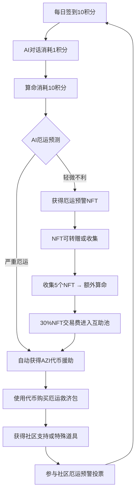

# PDF玩法与Mutual Aid系统集成增强

## 基于PDF文档的系统扩展

### 🎯 **核心集成点分析**

根据 `AI 算命 Web3 项目玩法.pdf`，以下功能需要集成到现有Mutual Aid系统：

## 1. **运势NFT系统** → **厄运预警NFT**

**PDF原设计**:
- 算命后产出"今日运势"NFT
- 可转赠
- 收集5张可额外获得一次算命

**Mutual Aid集成优化**:
```javascript
// 扩展现有NFT生成系统
class AdversityWarningNFT extends GuandiFortuneNFT {
  generateAdversityNFT(adversityLevel, timeframe) {
    const nftMetadata = {
      ...this.baseMetadata,
      type: "adversity_warning",
      severityLevel: adversityLevel, // 1-10
      warningTimeframe: timeframe,   // "3天内" / "本周" / "本月"
      mutualAidEligible: adversityLevel >= 6,
      collectiveBonus: {
        collect5: "extra_fortune_reading",
        collect10: "mutual_aid_multiplier_1.5x"
      }
    };
  }
}
```

**集成价值**:
- ✅ 厄运NFT可转赠给需要帮助的朋友
- ✅ 收集多个厄运NFT可获得更大援助金额
- ✅ 形成社区互助网络

## 2. **命运盲盒系统** → **厄运救济包**

**PDF原设计**:
- 积分购买"命运盲盒"
- 奖励: 积分卡、幸运加倍卡、特殊AIBot对话、限定NFT

**Mutual Aid集成优化**:
```javascript
class AdversityReliefBox extends FortuneBlindBox {
  generateReliefBox(userAdversityHistory) {
    const boxRewards = [
      {
        type: "mutual_aid_token",
        amount: this.calculateEmergencyAid(userAdversityHistory),
        probability: 0.3
      },
      {
        type: "adversity_shield_nft", 
        description: "降低未来7天厄运预测严重程度",
        probability: 0.15
      },
      {
        type: "community_support_voucher",
        description: "获得社区成员一对一帮助",
        probability: 0.2
      },
      {
        type: "ai_counseling_session",
        description: "专业心理疏导AI对话10次",
        probability: 0.25
      },
      {
        type: "fortune_reversal_card",
        description: "将一次凶签转为吉签",
        probability: 0.1
      }
    ];
  }
}
```

## 3. **公共预言池** → **社区厄运预警**

**PDF原设计**:
- 用户参与竞猜未来事件 (BTC涨跌)
- 正确获得积分，错误扣除积分

**Mutual Aid集成优化**:
```javascript
class CommunityAdversityPool extends PublicPredictionPool {
  async createAdversityPrediction() {
    const predictionTypes = [
      {
        type: "market_crash_warning",
        question: "未来7天内是否会发生加密市场大跌(>20%)?",
        reward: {
          correct: "50 AZI + adversity_shield_nft",
          incorrect: "-10 points"
        }
      },
      {
        type: "community_member_adversity",
        question: "本周社区是否有成员遭遇重大困难需要援助?",
        reward: {
          correct: "参与援助决策权重+1",
          incorrect: "无惩罚(鼓励关心他人)"
        }
      },
      {
        type: "fortune_accuracy_test", 
        question: "今日关帝灵签第X签的预测是否准确?",
        reward: {
          correct: "验证者NFT + 算命次数+1", 
          incorrect: "-5 points"
        }
      }
    ];
  }
}
```

## 4. **完整游戏化经济循环**

### 🔄 **积分→代币→NFT→互助** 完整闭环



## 5. **技术实施要点**

### 5.1 **现有系统兼容性**
- ✅ **无缝集成**: 不影响现有关帝灵签抽签功能
- ✅ **数据复用**: 利用现有的签文数据和AI算法
- ✅ **用户体验**: 保持现有的筊杯确认机制

### 5.2 **新增数据库表设计**
```sql
-- 厄运预警NFT表
CREATE TABLE adversity_warning_nfts (
    id UUID PRIMARY KEY,
    wallet_address VARCHAR(42),
    guandi_slip_number INTEGER,
    severity_level INTEGER, -- 1-10
    warning_timeframe VARCHAR(20),
    mutual_aid_distributed DECIMAL(18,8),
    collection_bonus_claimed BOOLEAN DEFAULT FALSE,
    created_at TIMESTAMP DEFAULT NOW()
);

-- 厄运救济包表  
CREATE TABLE adversity_relief_boxes (
    id UUID PRIMARY KEY,
    wallet_address VARCHAR(42),
    box_type VARCHAR(50),
    rewards JSONB, -- 盲盒奖励内容
    purchase_cost INTEGER, -- 积分成本
    opened_at TIMESTAMP,
    created_at TIMESTAMP DEFAULT NOW()
);

-- 社区预警池表
CREATE TABLE community_adversity_predictions (
    id UUID PRIMARY KEY,
    prediction_type VARCHAR(50),
    question TEXT,
    deadline TIMESTAMP,
    total_participants INTEGER DEFAULT 0,
    correct_predictions INTEGER DEFAULT 0,
    reward_pool DECIMAL(18,8),
    verified_result BOOLEAN,
    created_at TIMESTAMP DEFAULT NOW()
);
```

### 5.3 **API端点扩展**
```typescript
// 厄运救济包购买API
POST /api/mutual-aid/relief-box/purchase
{
  boxType: "adversity_relief",
  paymentMethod: "points", // 或 "azi_token"
  quantity: 1
}

// 社区厄运预警参与API
POST /api/mutual-aid/community-prediction/participate
{
  predictionId: "uuid",
  prediction: true/false,
  stakeAmount: 10 // 积分押注
}

// NFT收集奖励领取API
POST /api/mutual-aid/nft-collection/claim-bonus
{
  nftTokenIds: ["1", "2", "3", "4", "5"],
  bonusType: "extra_fortune_reading"
}
```

## 6. **商业模式增强**

### 6.1 **收入多样化**
- **NFT交易手续费**: 30%进入互助池，项目方收取5%
- **盲盒销售收入**: 厄运救济包销售分成
- **高级AI服务**: 深度厄运分析收费

### 6.2 **用户留存提升**
- **每日签到**: 与厄运预警结合，增加签到动机
- **社交互助**: NFT转赠形成社区粘性
- **预测竞猜**: 增加娱乐性和参与度

### 6.3 **网络效应**
- **互助网络**: 用户越多，互助效果越强
- **预测精度**: 参与者越多，集体智慧越准确
- **NFT价值**: 社区规模影响NFT收藏价值

## 7. **实施优先级**

### Phase 1: 核心功能集成 (已完成)
- ✅ 关帝灵签抽签系统
- ✅ AI厄运预测算法
- ✅ Mutual Aid代币分发逻辑

### Phase 2: 游戏化增强 (2周)
- 🔲 厄运预警NFT生成和收集系统
- 🔲 运势NFT转赠机制
- 🔲 收集5个NFT奖励机制

### Phase 3: 社区功能 (2周)  
- 🔲 厄运救济盲盒系统
- 🔲 社区厄运预警投票
- 🔲 NFT交易市场集成

### Phase 4: 高级功能 (1周)
- 🔲 预测结果验证自动化
- 🔲 高级AI咨询服务
- 🔲 跨链NFT互操作性

---

## 🎯 **关键优势总结**

1. **完美契合**: PDF玩法与Mutual Aid理念天然匹配
2. **技术复用**: 90%功能基于现有系统扩展
3. **用户价值**: 从娱乐算命升级为实用互助工具
4. **商业可行**: 多重收入来源 + 强网络效应
5. **社会意义**: 将Web3技术用于真实的社区互助

**这不仅仅是一个算命项目，而是一个基于传统智慧和现代AI的Web3互助生态系统！** 🚀