# AstroZi Mutual Aid System - Technical Design Document (TDD)

## Document Information
- **Project**: AstroZi Web3 Life Engineering Platform
- **Feature**: Mutual Aid Token Reward System with Guandi Fortune Slip NFT Integration
- **Version**: 1.0
- **Date**: 2025-01-09
- **Authors**: Development Team Lead
- **Review Status**: Draft

---

## Table of Contents
1. [Executive Summary](#executive-summary)
2. [System Architecture](#system-architecture)
3. [Technology Stack](#technology-stack)
4. [Database Design](#database-design)
5. [Smart Contract Architecture](#smart-contract-architecture)
6. [API Architecture](#api-architecture)
7. [Frontend Architecture](#frontend-architecture)
8. [Security Design](#security-design)
9. [Performance Requirements](#performance-requirements)
10. [Deployment Architecture](#deployment-architecture)
11. [Testing Strategy](#testing-strategy)
12. [Monitoring & Logging](#monitoring--logging)

---

## Executive Summary

### 🎯 **Project Overview**
The Mutual Aid Token Reward System transforms AstroZi from a traditional fortune-telling platform into a Web3 mutual assistance ecosystem. Users receive AI-powered adversity predictions based on Guandi fortune slips, Bazi (八字), and Ziwei (紫微) analysis, triggering automatic $AZI token distributions during difficult periods.

### 🔧 **Technical Scope**
- **Brownfield Integration**: Seamless integration with existing AstroZi infrastructure
- **Smart Contract Extensions**: Extending `AstroZiPointsSystemFixed.sol` with Mutual Aid functionality
- **AI Enhancement**: Adversity prediction using existing Bazi/Ziwei algorithms
- **NFT System**: Guandi fortune slip NFT minting with rarity-based generation
- **Community Features**: Social validation and transparent mutual aid network

### 📈 **Success Metrics**
- **Technical**: <3s AI analysis, <30s NFT minting, >99% uptime
- **Business**: >1000 active mutual aid participants within 6 months
- **User**: >80% user satisfaction with AI prediction accuracy

---

## System Architecture

### 🏗️ **High-Level Architecture**

```mermaid
graph TB
    subgraph "Frontend Layer"
        A[React/Next.js App] --> B[Web3 Wallet Integration]
        A --> C[Guandi Page UI]
        A --> D[Mutual Aid Dashboard]
    end
    
    subgraph "API Layer"
        E[/api/guandi/draw] --> F[/api/mutual-aid/analyze]
        F --> G[/api/mutual-aid/distribute] 
        G --> H[/api/nft/mint]
        H --> I[/api/community/validate]
    end
    
    subgraph "AI Services Layer"
        J[Adversity Analyzer] --> K[Bazi Calculator]
        J --> L[Ziwei Calculator] 
        J --> M[Guandi Slip Interpreter]
        J --> N[GPT-4/Claude AI]
    end
    
    subgraph "Blockchain Layer"
        O[AstroZiPointsSystemFixed.sol] --> P[MutualAidExtension.sol]
        P --> Q[GuandiNFT.sol]
        Q --> R[BSC Network]
    end
    
    subgraph "Data Layer"
        S[Supabase PostgreSQL] --> T[fortune_slips]
        S --> U[guandi_daily_draws]
        S --> V[mutual_aid_distributions]
        S --> W[user_points_web3]
    end
    
    subgraph "Storage Layer"
        X[IPFS] --> Y[NFT Metadata]
        X --> Z[NFT Images]
    end
    
    A --> E
    E --> J
    J --> P
    P --> S
    H --> X
```

### 🔄 **Data Flow Architecture**

```mermaid
sequenceDiagram
    participant User as 👤 User
    participant UI as 🖥️ Frontend
    participant API as 🔌 API Layer
    participant AI as 🧠 AI Service
    participant BC as ⛓️ Blockchain
    participant DB as 🗄️ Database
    participant IPFS as 📁 IPFS

    User->>UI: 摇签请求
    UI->>API: POST /api/guandi/draw
    API->>DB: 检查每日限制
    API->>DB: 随机选择签文
    API->>UI: 返回待确认签文
    User->>UI: 筊杯确认
    UI->>API: 筊杯结果确认
    API->>AI: 厄运分析请求
    AI->>AI: Bazi+Ziwei+签文分析
    AI->>API: 厄运预测结果
    
    alt 厄运等级 >= 6
        API->>BC: 分发Mutual Aid代币
        BC->>DB: 更新用户余额
    end
    
    API->>IPFS: 上传NFT元数据
    IPFS->>API: 返回IPFS哈希
    API->>BC: 铸造Guandi NFT
    BC->>API: 返回Token ID
    API->>DB: 记录NFT铸造
    API->>UI: 返回完整结果
    UI->>User: 显示签文+奖励
```



---

## Technology Stack

### 💻 **Frontend Stack**
```typescript
// 核心框架
- Next.js 14 (App Router)
- React 18 (Hooks + Context)
- TypeScript 5.0+
- Tailwind CSS 3.0+

// Web3 集成
- ethers.js 6.0+
- WalletConnect 2.0
- wagmi (React Hooks for Ethereum)

// UI 组件
- Radix UI (无障碍组件)
- Lucide React (图标)
- Framer Motion (动画)

// 状态管理
- Zustand (轻量状态管理)
- React Query (数据获取)
```

### 🔗 **Backend Stack**
```typescript
// 运行时环境
- Node.js 18+ LTS
- Next.js API Routes
- TypeScript 5.0+

// 数据库
- Supabase PostgreSQL
- Redis (缓存层)

// AI 服务
- OpenAI GPT-4 API
- Anthropic Claude API
- 自研八字/紫微算法

// 区块链集成
- ethers.js 6.0+
- BSC (Binance Smart Chain)
- IPFS (Pinata/Infura)
```

### ⛓️ **Blockchain Stack**
```solidity
// 智能合约
- Solidity 0.8.19+
- OpenZeppelin Contracts 4.9+
- Hardhat 开发环境
- BSC Mainnet/Testnet

// 合约架构
- AstroZiPointsSystemFixed.sol (主合约)
- MutualAidExtension.sol (扩展合约)  
- GuandiNFT.sol (NFT合约)
- AccessControl.sol (权限控制)
```

### 🗄️ **Database Stack**
```sql
-- 主数据库
- PostgreSQL 15+ (Supabase)
- Row Level Security (RLS)
- Real-time subscriptions

-- 缓存层
- Redis 7.0+ (会话/缓存)
- Memcached (查询缓存)

-- 文件存储
- IPFS (去中心化存储)
- Supabase Storage (传统存储)
```

---

## Database Design

### 📊 **Core Tables Extension**

#### 1. **Mutual Aid Distribution Table**
```sql
CREATE TABLE mutual_aid_distributions (
    id UUID PRIMARY KEY DEFAULT uuid_generate_v4(),
    wallet_address VARCHAR(42) NOT NULL,
    guandi_slip_number INTEGER NOT NULL,
    adversity_type adversity_type_enum NOT NULL, -- health, wealth, career, relationship
    severity_level INTEGER NOT NULL CHECK (severity_level BETWEEN 1 AND 10),
    ai_analysis_result JSONB NOT NULL,
    token_amount DECIMAL(18,8) NOT NULL,
    distribution_tx_hash VARCHAR(66),
    nft_token_id BIGINT,
    community_validated BOOLEAN DEFAULT FALSE,
    validation_votes INTEGER DEFAULT 0,
    created_at TIMESTAMP WITH TIME ZONE DEFAULT NOW(),
    distributed_at TIMESTAMP WITH TIME ZONE,
    
    -- Indexes for performance
    INDEX idx_wallet_address (wallet_address),
    INDEX idx_adversity_type (adversity_type),
    INDEX idx_severity_level (severity_level),
    INDEX idx_created_at (created_at)
);

-- Row Level Security
ALTER TABLE mutual_aid_distributions ENABLE ROW LEVEL SECURITY;

CREATE POLICY "Users can view their own distributions" ON mutual_aid_distributions
    FOR SELECT USING (wallet_address = current_setting('app.current_user_wallet'));

CREATE POLICY "Public can view distributions for transparency" ON mutual_aid_distributions
    FOR SELECT USING (true);
```

#### 2. **Adversity Analysis History**
```sql
CREATE TABLE adversity_analysis_history (
    id UUID PRIMARY KEY DEFAULT uuid_generate_v4(),
    wallet_address VARCHAR(42) NOT NULL,
    guandi_slip_id UUID NOT NULL REFERENCES fortune_slips(id),
    user_bazi_data JSONB, -- 八字数据
    user_ziwei_data JSONB, -- 紫微数据
    ai_prompt TEXT,
    ai_response JSONB,
    adversity_metrics JSONB, -- 各维度风险评分
    severity_score INTEGER NOT NULL,
    mutual_aid_eligible BOOLEAN NOT NULL,
    suggested_aid_amount DECIMAL(18,8),
    timeframe_prediction VARCHAR(50),
    analysis_duration_ms INTEGER,
    ai_model_used VARCHAR(50) DEFAULT 'gpt-4',
    created_at TIMESTAMP WITH TIME ZONE DEFAULT NOW(),
    
    -- Composite index for user queries
    INDEX idx_wallet_analysis_date (wallet_address, created_at DESC),
    INDEX idx_severity_eligible (severity_score, mutual_aid_eligible)
);
```

#### 3. **Guandi NFT Collection**
```sql
CREATE TABLE guandi_nft_collection (
    id UUID PRIMARY KEY DEFAULT uuid_generate_v4(),
    token_id BIGINT UNIQUE NOT NULL,
    wallet_address VARCHAR(42) NOT NULL,
    guandi_slip_number INTEGER NOT NULL,
    slip_title VARCHAR(200) NOT NULL,
    rarity_level rarity_enum NOT NULL, -- legendary, epic, rare
    fortune_level VARCHAR(50),
    mint_timestamp TIMESTAMP WITH TIME ZONE NOT NULL,
    consecutive_days INTEGER, -- 连续抽签天数影响稀有度
    adversity_level INTEGER, -- 厄运等级影响稀有度
    ipfs_metadata_hash VARCHAR(100) NOT NULL,
    ipfs_image_hash VARCHAR(100) NOT NULL,
    mint_tx_hash VARCHAR(66),
    transfer_count INTEGER DEFAULT 0,
    last_transfer_at TIMESTAMP WITH TIME ZONE,
    mutual_aid_bonus_used BOOLEAN DEFAULT FALSE, -- 是否已用于互助加成
    created_at TIMESTAMP WITH TIME ZONE DEFAULT NOW(),
    
    -- Performance indexes
    INDEX idx_wallet_rarity (wallet_address, rarity_level),
    INDEX idx_slip_number (guandi_slip_number),
    INDEX idx_mint_timestamp (mint_timestamp DESC)
);
```

#### 4. **Community Validation System**
```sql
CREATE TABLE community_validation_votes (
    id UUID PRIMARY KEY DEFAULT uuid_generate_v4(),
    distribution_id UUID NOT NULL REFERENCES mutual_aid_distributions(id),
    voter_wallet_address VARCHAR(42) NOT NULL,
    vote validation_vote_enum NOT NULL, -- approve, reject, need_more_info
    vote_weight DECIMAL(8,4) NOT NULL, -- 基于NFT持有量的投票权重
    reasoning TEXT,
    nft_holdings_snapshot JSONB, -- 投票时的NFT持有情况
    created_at TIMESTAMP WITH TIME ZONE DEFAULT NOW(),
    
    -- Prevent duplicate votes
    UNIQUE(distribution_id, voter_wallet_address),
    INDEX idx_distribution_vote (distribution_id, vote)
);
```

#### 5. **Extended User Points Web3 Table**
```sql
-- 扩展现有表结构
ALTER TABLE user_points_web3 ADD COLUMN IF NOT EXISTS 
    guandi_nft_mints_count INTEGER DEFAULT 0,
    guandi_fortune_draws_count INTEGER DEFAULT 0,
    guandi_consecutive_streak INTEGER DEFAULT 0,
    guandi_max_streak INTEGER DEFAULT 0,
    last_guandi_draw_date DATE,
    mutual_aid_received_total DECIMAL(18,8) DEFAULT 0,
    mutual_aid_validation_weight DECIMAL(8,4) DEFAULT 1.0,
    adversity_predictions_accurate INTEGER DEFAULT 0,
    adversity_predictions_total INTEGER DEFAULT 0,
    community_reputation_score INTEGER DEFAULT 100;

-- Add indexes for new columns
CREATE INDEX IF NOT EXISTS idx_user_points_guandi_streak ON user_points_web3(guandi_consecutive_streak DESC);
CREATE INDEX IF NOT EXISTS idx_user_points_validation_weight ON user_points_web3(mutual_aid_validation_weight DESC);
```

### 📈 **Database Performance Optimization**

#### Connection Pooling
```typescript
// lib/database/connection.ts
import { createPool } from '@supabase/supabase-js'

export const supabasePool = createPool({
  url: process.env.NEXT_PUBLIC_SUPABASE_URL!,
  key: process.env.SUPABASE_SERVICE_ROLE_KEY!,
  options: {
    db: {
      pool: {
        max: 20, // 最大连接数
        min: 5,  // 最小连接数
        idle: 10000, // 空闲超时
      }
    },
    realtime: {
      enabled: true,
      heartbeat: 30000
    }
  }
})
```

#### Query Optimization
```sql
-- 高频查询优化
CREATE MATERIALIZED VIEW daily_mutual_aid_stats AS
SELECT 
    DATE(created_at) as date,
    COUNT(*) as total_distributions,
    SUM(token_amount) as total_amount,
    AVG(severity_level) as avg_severity,
    COUNT(DISTINCT wallet_address) as unique_recipients
FROM mutual_aid_distributions 
WHERE created_at >= NOW() - INTERVAL '30 days'
GROUP BY DATE(created_at);

-- 定期刷新物化视图
CREATE OR REPLACE FUNCTION refresh_daily_stats()
RETURNS void AS $$
BEGIN
    REFRESH MATERIALIZED VIEW CONCURRENTLY daily_mutual_aid_stats;
END;
$$ LANGUAGE plpgsql;

-- 创建定时任务
SELECT cron.schedule('refresh-stats', '0 1 * * *', 'SELECT refresh_daily_stats();');
```

---

## Smart Contract Architecture

### 📜 **Contract Structure**

#### 1. **MutualAidExtension.sol** - 核心扩展合约
```solidity
// SPDX-License-Identifier: MIT
pragma solidity ^0.8.19;

import "./AstroZiPointsSystem_Fixed.sol";
import "@openzeppelin/contracts/security/ReentrancyGuard.sol";
import "@openzeppelin/contracts/security/Pausable.sol";
import "@openzeppelin/contracts/access/AccessControl.sol";

/**
 * @title MutualAidExtension
 * @notice 扩展现有积分系统，添加互助代币分发功能
 */
contract MutualAidExtension is AstroZiPointsSystemFixed, ReentrancyGuard, Pausable, AccessControl {
    bytes32 public constant AI_ORACLE_ROLE = keccak256("AI_ORACLE_ROLE");
    bytes32 public constant COMMUNITY_VALIDATOR_ROLE = keccak256("COMMUNITY_VALIDATOR_ROLE");
    
    // 互助分发记录
    struct MutualAidDistribution {
        uint256 timestamp;
        address recipient;
        uint256 amount;
        AdversityType adversityType;
        uint8 severityLevel; // 1-10
        uint256 guangdiSlipNumber;
        uint256 nftTokenId;
        bool communityValidated;
        string ipfsHash; // AI分析结果存储
    }
    
    enum AdversityType {
        HEALTH,
        WEALTH, 
        CAREER,
        RELATIONSHIP
    }
    
    // 映射和状态变量
    mapping(address => MutualAidDistribution[]) public userMutualAidHistory;
    mapping(uint256 => bool) public distributionValidated;
    
    uint256 public totalMutualAidDistributed;
    uint256 public mutualAidFundBalance;
    uint256 public communityValidationThreshold = 3; // 需要3个验证者
    uint256 public maxDailyDistributionPerUser = 1000 * 10**18; // 1000 AZI
    
    // 事件定义
    event MutualAidDistributed(
        address indexed recipient,
        uint256 amount,
        AdversityType adversityType,
        uint8 severityLevel,
        uint256 guangdiSlipNumber,
        uint256 distributionId
    );
    
    event CommunityValidation(
        uint256 indexed distributionId,
        address indexed validator,
        bool approved,
        uint256 validationCount
    );
    
    event NFTMintedForAdversity(
        address indexed recipient,
        uint256 tokenId,
        uint256 guangdiSlipNumber,
        string rarity
    );
    
    constructor(
        address _aziToken,
        address _nftContract,
        address _initialAdmin
    ) AstroZiPointsSystemFixed(_aziToken) {
        _grantRole(DEFAULT_ADMIN_ROLE, _initialAdmin);
        _grantRole(AI_ORACLE_ROLE, _initialAdmin);
    }
    
    /**
     * @notice AI预言机调用的互助代币分发函数
     * @param recipient 接收者地址
     * @param amount 分发金额
     * @param adversityType 厄运类型
     * @param severityLevel 严重程度 (1-10)
     * @param guangdiSlipNumber 关帝签号
     * @param analysisHash AI分析结果的IPFS哈希
     */
    function distributeMutualAid(
        address recipient,
        uint256 amount,
        AdversityType adversityType,
        uint8 severityLevel,
        uint256 guangdiSlipNumber,
        string calldata analysisHash
    ) external onlyRole(AI_ORACLE_ROLE) nonReentrant whenNotPaused {
        require(recipient != address(0), "Invalid recipient");
        require(amount > 0 && amount <= maxDailyDistributionPerUser, "Invalid amount");
        require(severityLevel >= 1 && severityLevel <= 10, "Invalid severity level");
        require(severityLevel >= 6, "Severity too low for mutual aid");
        require(guangdiSlipNumber >= 1 && guangdiSlipNumber <= 100, "Invalid slip number");
        
        // 检查每日限额
        require(_checkDailyLimit(recipient, amount), "Daily limit exceeded");
        
        // 检查资金池余额
        require(mutualAidFundBalance >= amount, "Insufficient fund balance");
        
        // 创建分发记录
        MutualAidDistribution memory distribution = MutualAidDistribution({
            timestamp: block.timestamp,
            recipient: recipient,
            amount: amount,
            adversityType: adversityType,
            severityLevel: severityLevel,
            guangdiSlipNumber: guangdiSlipNumber,
            nftTokenId: 0, // 将在NFT铸造后更新
            communityValidated: severityLevel >= 8, // 高严重程度自动通过
            ipfsHash: analysisHash
        });
        
        uint256 distributionId = userMutualAidHistory[recipient].length;
        userMutualAidHistory[recipient].push(distribution);
        
        // 转账代币
        _transferFromPool(recipient, amount);
        
        // 更新统计数据
        totalMutualAidDistributed += amount;
        mutualAidFundBalance -= amount;
        
        emit MutualAidDistributed(
            recipient,
            amount,
            adversityType,
            severityLevel,
            guangdiSlipNumber,
            distributionId
        );
    }
    
    /**
     * @notice 社区验证互助分发
     * @param recipient 接收者地址
     * @param distributionIndex 分发记录索引
     * @param approved 是否批准
     */
    function validateMutualAid(
        address recipient,
        uint256 distributionIndex,
        bool approved
    ) external onlyRole(COMMUNITY_VALIDATOR_ROLE) {
        require(distributionIndex < userMutualAidHistory[recipient].length, "Invalid distribution");
        
        MutualAidDistribution storage distribution = userMutualAidHistory[recipient][distributionIndex];
        require(!distribution.communityValidated, "Already validated");
        
        // 在这里实现投票逻辑
        // 简化版：达到阈值即通过
        uint256 distributionId = uint256(keccak256(abi.encodePacked(recipient, distributionIndex)));
        
        if (approved) {
            distribution.communityValidated = true;
        }
        
        emit CommunityValidation(distributionId, msg.sender, approved, 1);
    }
    
    /**
     * @notice 为互助分发铸造NFT
     * @param recipient 接收者
     * @param distributionIndex 分发索引
     * @param nftTokenId NFT Token ID
     */
    function linkNFTToDistribution(
        address recipient,
        uint256 distributionIndex,
        uint256 nftTokenId
    ) external onlyRole(AI_ORACLE_ROLE) {
        require(distributionIndex < userMutualAidHistory[recipient].length, "Invalid distribution");
        
        userMutualAidHistory[recipient][distributionIndex].nftTokenId = nftTokenId;
        
        emit NFTMintedForAdversity(
            recipient,
            nftTokenId,
            userMutualAidHistory[recipient][distributionIndex].guangdiSlipNumber,
            "adversity_warning" // 基于严重程度确定稀有度
        );
    }
    
    // 内部辅助函数
    function _checkDailyLimit(address user, uint256 amount) internal view returns (bool) {
        uint256 todayStart = block.timestamp - (block.timestamp % 1 days);
        uint256 dailyTotal = 0;
        
        MutualAidDistribution[] memory userHistory = userMutualAidHistory[user];
        for (uint i = 0; i < userHistory.length; i++) {
            if (userHistory[i].timestamp >= todayStart) {
                dailyTotal += userHistory[i].amount;
            }
        }
        
        return dailyTotal + amount <= maxDailyDistributionPerUser;
    }
    
    function _transferFromPool(address recipient, uint256 amount) internal {
        // 实现从资金池转账的逻辑
        // 这里需要与现有的积分系统集成
        require(transfer(recipient, amount), "Transfer failed");
    }
    
    // 管理函数
    function addFunds(uint256 amount) external onlyRole(DEFAULT_ADMIN_ROLE) {
        mutualAidFundBalance += amount;
    }
    
    function setValidationThreshold(uint256 threshold) external onlyRole(DEFAULT_ADMIN_ROLE) {
        communityValidationThreshold = threshold;
    }
    
    function pause() external onlyRole(DEFAULT_ADMIN_ROLE) {
        _pause();
    }
    
    function unpause() external onlyRole(DEFAULT_ADMIN_ROLE) {
        _unpause();
    }
    
    // 查询函数
    function getUserMutualAidHistory(address user) external view returns (MutualAidDistribution[] memory) {
        return userMutualAidHistory[user];
    }
    
    function getTotalDistributions() external view returns (uint256) {
        return totalMutualAidDistributed;
    }
    
    function getFundBalance() external view returns (uint256) {
        return mutualAidFundBalance;
    }
}
```

#### 2. **GuandiNFT.sol** - NFT合约
```solidity
// SPDX-License-Identifier: MIT
pragma solidity ^0.8.19;

import "@openzeppelin/contracts/token/ERC721/ERC721.sol";
import "@openzeppelin/contracts/token/ERC721/extensions/ERC721URIStorage.sol";
import "@openzeppelin/contracts/security/Pausable.sol";
import "@openzeppelin/contracts/access/AccessControl.sol";
import "@openzeppelin/contracts/utils/Counters.sol";

/**
 * @title GuandiNFT
 * @notice 关帝灵签NFT合约，支持稀有度系统和互助功能
 */
contract GuandiNFT is ERC721, ERC721URIStorage, Pausable, AccessControl {
    using Counters for Counters.Counter;
    
    bytes32 public constant MINTER_ROLE = keccak256("MINTER_ROLE");
    bytes32 public constant MUTUAL_AID_ROLE = keccak256("MUTUAL_AID_ROLE");
    
    Counters.Counter private _tokenIdCounter;
    
    // NFT元数据结构
    struct FortuneNFTMetadata {
        uint256 slipNumber;      // 签号 1-100
        string rarity;           // 稀有度 legendary/epic/rare
        uint256 mintTimestamp;   // 铸造时间
        string fortuneLevel;     // 吉凶等级
        uint256 consecutiveDays; // 连续抽签天数影响稀有度
        uint8 adversityLevel;    // 厄运等级 (0=无厄运, 1-10=厄运等级)
        bool mutualAidEligible;  // 是否有资格获得互助
        uint256 mutualAidAmount; // 关联的互助金额
    }
    
    mapping(uint256 => FortuneNFTMetadata) public tokenMetadata;
    mapping(address => uint256[]) public userTokens;
    mapping(address => mapping(uint256 => bool)) public hasDailyNFT; // 每日NFT限制
    
    // 稀有度统计
    mapping(string => uint256) public rarityCount;
    uint256 public maxSupply = 10000; // 最大供应量
    
    event NFTMinted(
        address indexed to,
        uint256 indexed tokenId,
        uint256 slipNumber,
        string rarity,
        uint8 adversityLevel
    );
    
    event MutualAidLinked(
        uint256 indexed tokenId,
        uint256 mutualAidAmount,
        bool eligible
    );
    
    constructor(
        string memory name,
        string memory symbol,
        address initialAdmin
    ) ERC721(name, symbol) {
        _grantRole(DEFAULT_ADMIN_ROLE, initialAdmin);
        _grantRole(MINTER_ROLE, initialAdmin);
        _grantRole(MUTUAL_AID_ROLE, initialAdmin);
    }
    
    /**
     * @notice 铸造关帝灵签NFT
     * @param to 接收者地址
     * @param slipNumber 签号
     * @param rarity 稀有度
     * @param fortuneLevel 吉凶等级
     * @param consecutiveDays 连续天数
     * @param adversityLevel 厄运等级
     * @param tokenURI 元数据URI
     */
    function mintFortuneNFT(
        address to,
        uint256 slipNumber,
        string calldata rarity,
        string calldata fortuneLevel,
        uint256 consecutiveDays,
        uint8 adversityLevel,
        string calldata tokenURI
    ) external onlyRole(MINTER_ROLE) returns (uint256) {
        require(to != address(0), "Invalid recipient");
        require(slipNumber >= 1 && slipNumber <= 100, "Invalid slip number");
        require(_tokenIdCounter.current() < maxSupply, "Max supply reached");
        
        uint256 tokenId = _tokenIdCounter.current();
        _tokenIdCounter.increment();
        
        // 铸造NFT
        _safeMint(to, tokenId);
        _setTokenURI(tokenId, tokenURI);
        
        // 设置元数据
        tokenMetadata[tokenId] = FortuneNFTMetadata({
            slipNumber: slipNumber,
            rarity: rarity,
            mintTimestamp: block.timestamp,
            fortuneLevel: fortuneLevel,
            consecutiveDays: consecutiveDays,
            adversityLevel: adversityLevel,
            mutualAidEligible: adversityLevel >= 6,
            mutualAidAmount: 0 // 稍后通过linkMutualAid设置
        });
        
        // 更新用户持有列表
        userTokens[to].push(tokenId);
        
        // 更新稀有度统计
        rarityCount[rarity]++;
        
        emit NFTMinted(to, tokenId, slipNumber, rarity, adversityLevel);
        
        return tokenId;
    }
    
    /**
     * @notice 将NFT与互助记录关联
     * @param tokenId NFT Token ID
     * @param mutualAidAmount 互助金额
     */
    function linkMutualAid(
        uint256 tokenId,
        uint256 mutualAidAmount
    ) external onlyRole(MUTUAL_AID_ROLE) {
        require(_exists(tokenId), "Token does not exist");
        
        tokenMetadata[tokenId].mutualAidAmount = mutualAidAmount;
        
        emit MutualAidLinked(tokenId, mutualAidAmount, tokenMetadata[tokenId].mutualAidEligible);
    }
    
    /**
     * @notice 获取用户的所有NFT
     */
    function getUserTokens(address user) external view returns (uint256[] memory) {
        return userTokens[user];
    }
    
    /**
     * @notice 获取NFT的完整元数据
     */
    function getTokenMetadata(uint256 tokenId) external view returns (FortuneNFTMetadata memory) {
        require(_exists(tokenId), "Token does not exist");
        return tokenMetadata[tokenId];
    }
    
    /**
     * @notice 计算用户的互助验证权重
     * @dev 基于用户持有的NFT稀有度和数量计算权重
     */
    function calculateValidationWeight(address user) external view returns (uint256) {
        uint256[] memory tokens = userTokens[user];
        uint256 weight = 0;
        
        for (uint i = 0; i < tokens.length; i++) {
            FortuneNFTMetadata memory metadata = tokenMetadata[tokens[i]];
            
            // 基于稀有度分配权重
            if (keccak256(bytes(metadata.rarity)) == keccak256(bytes("legendary"))) {
                weight += 10;
            } else if (keccak256(bytes(metadata.rarity)) == keccak256(bytes("epic"))) {
                weight += 5;
            } else {
                weight += 1;
            }
            
            // 厄运NFT额外权重
            if (metadata.adversityLevel >= 6) {
                weight += metadata.adversityLevel;
            }
        }
        
        return weight;
    }
    
    // Override functions
    function _beforeTokenTransfer(address from, address to, uint256 tokenId, uint256 batchSize)
        internal
        whenNotPaused
        override
    {
        super._beforeTokenTransfer(from, to, tokenId, batchSize);
        
        // 更新用户持有列表
        if (from != address(0) && to != address(0)) {
            // 从发送者列表中移除
            _removeTokenFromUser(from, tokenId);
            // 添加到接收者列表
            userTokens[to].push(tokenId);
        }
    }
    
    function _removeTokenFromUser(address user, uint256 tokenId) internal {
        uint256[] storage tokens = userTokens[user];
        for (uint i = 0; i < tokens.length; i++) {
            if (tokens[i] == tokenId) {
                tokens[i] = tokens[tokens.length - 1];
                tokens.pop();
                break;
            }
        }
    }
    
    function _burn(uint256 tokenId) internal override(ERC721, ERC721URIStorage) {
        super._burn(tokenId);
    }
    
    function tokenURI(uint256 tokenId) 
        public 
        view 
        override(ERC721, ERC721URIStorage) 
        returns (string memory) 
    {
        return super.tokenURI(tokenId);
    }
    
    function supportsInterface(bytes4 interfaceId)
        public
        view
        override(ERC721, ERC721URIStorage, AccessControl)
        returns (bool)
    {
        return super.supportsInterface(interfaceId);
    }
    
    // 管理函数
    function pause() public onlyRole(DEFAULT_ADMIN_ROLE) {
        _pause();
    }
    
    function unpause() public onlyRole(DEFAULT_ADMIN_ROLE) {
        _unpause();
    }
    
    function setMaxSupply(uint256 _maxSupply) external onlyRole(DEFAULT_ADMIN_ROLE) {
        maxSupply = _maxSupply;
    }
    
    function totalSupply() public view returns (uint256) {
        return _tokenIdCounter.current();
    }
    
    function getRarityStats() external view returns (
        uint256 legendary,
        uint256 epic, 
        uint256 rare
    ) {
        return (
            rarityCount["legendary"],
            rarityCount["epic"], 
            rarityCount["rare"]
        );
    }
}
```

### 🔐 **Smart Contract Security**

#### Gas Optimization
```solidity
// Gas优化技巧
contract GasOptimizedMutualAid {
    // 使用packed structs减少存储成本
    struct PackedDistribution {
        address recipient;     // 20 bytes
        uint96 amount;        // 12 bytes (足够存储代币金额)
        uint32 timestamp;     // 4 bytes (2106年前足够)
        uint16 slipNumber;    // 2 bytes (1-100)
        uint8 adversityType;  // 1 byte
        uint8 severityLevel;  // 1 byte
        // Total: 40 bytes = 1.25 storage slots
    }
    
    // 批量操作减少gas成本
    function batchDistribute(
        address[] calldata recipients,
        uint256[] calldata amounts,
        uint8[] calldata severityLevels
    ) external onlyRole(AI_ORACLE_ROLE) {
        require(
            recipients.length == amounts.length && 
            amounts.length == severityLevels.length,
            "Array length mismatch"
        );
        
        for (uint256 i = 0; i < recipients.length;) {
            _distributeSingle(recipients[i], amounts[i], severityLevels[i]);
            unchecked { ++i; } // Gas optimization
        }
    }
}
```

#### Reentrancy Protection
```solidity
// 防重入攻击
import "@openzeppelin/contracts/security/ReentrancyGuard.sol";

contract SecureMutualAid is ReentrancyGuard {
    mapping(address => bool) private _distributing;
    
    function distributeMutualAid(
        address recipient,
        uint256 amount
    ) external nonReentrant {
        require(!_distributing[recipient], "Distribution in progress");
        _distributing[recipient] = true;
        
        // 执行分发逻辑
        _performDistribution(recipient, amount);
        
        _distributing[recipient] = false;
    }
    
    // 使用 Checks-Effects-Interactions 模式
    function _performDistribution(address recipient, uint256 amount) internal {
        // Checks
        require(recipient != address(0), "Invalid recipient");
        require(amount <= maxDailyDistributionPerUser, "Amount too large");
        require(mutualAidFundBalance >= amount, "Insufficient funds");
        
        // Effects (状态变更在外部调用之前)
        mutualAidFundBalance -= amount;
        totalMutualAidDistributed += amount;
        
        // Interactions (外部调用最后执行)
        require(IERC20(aziToken).transfer(recipient, amount), "Transfer failed");
    }
}
```

---

## API Architecture

### 🔌 **RESTful API Design**

#### 1. **Mutual Aid Core APIs**
```typescript
// app/api/mutual-aid/analyze/route.ts
import { NextRequest, NextResponse } from 'next/server';
import { AdversityAnalyzer } from '@/lib/services/guandi-adversity-analyzer';
import { validateWeb3User } from '@/lib/auth/web3-auth';
import { rateLimiter } from '@/lib/middleware/rate-limit';

export async function POST(request: NextRequest) {
  try {
    // 1. Rate limiting (防止滥用)
    const rateLimitResult = await rateLimiter.check(request, 'mutual-aid-analysis', 5, 60000); // 5 req/min
    if (!rateLimitResult.success) {
      return NextResponse.json({ 
        error: 'Rate limit exceeded',
        retryAfter: rateLimitResult.retryAfter 
      }, { status: 429 });
    }
    
    // 2. 验证Web3用户身份
    const web3User = await validateWeb3User(request);
    if (!web3User) {
      return NextResponse.json({ error: 'Web3 authentication required' }, { status: 401 });
    }
    
    // 3. 解析请求数据
    const body = await request.json();
    const { slipData, userProfile } = body;
    
    // 4. 验证输入数据
    if (!slipData?.slip_number || !slipData?.fortune_level) {
      return NextResponse.json({ error: 'Invalid slip data' }, { status: 400 });
    }
    
    // 5. AI厄运分析
    const analyzer = new AdversityAnalyzer();
    const analysisResult = await analyzer.analyzeSlipAndProfile(
      slipData,
      userProfile.baziData,
      userProfile.ziweiData
    );
    
    // 6. 记录分析历史
    const { data: analysisRecord, error: recordError } = await supabase
      .from('adversity_analysis_history')
      .insert({
        wallet_address: web3User.walletAddress,
        guandi_slip_id: slipData.id,
        user_bazi_data: userProfile.baziData,
        user_ziwei_data: userProfile.ziweiData,
        ai_response: analysisResult,
        severity_score: analysisResult.severityLevel,
        mutual_aid_eligible: analysisResult.mutualAidEligible,
        suggested_aid_amount: analysisResult.suggestedAmount,
        analysis_duration_ms: Date.now() - startTime
      })
      .select()
      .single();
    
    // 7. 如果符合互助条件，触发代币分发
    let distributionResult = null;
    if (analysisResult.mutualAidEligible && analysisResult.severityLevel >= 6) {
      distributionResult = await distributeMutualAidTokens(
        web3User.walletAddress,
        analysisResult.suggestedAmount,
        analysisResult.adversityType,
        analysisResult.severityLevel,
        slipData.slip_number,
        analysisRecord.id
      );
    }
    
    // 8. NFT铸造 (异步进行)
    mintAdversityNFT(
      web3User.walletAddress,
      slipData,
      analysisResult
    ).catch(error => {
      console.error('NFT minting failed:', error);
      // 记录错误但不影响主流程
    });
    
    return NextResponse.json({
      success: true,
      data: {
        analysis: analysisResult,
        mutualAidDistributed: distributionResult?.amount || 0,
        distributionTxHash: distributionResult?.txHash,
        analysisId: analysisRecord.id,
        estimatedNFTMintTime: '30-60 seconds'
      }
    });
    
  } catch (error) {
    console.error('Mutual aid analysis error:', error);
    
    // 错误监控
    await logError('mutual-aid-analysis', error, {
      walletAddress: web3User?.walletAddress,
      timestamp: Date.now()
    });
    
    return NextResponse.json({ 
      error: 'Analysis failed',
      message: process.env.NODE_ENV === 'development' ? error.message : 'Internal server error'
    }, { status: 500 });
  }
}

// GET 方法：获取用户的互助历史
export async function GET(request: NextRequest) {
  try {
    const { searchParams } = new URL(request.url);
    const walletAddress = searchParams.get('wallet_address')?.toLowerCase();
    const limit = parseInt(searchParams.get('limit') || '10');
    const offset = parseInt(searchParams.get('offset') || '0');
    
    if (!walletAddress || !ethers.isAddress(walletAddress)) {
      return NextResponse.json({ error: 'Valid wallet address required' }, { status: 400 });
    }
    
    // 获取用户互助历史
    const { data: mutualAidHistory, error } = await supabase
      .from('mutual_aid_distributions')
      .select(`
        *,
        adversity_analysis_history:analysis_id (
          ai_response,
          adversity_metrics
        )
      `)
      .eq('wallet_address', walletAddress)
      .order('created_at', { ascending: false })
      .range(offset, offset + limit - 1);
    
    if (error) {
      throw error;
    }
    
    // 聚合统计信息
    const { data: statsData } = await supabase
      .from('mutual_aid_distributions')
      .select('token_amount, adversity_type, severity_level')
      .eq('wallet_address', walletAddress);
    
    const stats = {
      totalReceived: statsData?.reduce((sum, item) => sum + parseFloat(item.token_amount), 0) || 0,
      distributionCount: statsData?.length || 0,
      averageSeverity: statsData?.reduce((sum, item) => sum + item.severity_level, 0) / (statsData?.length || 1),
      adversityTypeBreakdown: statsData?.reduce((acc, item) => {
        acc[item.adversity_type] = (acc[item.adversity_type] || 0) + 1;
        return acc;
      }, {}) || {}
    };
    
    return NextResponse.json({
      success: true,
      data: {
        history: mutualAidHistory,
        stats,
        pagination: {
          limit,
          offset,
          hasMore: mutualAidHistory.length === limit
        }
      }
    });
    
  } catch (error) {
    console.error('Get mutual aid history error:', error);
    return NextResponse.json({ error: 'Failed to fetch history' }, { status: 500 });
  }
}
```

#### 2. **Community Validation API**
```typescript
// app/api/mutual-aid/community/validate/route.ts
export async function POST(request: NextRequest) {
  try {
    const web3User = await validateWeb3User(request);
    if (!web3User) {
      return NextResponse.json({ error: 'Authentication required' }, { status: 401 });
    }
    
    const { distributionId, vote, reasoning } = await request.json();
    
    // 验证用户是否有投票资格（基于NFT持有量）
    const validationWeight = await calculateUserValidationWeight(web3User.walletAddress);
    if (validationWeight < 1) {
      return NextResponse.json({ 
        error: 'Insufficient validation weight',
        message: 'Hold Guandi NFTs to participate in community validation'
      }, { status: 403 });
    }
    
    // 检查是否已经投票
    const { data: existingVote } = await supabase
      .from('community_validation_votes')
      .select('id')
      .eq('distribution_id', distributionId)
      .eq('voter_wallet_address', web3User.walletAddress)
      .single();
    
    if (existingVote) {
      return NextResponse.json({ error: 'Already voted on this distribution' }, { status: 409 });
    }
    
    // 获取当前NFT持有情况快照
    const nftSnapshot = await getUserNFTSnapshot(web3User.walletAddress);
    
    // 记录投票
    const { data: voteRecord, error: voteError } = await supabase
      .from('community_validation_votes')
      .insert({
        distribution_id: distributionId,
        voter_wallet_address: web3User.walletAddress,
        vote: vote,
        vote_weight: validationWeight,
        reasoning: reasoning,
        nft_holdings_snapshot: nftSnapshot
      })
      .select()
      .single();
    
    if (voteError) {
      throw voteError;
    }
    
    // 检查是否达到验证阈值
    const validationResult = await checkValidationThreshold(distributionId);
    
    // 如果达到阈值，更新分发记录的验证状态
    if (validationResult.threshold_reached) {
      await updateDistributionValidationStatus(distributionId, validationResult.approved);
    }
    
    return NextResponse.json({
      success: true,
      data: {
        voteId: voteRecord.id,
        voteWeight: validationWeight,
        validationStatus: validationResult,
        message: 'Vote recorded successfully'
      }
    });
    
  } catch (error) {
    console.error('Community validation error:', error);
    return NextResponse.json({ error: 'Validation failed' }, { status: 500 });
  }
}
```

#### 3. **NFT Collection API**
```typescript
// app/api/mutual-aid/nft/collection/route.ts
export async function GET(request: NextRequest) {
  try {
    const { searchParams } = new URL(request.url);
    const walletAddress = searchParams.get('wallet_address')?.toLowerCase();
    const includeMetadata = searchParams.get('include_metadata') === 'true';
    
    if (!walletAddress || !ethers.isAddress(walletAddress)) {
      return NextResponse.json({ error: 'Valid wallet address required' }, { status: 400 });
    }
    
    // 获取用户NFT收藏
    const { data: nftCollection, error } = await supabase
      .from('guandi_nft_collection')
      .select(`
        token_id,
        guandi_slip_number,
        slip_title,
        rarity_level,
        mint_timestamp,
        consecutive_days,
        adversity_level,
        ipfs_metadata_hash,
        ipfs_image_hash,
        mutual_aid_bonus_used,
        ${includeMetadata ? `
          mutual_aid_distributions:wallet_address (
            token_amount,
            adversity_type,
            severity_level,
            created_at
          )
        ` : ''}
      `)
      .eq('wallet_address', walletAddress)
      .order('mint_timestamp', { ascending: false });
    
    if (error) {
      throw error;
    }
    
    // 计算收藏统计
    const collectionStats = {
      totalNFTs: nftCollection.length,
      rarityBreakdown: nftCollection.reduce((acc, nft) => {
        acc[nft.rarity_level] = (acc[nft.rarity_level] || 0) + 1;
        return acc;
      }, {}),
      adversityNFTs: nftCollection.filter(nft => nft.adversity_level >= 6).length,
      availableCollectionBonuses: Math.floor(nftCollection.length / 5), // 每5个NFT可获得1次额外算命
      totalValidationWeight: await calculateUserValidationWeight(walletAddress)
    };
    
    // 检查收藏里程碑奖励
    const milestoneRewards = await checkCollectionMilestones(walletAddress, nftCollection.length);
    
    return NextResponse.json({
      success: true,
      data: {
        collection: nftCollection,
        stats: collectionStats,
        milestoneRewards,
        collectionValue: {
          estimatedFloorPrice: await getCollectionFloorPrice(),
          rarityScore: calculateRarityScore(nftCollection)
        }
      }
    });
    
  } catch (error) {
    console.error('NFT collection API error:', error);
    return NextResponse.json({ error: 'Failed to fetch collection' }, { status: 500 });
  }
}

// POST: 声明收藏奖励
export async function POST(request: NextRequest) {
  try {
    const web3User = await validateWeb3User(request);
    if (!web3User) {
      return NextResponse.json({ error: 'Authentication required' }, { status: 401 });
    }
    
    const { rewardType, nftTokenIds } = await request.json();
    
    // 验证NFT所有权
    const ownedNFTs = await verifyNFTOwnership(web3User.walletAddress, nftTokenIds);
    if (ownedNFTs.length !== nftTokenIds.length) {
      return NextResponse.json({ error: 'Invalid NFT ownership' }, { status: 403 });
    }
    
    let rewardResult = null;
    
    switch (rewardType) {
      case 'extra_fortune_reading':
        // 检查是否有5个NFT可用于兑换
        if (nftTokenIds.length >= 5) {
          rewardResult = await grantExtraFortuneReading(web3User.walletAddress);
          // 标记NFT已使用收藏奖励
          await markNFTsAsUsedForBonus(nftTokenIds.slice(0, 5));
        }
        break;
        
      case 'mutual_aid_multiplier':
        // 特殊稀有NFT可以获得互助倍数加成
        const legendaryNFTs = ownedNFTs.filter(nft => nft.rarity_level === 'legendary');
        if (legendaryNFTs.length > 0) {
          rewardResult = await grantMutualAidMultiplier(web3User.walletAddress, 1.5);
        }
        break;
        
      default:
        return NextResponse.json({ error: 'Unknown reward type' }, { status: 400 });
    }
    
    return NextResponse.json({
      success: true,
      data: {
        reward: rewardResult,
        message: 'Collection reward claimed successfully'
      }
    });
    
  } catch (error) {
    console.error('Collection reward claim error:', error);
    return NextResponse.json({ error: 'Failed to claim reward' }, { status: 500 });
  }
}
```

### 🔐 **API Security & Middleware**

#### Rate Limiting
```typescript
// lib/middleware/rate-limit.ts
import { Redis } from 'ioredis';

const redis = new Redis(process.env.REDIS_URL!);

export class RateLimiter {
  async check(
    request: NextRequest, 
    identifier: string, 
    maxRequests: number, 
    windowMs: number
  ): Promise<{ success: boolean; retryAfter?: number }> {
    const ip = request.ip || request.headers.get('x-forwarded-for');
    const key = `rate_limit:${identifier}:${ip}`;
    
    const current = await redis.incr(key);
    if (current === 1) {
      await redis.expire(key, Math.ceil(windowMs / 1000));
    }
    
    if (current > maxRequests) {
      const ttl = await redis.ttl(key);
      return { success: false, retryAfter: ttl * 1000 };
    }
    
    return { success: true };
  }
}

export const rateLimiter = new RateLimiter();
```

#### Authentication Middleware
```typescript
// lib/auth/web3-auth.ts
import { ethers } from 'ethers';
import { NextRequest } from 'next/server';

export async function validateWeb3User(request: NextRequest) {
  try {
    const web3UserHeader = request.headers.get('X-Web3-User');
    if (!web3UserHeader) {
      return null;
    }
    
    const web3User = JSON.parse(decodeURIComponent(atob(web3UserHeader)));
    
    // 验证钱包地址格式
    if (!ethers.isAddress(web3User.walletAddress)) {
      return null;
    }
    
    // 验证签名 (如果包含)
    if (web3User.signature && web3User.message) {
      const recoveredAddress = ethers.verifyMessage(web3User.message, web3User.signature);
      if (recoveredAddress.toLowerCase() !== web3User.walletAddress.toLowerCase()) {
        return null;
      }
    }
    
    // 检查用户是否在数据库中
    const { data: userRecord } = await supabase
      .from('user_points_web3')
      .select('wallet_address, is_active')
      .eq('wallet_address', web3User.walletAddress.toLowerCase())
      .single();
    
    if (!userRecord?.is_active) {
      return null;
    }
    
    return {
      walletAddress: web3User.walletAddress.toLowerCase(),
      signature: web3User.signature,
      verified: !!web3User.signature
    };
    
  } catch (error) {
    console.error('Web3 authentication error:', error);
    return null;
  }
}
```

#### Error Handling & Logging
```typescript
// lib/middleware/error-handler.ts
export class APIError extends Error {
  constructor(
    message: string,
    public statusCode: number = 500,
    public code: string = 'INTERNAL_ERROR'
  ) {
    super(message);
    this.name = 'APIError';
  }
}

export async function logError(
  context: string,
  error: Error,
  metadata: Record<string, any> = {}
) {
  const errorLog = {
    context,
    message: error.message,
    stack: error.stack,
    metadata,
    timestamp: Date.now(),
    environment: process.env.NODE_ENV
  };
  
  // 记录到数据库
  await supabase
    .from('error_logs')
    .insert(errorLog);
  
  // 生产环境发送到监控服务
  if (process.env.NODE_ENV === 'production') {
    // 发送到Sentry或其他监控服务
    console.error('API Error:', errorLog);
  }
}

export function handleAPIError(error: unknown): NextResponse {
  if (error instanceof APIError) {
    return NextResponse.json(
      { error: error.message, code: error.code },
      { status: error.statusCode }
    );
  }
  
  console.error('Unhandled API error:', error);
  return NextResponse.json(
    { error: 'Internal server error', code: 'INTERNAL_ERROR' },
    { status: 500 }
  );
}
```

---

## Frontend Architecture

### ⚛️ **React Component Architecture**

#### Component Hierarchy
```
src/
├── app/                          # Next.js App Router
│   ├── guandi/
│   │   └── page.tsx             # 关帝页面主入口
│   ├── web3/
│   │   └── page.tsx             # Web3功能页面
│   └── mutual-aid/
│       ├── page.tsx             # 互助系统主页
│       ├── history/
│       │   └── page.tsx         # 互助历史
│       └── community/
│           └── page.tsx         # 社区验证
├── components/
│   ├── fortune/                  # 算命相关组件
│   │   ├── GuandiFortuneSlipLayout.tsx
│   │   ├── JiaobeiComponent.tsx
│   │   └── AdversityWarningCard.tsx
│   ├── web3/                     # Web3相关组件
│   │   ├── MutualAidCard.tsx
│   │   ├── NFTCollection.tsx
│   │   ├── CommunityValidation.tsx
│   │   └── AdversityReliefBox.tsx
│   ├── ui/                       # 基础UI组件
│   │   ├── Button.tsx
│   │   ├── Card.tsx
│   │   └── Modal.tsx
│   └── layouts/                  # 布局组件
│       ├── MainLayout.tsx
│       └── Web3Layout.tsx
├── hooks/                        # 自定义Hooks
│   ├── useWeb3User.tsx
│   ├── useMutualAid.tsx
│   ├── useNFTCollection.tsx
│   └── useAdversityAnalysis.tsx
├── lib/                          # 工具库
│   ├── services/                 # 服务层
│   │   ├── mutual-aid-service.ts
│   │   ├── nft-service.ts
│   │   └── adversity-analyzer.ts
│   ├── contexts/                 # React Context
│   │   ├── Web3Context.tsx
│   │   └── MutualAidContext.tsx
│   └── utils/                    # 工具函数
│       ├── format.ts
│       └── constants.ts
└── types/                        # TypeScript类型定义
    ├── mutual-aid.ts
    ├── nft.ts
    └── adversity.ts
```

#### 1. **Core Mutual Aid Components**

##### MutualAidCard.tsx - 互助状态卡片
```tsx
// components/web3/MutualAidCard.tsx
'use client';

import React, { useState, useEffect } from 'react';
import { Card, CardContent, CardHeader, CardTitle } from '@/components/ui/card';
import { Badge } from '@/components/ui/badge';
import { Button } from '@/components/ui/button';
import { 
  Shield, 
  AlertTriangle, 
  Coins, 
  TrendingUp,
  Clock,
  Users
} from 'lucide-react';
import { useMutualAid } from '@/hooks/useMutualAid';
import { useWeb3User } from '@/hooks/useWeb3User';
import { formatTokenAmount, formatDate } from '@/lib/utils/format';
import type { MutualAidStatus, AdversityPrediction } from '@/types/mutual-aid';

interface MutualAidCardProps {
  className?: string;
  showDetails?: boolean;
  onAnalysisRequest?: () => void;
}

const MutualAidCard: React.FC<MutualAidCardProps> = ({
  className = '',
  showDetails = true,
  onAnalysisRequest
}) => {
  const { user } = useWeb3User();
  const { 
    mutualAidStatus, 
    adversityPrediction,
    isAnalyzing,
    requestAnalysis,
    claimDistribution 
  } = useMutualAid(user?.walletAddress);

  const [showPredictionDetails, setShowPredictionDetails] = useState(false);

  // 获取厄运等级的显示样式
  const getAdversityStyle = (level: number) => {
    if (level >= 8) return { color: 'text-red-600', bg: 'bg-red-50', icon: AlertTriangle };
    if (level >= 6) return { color: 'text-orange-600', bg: 'bg-orange-50', icon: AlertTriangle };
    if (level >= 4) return { color: 'text-yellow-600', bg: 'bg-yellow-50', icon: Clock };
    return { color: 'text-green-600', bg: 'bg-green-50', icon: Shield };
  };

  const adversityStyle = adversityPrediction ? getAdversityStyle(adversityPrediction.severityLevel) : null;

  return (
    <Card className={`${className} border-l-4 border-l-blue-500`}>
      <CardHeader className="pb-3">
        <div className="flex items-center justify-between">
          <CardTitle className="text-lg font-semibold flex items-center space-x-2">
            <Shield className="w-5 h-5 text-blue-600" />
            <span>互助网络状态</span>
          </CardTitle>
          
          {mutualAidStatus?.isEligible && (
            <Badge variant="secondary" className="bg-blue-100 text-blue-700">
              已激活
            </Badge>
          )}
        </div>
      </CardHeader>

      <CardContent className="space-y-4">
        {/* 基础统计 */}
        <div className="grid grid-cols-2 md:grid-cols-4 gap-4">
          <div className="text-center">
            <div className="text-2xl font-bold text-green-600">
              {formatTokenAmount(mutualAidStatus?.totalReceived || 0)}
            </div>
            <div className="text-xs text-gray-500">已获援助</div>
          </div>
          
          <div className="text-center">
            <div className="text-2xl font-bold text-blue-600">
              {mutualAidStatus?.distributionCount || 0}
            </div>
            <div className="text-xs text-gray-500">援助次数</div>
          </div>
          
          <div className="text-center">
            <div className="text-2xl font-bold text-purple-600">
              {mutualAidStatus?.validationWeight?.toFixed(1) || '0.0'}
            </div>
            <div className="text-xs text-gray-500">验证权重</div>
          </div>
          
          <div className="text-center">
            <div className="text-2xl font-bold text-orange-600">
              {mutualAidStatus?.communityRank || 'N/A'}
            </div>
            <div className="text-xs text-gray-500">社区排名</div>
          </div>
        </div>

        {/* 当前厄运预测 */}
        {adversityPrediction && (
          <div className={`p-4 rounded-lg ${adversityStyle!.bg} border border-gray-200`}>
            <div className="flex items-start justify-between mb-2">
              <div className="flex items-center space-x-2">
                {React.createElement(adversityStyle!.icon, { 
                  className: `w-5 h-5 ${adversityStyle!.color}` 
                })}
                <span className={`font-semibold ${adversityStyle!.color}`}>
                  当前预测
                </span>
              </div>
              <Badge 
                variant={adversityPrediction.severityLevel >= 6 ? "destructive" : "secondary"}
              >
                等级 {adversityPrediction.severityLevel}/10
              </Badge>
            </div>
            
            <p className="text-sm text-gray-700 mb-3">
              {adversityPrediction.description}
            </p>
            
            {adversityPrediction.mutualAidEligible && (
              <div className="bg-white/50 p-3 rounded border">
                <div className="flex items-center justify-between">
                  <span className="text-sm font-medium">建议援助金额:</span>
                  <span className="text-lg font-bold text-green-600">
                    {formatTokenAmount(adversityPrediction.suggestedAmount)} $AZI
                  </span>
                </div>
                
                {adversityPrediction.timeframe && (
                  <div className="flex items-center justify-between mt-2">
                    <span className="text-xs text-gray-600">预测时间范围:</span>
                    <span className="text-sm font-medium">{adversityPrediction.timeframe}</span>
                  </div>
                )}
              </div>
            )}
            
            {showDetails && (
              <Button
                variant="ghost"
                size="sm"
                className="mt-2 w-full"
                onClick={() => setShowPredictionDetails(!showPredictionDetails)}
              >
                {showPredictionDetails ? '隐藏详情' : '查看详情'}
              </Button>
            )}
          </div>
        )}

        {/* 详细预测信息 */}
        {showPredictionDetails && adversityPrediction && (
          <div className="space-y-3 p-4 bg-gray-50 rounded-lg">
            <h4 className="font-semibold text-gray-800">详细分析</h4>
            
            {Object.entries(adversityPrediction.adversityMetrics).map(([type, risk]) => (
              <div key={type} className="flex items-center justify-between">
                <span className="text-sm capitalize">
                  {type === 'healthRisk' ? '健康风险' : 
                   type === 'wealthChallenge' ? '财运挑战' : 
                   type === 'careerObstacle' ? '事业障碍' : 
                   type === 'relationshipConflict' ? '感情冲突' : type}
                </span>
                <div className="flex items-center space-x-2">
                  <div className="w-20 bg-gray-200 rounded-full h-2">
                    <div 
                      className={`h-2 rounded-full ${
                        (risk as number) >= 8 ? 'bg-red-500' :
                        (risk as number) >= 6 ? 'bg-orange-500' :
                        (risk as number) >= 4 ? 'bg-yellow-500' : 'bg-green-500'
                      }`}
                      style={{ width: `${(risk as number) * 10}%` }}
                    ></div>
                  </div>
                  <span className="text-sm font-medium">{risk}/10</span>
                </div>
              </div>
            ))}
          </div>
        )}

        {/* 操作按钮 */}
        <div className="flex flex-col sm:flex-row gap-2">
          <Button
            onClick={onAnalysisRequest || requestAnalysis}
            disabled={isAnalyzing}
            className="flex-1"
          >
            {isAnalyzing ? (
              <>
                <div className="animate-spin rounded-full h-4 w-4 border-b-2 border-white mr-2"></div>
                分析中...
              </>
            ) : (
              <>
                <TrendingUp className="w-4 h-4 mr-2" />
                AI厄运分析
              </>
            )}
          </Button>
          
          {adversityPrediction?.mutualAidEligible && (
            <Button
              variant="outline"
              onClick={claimDistribution}
              className="flex-1"
            >
              <Coins className="w-4 h-4 mr-2" />
              申请援助
            </Button>
          )}
        </div>

        {/* 社区参与入口 */}
        {showDetails && (
          <div className="border-t pt-4">
            <div className="flex items-center justify-between">
              <div className="flex items-center space-x-2">
                <Users className="w-4 h-4 text-gray-600" />
                <span className="text-sm text-gray-600">社区互助</span>
              </div>
              <Button variant="ghost" size="sm" asChild>
                <a href="/mutual-aid/community">
                  参与验证
                </a>
              </Button>
            </div>
          </div>
        )}
      </CardContent>
    </Card>
  );
};

export default MutualAidCard;
```

##### NFTCollection.tsx - NFT收藏展示
```tsx
// components/web3/NFTCollection.tsx
'use client';

import React, { useState, useEffect } from 'react';
import { Card, CardContent, CardHeader, CardTitle } from '@/components/ui/card';
import { Badge } from '@/components/ui/badge';
import { Button } from '@/components/ui/button';
import { Tabs, TabsContent, TabsList, TabsTrigger } from '@/components/ui/tabs';
import { 
  Crown, 
  Star, 
  Shield,
  Gift,
  ExternalLink,
  Filter,
  Grid,
  List
} from 'lucide-react';
import { useNFTCollection } from '@/hooks/useNFTCollection';
import { useWeb3User } from '@/hooks/useWeb3User';
import type { GuandiNFT, CollectionStats } from '@/types/nft';

interface NFTCollectionProps {
  className?: string;
  viewMode?: 'grid' | 'list';
  showFilters?: boolean;
}

const NFTCollection: React.FC<NFTCollectionProps> = ({
  className = '',
  viewMode: initialViewMode = 'grid',
  showFilters = true
}) => {
  const { user } = useWeb3User();
  const { 
    collection, 
    stats, 
    isLoading,
    error,
    claimCollectionReward,
    refreshCollection 
  } = useNFTCollection(user?.walletAddress);

  const [viewMode, setViewMode] = useState(initialViewMode);
  const [filterRarity, setFilterRarity] = useState<string>('all');
  const [filterAdversity, setFilterAdversity] = useState<boolean | null>(null);

  // 过滤NFT
  const filteredCollection = collection?.filter(nft => {
    if (filterRarity !== 'all' && nft.rarity_level !== filterRarity) {
      return false;
    }
    if (filterAdversity !== null) {
      const isAdversityNFT = nft.adversity_level >= 6;
      if (filterAdversity !== isAdversityNFT) {
        return false;
      }
    }
    return true;
  }) || [];

  // 获取稀有度样式
  const getRarityStyle = (rarity: string) => {
    switch (rarity) {
      case 'legendary':
        return { 
          color: 'text-yellow-600', 
          bg: 'bg-gradient-to-r from-yellow-100 to-yellow-200',
          border: 'border-yellow-400',
          icon: Crown 
        };
      case 'epic':
        return { 
          color: 'text-purple-600', 
          bg: 'bg-gradient-to-r from-purple-100 to-purple-200',
          border: 'border-purple-400',
          icon: Star 
        };
      case 'rare':
        return { 
          color: 'text-blue-600', 
          bg: 'bg-gradient-to-r from-blue-100 to-blue-200',
          border: 'border-blue-400',
          icon: Shield 
        };
      default:
        return { 
          color: 'text-gray-600', 
          bg: 'bg-gray-100',
          border: 'border-gray-300',
          icon: Shield 
        };
    }
  };

  // NFT卡片组件
  const NFTCard: React.FC<{ nft: GuandiNFT; compact?: boolean }> = ({ nft, compact = false }) => {
    const rarityStyle = getRarityStyle(nft.rarity_level);
    
    return (
      <Card className={`${rarityStyle.border} border-2 ${rarityStyle.bg} hover:shadow-lg transition-shadow`}>
        <div className="relative">
          {/* NFT图片 */}
          <div className={`${compact ? 'h-32' : 'h-48'} bg-gray-200 rounded-t-lg flex items-center justify-center overflow-hidden`}>
            {nft.ipfs_image_hash ? (
              
            ) : (
              <div className="text-4xl">🎲</div>
            )}
          </div>
          
          {/* 稀有度标签 */}
          <div className="absolute top-2 right-2">
            <Badge className={`${rarityStyle.color} bg-white/90`}>
              {React.createElement(rarityStyle.icon, { className: 'w-3 h-3 mr-1' })}
              {nft.rarity_level.toUpperCase()}
            </Badge>
          </div>
          
          {/* 厄运标记 */}
          {nft.adversity_level >= 6 && (
            <div className="absolute top-2 left-2">
              <Badge variant="destructive" className="text-xs">
                厄运 Lv.{nft.adversity_level}
              </Badge>
            </div>
          )}
        </div>

        <CardContent className="p-4">
          <div className="space-y-2">
            {/* 标题和签号 */}
            <div>
              <h3 className="font-semibold text-sm line-clamp-1" title={nft.slip_title}>
                {nft.slip_title}
              </h3>
              <p className="text-xs text-gray-600">第 {nft.guandi_slip_number} 签</p>
            </div>
            
            {!compact && (
              <>
                {/* 铸造信息 */}
                <div className="flex items-center justify-between text-xs text-gray-500">
                  <span>铸造于</span>
                  <span>{new Date(nft.mint_timestamp).toLocaleDateString()}</span>
                </div>
                
                {/* 连续天数 */}
                {nft.consecutive_days > 0 && (
                  <div className="flex items-center justify-between text-xs">
                    <span>连续抽签</span>
                    <Badge variant="secondary">{nft.consecutive_days} 天</Badge>
                  </div>
                )}
                
                {/* 互助奖励使用状态 */}
                <div className="flex items-center justify-between text-xs">
                  <span>收藏奖励</span>
                  <Badge variant={nft.mutual_aid_bonus_used ? "outline" : "secondary"}>
                    {nft.mutual_aid_bonus_used ? '已使用' : '可用'}
                  </Badge>
                </div>
                
                {/* 操作按钮 */}
                <div className="flex space-x-2 pt-2">
                  <Button size="sm" variant="ghost" className="flex-1" asChild>
                    <a 
                      href={`https://bscscan.com/token/${process.env.NEXT_PUBLIC_NFT_CONTRACT_ADDRESS}?a=${nft.token_id}`}
                      target="_blank" 
                      rel="noopener noreferrer"
                    >
                      <ExternalLink className="w-3 h-3 mr-1" />
                      查看
                    </a>
                  </Button>
                  
                  {!nft.mutual_aid_bonus_used && (
                    <Button size="sm" variant="outline" className="flex-1">
                      <Gift className="w-3 h-3 mr-1" />
                      使用
                    </Button>
                  )}
                </div>
              </>
            )}
          </div>
        </CardContent>
      </Card>
    );
  };

  if (isLoading) {
    return (
      <Card className={className}>
        <CardContent className="p-6">
          <div className="flex items-center justify-center h-32">
            <div className="animate-spin rounded-full h-8 w-8 border-b-2 border-gray-900"></div>
          </div>
        </CardContent>
      </Card>
    );
  }

  if (error) {
    return (
      <Card className={className}>
        <CardContent className="p-6">
          <div className="text-center text-red-600">
            <p>加载NFT收藏失败</p>
            <Button size="sm" variant="ghost" onClick={refreshCollection} className="mt-2">
              重试
            </Button>
          </div>
        </CardContent>
      </Card>
    );
  }

  return (
    <Card className={className}>
      <CardHeader>
        <div className="flex items-center justify-between">
          <CardTitle className="flex items-center space-x-2">
            <Crown className="w-5 h-5 text-yellow-600" />
            <span>关帝灵签收藏</span>
          </CardTitle>
          
          <div className="flex items-center space-x-2">
            {/* 视图切换 */}
            <div className="flex border rounded-lg">
              <Button
                size="sm"
                variant={viewMode === 'grid' ? 'default' : 'ghost'}
                onClick={() => setViewMode('grid')}
                className="rounded-r-none"
              >
                <Grid className="w-4 h-4" />
              </Button>
              <Button
                size="sm"
                variant={viewMode === 'list' ? 'default' : 'ghost'}
                onClick={() => setViewMode('list')}
                className="rounded-l-none"
              >
                <List className="w-4 h-4" />
              </Button>
            </div>
          </div>
        </div>
      </CardHeader>

      <CardContent>
        {/* 收藏统计 */}
        {stats && (
          <div className="mb-6 p-4 bg-gradient-to-r from-blue-50 to-purple-50 rounded-lg">
            <div className="grid grid-cols-2 md:grid-cols-4 gap-4 text-center">
              <div>
                <div className="text-2xl font-bold text-blue-600">{stats.totalNFTs}</div>
                <div className="text-xs text-gray-600">总计NFT</div>
              </div>
              <div>
                <div className="text-2xl font-bold text-yellow-600">
                  {stats.rarityBreakdown.legendary || 0}
                </div>
                <div className="text-xs text-gray-600">传奇</div>
              </div>
              <div>
                <div className="text-2xl font-bold text-purple-600">
                  {stats.rarityBreakdown.epic || 0}
                </div>
                <div className="text-xs text-gray-600">史诗</div>
              </div>
              <div>
                <div className="text-2xl font-bold text-green-600">
                  {stats.availableCollectionBonuses}
                </div>
                <div className="text-xs text-gray-600">可用奖励</div>
              </div>
            </div>
            
            {/* 收藏奖励 */}
            {stats.availableCollectionBonuses > 0 && (
              <div className="mt-4 text-center">
                <Button 
                  onClick={() => claimCollectionReward('extra_fortune_reading')}
                  className="bg-gradient-to-r from-blue-500 to-purple-600"
                >
                  <Gift className="w-4 h-4 mr-2" />
                  兑换 {stats.availableCollectionBonuses} 次额外算命
                </Button>
              </div>
            )}
          </div>
        )}

        <Tabs defaultValue="all" className="w-full">
          <TabsList className="grid grid-cols-4 w-full mb-4">
            <TabsTrigger value="all">全部</TabsTrigger>
            <TabsTrigger value="legendary">传奇</TabsTrigger>
            <TabsTrigger value="epic">史诗</TabsTrigger>
            <TabsTrigger value="adversity">厄运</TabsTrigger>
          </TabsList>

          <TabsContent value="all">
            <div className={`grid gap-4 ${
              viewMode === 'grid' 
                ? 'grid-cols-1 sm:grid-cols-2 lg:grid-cols-3 xl:grid-cols-4' 
                : 'grid-cols-1'
            }`}>
              {filteredCollection.map(nft => (
                <NFTCard key={nft.token_id} nft={nft} compact={viewMode === 'list'} />
              ))}
            </div>
            
            {filteredCollection.length === 0 && (
              <div className="text-center py-8 text-gray-500">
                <Crown className="w-12 h-12 mx-auto mb-4 opacity-50" />
                <p>还没有NFT收藏</p>
                <p className="text-sm">通过抽签获得你的第一个关帝灵签NFT</p>
              </div>
            )}
          </TabsContent>

          <TabsContent value="legendary">
            <div className={`grid gap-4 ${
              viewMode === 'grid' 
                ? 'grid-cols-1 sm:grid-cols-2 lg:grid-cols-3' 
                : 'grid-cols-1'
            }`}>
              {filteredCollection
                .filter(nft => nft.rarity_level === 'legendary')
                .map(nft => (
                  <NFTCard key={nft.token_id} nft={nft} compact={viewMode === 'list'} />
                ))}
            </div>
          </TabsContent>

          <TabsContent value="epic">
            <div className={`grid gap-4 ${
              viewMode === 'grid' 
                ? 'grid-cols-1 sm:grid-cols-2 lg:grid-cols-3' 
                : 'grid-cols-1'
            }`}>
              {filteredCollection
                .filter(nft => nft.rarity_level === 'epic')
                .map(nft => (
                  <NFTCard key={nft.token_id} nft={nft} compact={viewMode === 'list'} />
                ))}
            </div>
          </TabsContent>

          <TabsContent value="adversity">
            <div className={`grid gap-4 ${
              viewMode === 'grid' 
                ? 'grid-cols-1 sm:grid-cols-2 lg:grid-cols-3' 
                : 'grid-cols-1'
            }`}>
              {filteredCollection
                .filter(nft => nft.adversity_level >= 6)
                .map(nft => (
                  <NFTCard key={nft.token_id} nft={nft} compact={viewMode === 'list'} />
                ))}
            </div>
          </TabsContent>
        </Tabs>
      </CardContent>
    </Card>
  );
};

export default NFTCollection;
```

#### 2. **Custom Hooks for State Management**

##### useMutualAid.tsx - 互助系统Hook
```tsx
// hooks/useMutualAid.tsx
'use client';

import { useState, useEffect, useCallback } from 'react';
import { mutualAidService } from '@/lib/services/mutual-aid-service';
import type { 
  MutualAidStatus, 
  AdversityPrediction, 
  MutualAidHistory 
} from '@/types/mutual-aid';

export function useMutualAid(walletAddress?: string) {
  const [mutualAidStatus, setMutualAidStatus] = useState<MutualAidStatus | null>(null);
  const [adversityPrediction, setAdversityPrediction] = useState<AdversityPrediction | null>(null);
  const [history, setHistory] = useState<MutualAidHistory[]>([]);
  const [isAnalyzing, setIsAnalyzing] = useState(false);
  const [isLoading, setIsLoading] = useState(false);
  const [error, setError] = useState<string | null>(null);

  // 获取互助状态
  const fetchMutualAidStatus = useCallback(async () => {
    if (!walletAddress) return;

    setIsLoading(true);
    setError(null);
    
    try {
      const status = await mutualAidService.getUserStatus(walletAddress);
      setMutualAidStatus(status);
      
      // 如果有最近的预测，也加载
      if (status.latestPrediction) {
        setAdversityPrediction(status.latestPrediction);
      }
    } catch (err) {
      setError(err instanceof Error ? err.message : 'Failed to fetch status');
    } finally {
      setIsLoading(false);
    }
  }, [walletAddress]);

  // 请求AI厄运分析
  const requestAnalysis = useCallback(async (slipData?: any, userProfile?: any) => {
    if (!walletAddress || isAnalyzing) return;

    setIsAnalyzing(true);
    setError(null);

    try {
      const result = await mutualAidService.requestAdversityAnalysis(
        walletAddress,
        slipData,
        userProfile
      );
      
      setAdversityPrediction(result.analysis);
      
      // 如果分发了代币，更新状态
      if (result.mutualAidDistributed > 0) {
        await fetchMutualAidStatus(); // 刷新状态
      }
      
      return result;
    } catch (err) {
      setError(err instanceof Error ? err.message : 'Analysis failed');
      throw err;
    } finally {
      setIsAnalyzing(false);
    }
  }, [walletAddress, isAnalyzing, fetchMutualAidStatus]);

  // 申请互助分发
  const claimDistribution = useCallback(async () => {
    if (!walletAddress || !adversityPrediction?.mutualAidEligible) return;

    try {
      const result = await mutualAidService.claimMutualAid(
        walletAddress,
        adversityPrediction.analysisId
      );
      
      // 更新状态
      await fetchMutualAidStatus();
      
      return result;
    } catch (err) {
      setError(err instanceof Error ? err.message : 'Claim failed');
      throw err;
    }
  }, [walletAddress, adversityPrediction, fetchMutualAidStatus]);

  // 获取历史记录
  const fetchHistory = useCallback(async (limit = 10, offset = 0) => {
    if (!walletAddress) return;

    try {
      const historyData = await mutualAidService.getUserHistory(
        walletAddress,
        limit,
        offset
      );
      
      if (offset === 0) {
        setHistory(historyData.history);
      } else {
        setHistory(prev => [...prev, ...historyData.history]);
      }
      
      return historyData;
    } catch (err) {
      setError(err instanceof Error ? err.message : 'Failed to fetch history');
      throw err;
    }
  }, [walletAddress]);

  // 社区验证
  const submitCommunityValidation = useCallback(async (
    distributionId: string,
    vote: 'approve' | 'reject',
    reasoning?: string
  ) => {
    if (!walletAddress) return;

    try {
      const result = await mutualAidService.submitValidation(
        distributionId,
        vote,
        reasoning
      );
      
      return result;
    } catch (err) {
      setError(err instanceof Error ? err.message : 'Validation failed');
      throw err;
    }
  }, [walletAddress]);

  // 初始化时获取状态
  useEffect(() => {
    fetchMutualAidStatus();
  }, [fetchMutualAidStatus]);

  // 定期刷新状态 (每30秒)
  useEffect(() => {
    if (!walletAddress) return;

    const interval = setInterval(fetchMutualAidStatus, 30000);
    return () => clearInterval(interval);
  }, [walletAddress, fetchMutualAidStatus]);

  return {
    // State
    mutualAidStatus,
    adversityPrediction,
    history,
    isAnalyzing,
    isLoading,
    error,
    
    // Actions
    requestAnalysis,
    claimDistribution,
    fetchHistory,
    submitCommunityValidation,
    refresh: fetchMutualAidStatus,
    
    // Utils
    clearError: () => setError(null),
    isEligible: mutualAidStatus?.isEligible || false,
    hasActivePrediction: !!adversityPrediction && adversityPrediction.mutualAidEligible
  };
}
```

---

## Security Design

### 🛡️ **Security Architecture**

#### Authentication & Authorization
```typescript
// lib/auth/web3-auth.ts
import { verifyMessage } from 'ethers/lib/utils'

export class Web3AuthService {
  // Web3钱包签名验证
  static async verifyWalletSignature(
    message: string,
    signature: string, 
    walletAddress: string
  ): Promise<boolean> {
    try {
      const recoveredAddress = verifyMessage(message, signature);
      return recoveredAddress.toLowerCase() === walletAddress.toLowerCase();
    } catch (error) {
      console.error('Signature verification failed:', error);
      return false;
    }
  }

  // 生成挑战消息
  static generateChallengeMessage(walletAddress: string, nonce: string): string {
    return `AstroZi Mutual Aid Authentication
Wallet: ${walletAddress}
Nonce: ${nonce}
Timestamp: ${Date.now()}
Please sign this message to verify your wallet ownership.`;
  }

  // JWT Token生成
  static async generateSessionToken(walletAddress: string): Promise<string> {
    const payload = {
      walletAddress,
      iat: Math.floor(Date.now() / 1000),
      exp: Math.floor(Date.now() / 1000) + (24 * 60 * 60), // 24小时有效期
    };
    
    return jwt.sign(payload, process.env.JWT_SECRET!, { algorithm: 'HS256' });
  }
}
```

#### Smart Contract Security
```solidity
// contracts/security/ReentrancyGuard.sol
contract MutualAidReentrancyGuard {
    uint256 private constant _NOT_ENTERED = 1;
    uint256 private constant _ENTERED = 2;
    uint256 private _status;

    constructor() {
        _status = _NOT_ENTERED;
    }

    modifier nonReentrant() {
        require(_status != _ENTERED, "ReentrancyGuard: reentrant call");
        _status = _ENTERED;
        _;
        _status = _NOT_ENTERED;
    }
}

// contracts/MutualAidExtension.sol - 安全增强版
contract MutualAidExtension is ReentrancyGuard, AccessControl {
    using SafeMath for uint256;

    // 重入攻击保护
    modifier onlyValidDistribution(address recipient, uint256 amount) {
        require(recipient != address(0), "Invalid recipient");
        require(amount > 0 && amount <= maxSingleDistribution, "Invalid amount");
        require(block.timestamp >= lastDistribution[recipient] + cooldownPeriod, "Cooldown active");
        _;
    }

    // 代币分发 - 安全版本
    function distributeMutualAid(
        address recipient,
        uint256 amount,
        bytes32 predictionHash
    ) 
        external 
        nonReentrant 
        onlyRole(DISTRIBUTOR_ROLE)
        onlyValidDistribution(recipient, amount)
    {
        // 验证预测哈希
        require(verifyPredictionHash(recipient, predictionHash), "Invalid prediction");
        
        // 更新分发记录
        lastDistribution[recipient] = block.timestamp;
        totalDistributed = totalDistributed.add(amount);
        
        // 执行转账
        require(aziToken.transfer(recipient, amount), "Transfer failed");
        
        emit MutualAidDistributed(recipient, amount, predictionHash, block.timestamp);
    }

    // 预测哈希验证
    function verifyPredictionHash(address user, bytes32 hash) private view returns (bool) {
        // 验证预测数据的完整性和真实性
        return storedPredictionHashes[user] == hash;
    }
}
```

#### Data Security
```typescript
// lib/security/encryption.ts
import crypto from 'crypto';

export class DataEncryption {
  private static readonly ALGORITHM = 'aes-256-gcm';
  private static readonly SECRET_KEY = process.env.ENCRYPTION_KEY!;

  // 敏感数据加密
  static encrypt(text: string): { encrypted: string; authTag: string; iv: string } {
    const iv = crypto.randomBytes(16);
    const cipher = crypto.createCipher(this.ALGORITHM, this.SECRET_KEY);
    cipher.setAAD(Buffer.from('AstroZi-MutualAid'));
    
    let encrypted = cipher.update(text, 'utf8', 'hex');
    encrypted += cipher.final('hex');
    
    const authTag = cipher.getAuthTag();
    
    return {
      encrypted,
      authTag: authTag.toString('hex'),
      iv: iv.toString('hex')
    };
  }

  // 数据解密
  static decrypt(encryptedData: string, authTag: string, iv: string): string {
    const decipher = crypto.createDecipher(this.ALGORITHM, this.SECRET_KEY);
    decipher.setAAD(Buffer.from('AstroZi-MutualAid'));
    decipher.setAuthTag(Buffer.from(authTag, 'hex'));
    
    let decrypted = decipher.update(encryptedData, 'hex', 'utf8');
    decrypted += decipher.final('utf8');
    
    return decrypted;
  }

  // 个人信息哈希化
  static hashPersonalInfo(info: string): string {
    return crypto.createHmac('sha256', this.SECRET_KEY)
      .update(info)
      .digest('hex');
  }
}
```

#### Rate Limiting & DDoS Protection
```typescript
// lib/security/rate-limiter.ts
import { Redis } from 'ioredis';

export class RateLimiter {
  private redis: Redis;

  constructor() {
    this.redis = new Redis(process.env.REDIS_URL!);
  }

  async checkRateLimit(
    key: string,
    maxRequests: number,
    windowSizeInSeconds: number
  ): Promise<{ allowed: boolean; remaining: number; resetTime: number }> {
    const multi = this.redis.multi();
    const now = Date.now();
    const window = Math.floor(now / (windowSizeInSeconds * 1000));
    const redisKey = `rate_limit:${key}:${window}`;

    multi.incr(redisKey);
    multi.expire(redisKey, windowSizeInSeconds);
    
    const results = await multi.exec();
    const currentRequests = results![0][1] as number;

    return {
      allowed: currentRequests <= maxRequests,
      remaining: Math.max(0, maxRequests - currentRequests),
      resetTime: (window + 1) * windowSizeInSeconds * 1000
    };
  }
}

// API中间件使用
export const rateLimitMiddleware = async (req: NextRequest) => {
  const limiter = new RateLimiter();
  const clientIP = req.ip || req.headers.get('x-forwarded-for') || 'unknown';
  
  const result = await limiter.checkRateLimit(
    `api:${clientIP}`,
    100, // 每分钟最多100次请求
    60   // 60秒窗口
  );

  if (!result.allowed) {
    return NextResponse.json(
      { error: 'Too many requests' },
      { 
        status: 429,
        headers: {
          'X-RateLimit-Remaining': result.remaining.toString(),
          'X-RateLimit-Reset': result.resetTime.toString(),
        }
      }
    );
  }

  return null; // 允许继续
};
```

### 🔐 **Security Measures**

#### Input Validation
```typescript
// lib/validation/schemas.ts
import { z } from 'zod';

export const AdversityAnalysisSchema = z.object({
  walletAddress: z.string().regex(/^0x[a-fA-F0-9]{40}$/, "Invalid wallet address"),
  fortuneSlipNumber: z.number().min(1).max(100),
  birthData: z.object({
    year: z.number().min(1900).max(2100),
    month: z.number().min(1).max(12),
    day: z.number().min(1).max(31),
    hour: z.number().min(0).max(23)
  }).optional(),
  jiaobeiConfirmed: z.boolean()
});

export const CommunityVoteSchema = z.object({
  requestId: z.string().uuid(),
  vote: z.enum(['approve', 'reject']),
  reasoning: z.string().min(10).max(500).optional(),
  nftTokenIds: z.array(z.string()).min(1).max(10)
});

// 中间件验证
export const validateRequest = (schema: z.ZodSchema) => {
  return async (req: NextRequest) => {
    try {
      const body = await req.json();
      const validated = schema.parse(body);
      return validated;
    } catch (error) {
      throw new Error(`Validation failed: ${error.message}`);
    }
  };
};
```

#### SQL Injection Prevention
```typescript
// lib/database/secure-queries.ts
import { supabase } from './connection';

export class SecureQueries {
  // 参数化查询防止SQL注入
  static async getMutualAidHistory(
    walletAddress: string,
    limit: number = 10,
    offset: number = 0
  ) {
    const { data, error } = await supabase
      .from('mutual_aid_distributions')
      .select('*')
      .eq('recipient_address', walletAddress)
      .order('created_at', { ascending: false })
      .range(offset, offset + limit - 1);

    if (error) throw new Error(`Database query failed: ${error.message}`);
    return data;
  }

  // 事务处理确保数据一致性
  static async recordMutualAidDistribution(
    recipientAddress: string,
    amount: number,
    predictionId: string,
    txHash: string
  ) {
    const { data, error } = await supabase.rpc('record_mutual_aid_transaction', {
      p_recipient: recipientAddress,
      p_amount: amount,
      p_prediction_id: predictionId,
      p_tx_hash: txHash
    });

    if (error) throw new Error(`Transaction recording failed: ${error.message}`);
    return data;
  }
}
```

---

## Performance Requirements

### ⚡ **Performance Targets**

#### API Response Times
| Endpoint | Target Response Time | Max Response Time |
|----------|---------------------|-------------------|
| `/api/mutual-aid/adversity-analysis` | <2s | <5s |
| `/api/mutual-aid/request-help` | <200ms | <500ms |
| `/api/mutual-aid/community-vote` | <100ms | <300ms |
| `/api/mutual-aid/history` | <100ms | <300ms |
| `/api/nft/generate` | <3s | <8s |

#### Database Performance
```sql
-- 性能监控查询
CREATE OR REPLACE VIEW performance_metrics AS
SELECT 
    schemaname,
    tablename,
    attname,
    n_distinct,
    correlation,
    most_common_vals,
    most_common_freqs
FROM pg_stats 
WHERE schemaname = 'public'
AND tablename IN ('mutual_aid_distributions', 'adversity_predictions', 'nft_metadata');

-- 慢查询监控
SELECT 
    query,
    calls,
    total_time,
    mean_time,
    rows
FROM pg_stat_statements 
WHERE mean_time > 100 -- 超过100ms的查询
ORDER BY mean_time DESC
LIMIT 10;
```

#### Caching Strategy
```typescript
// lib/cache/redis-cache.ts
import { Redis } from 'ioredis';

export class CacheManager {
  private redis: Redis;

  constructor() {
    this.redis = new Redis({
      host: process.env.REDIS_HOST,
      port: parseInt(process.env.REDIS_PORT!),
      password: process.env.REDIS_PASSWORD,
      retryDelayOnFailover: 100,
      maxRetriesPerRequest: 3,
    });
  }

  // 厄运预测结果缓存 (24小时)
  async cacheAdversityPrediction(walletAddress: string, prediction: any) {
    const key = `adversity:${walletAddress}`;
    await this.redis.setex(key, 24 * 60 * 60, JSON.stringify(prediction));
  }

  // NFT元数据缓存 (7天)
  async cacheNFTMetadata(tokenId: string, metadata: any) {
    const key = `nft:metadata:${tokenId}`;
    await this.redis.setex(key, 7 * 24 * 60 * 60, JSON.stringify(metadata));
  }

  // 用户互助状态缓存 (5分钟)
  async cacheMutualAidStatus(walletAddress: string, status: any) {
    const key = `mutual_aid_status:${walletAddress}`;
    await this.redis.setex(key, 5 * 60, JSON.stringify(status));
  }

  // 缓存失效处理
  async invalidateUserCache(walletAddress: string) {
    const patterns = [
      `adversity:${walletAddress}`,
      `mutual_aid_status:${walletAddress}`,
      `user_history:${walletAddress}*`
    ];

    for (const pattern of patterns) {
      const keys = await this.redis.keys(pattern);
      if (keys.length > 0) {
        await this.redis.del(...keys);
      }
    }
  }
}
```

#### Load Testing Configuration
```typescript
// tests/load/load-test.ts
import { check, sleep } from 'k6';
import http from 'k6/http';

export let options = {
  scenarios: {
    // 常规负载测试
    normal_load: {
      executor: 'ramping-vus',
      startVUs: 0,
      stages: [
        { duration: '2m', target: 100 },  // 逐渐增加到100用户
        { duration: '5m', target: 100 },  // 维持5分钟
        { duration: '2m', target: 200 },  // 增加到200用户
        { duration: '5m', target: 200 },  // 维持5分钟
        { duration: '2m', target: 0 },    // 逐渐减少到0
      ],
    },
    
    // 峰值负载测试
    spike_test: {
      executor: 'ramping-vus',
      startVUs: 0,
      stages: [
        { duration: '10s', target: 100 },
        { duration: '1m', target: 100 },
        { duration: '10s', target: 1400 }, // 突然增加到1400用户
        { duration: '3m', target: 1400 },
        { duration: '10s', target: 100 },
        { duration: '3m', target: 100 },
        { duration: '10s', target: 0 },
      ],
    }
  },
  thresholds: {
    http_req_duration: ['p(99)<500'], // 99%请求在500ms内完成
    http_req_failed: ['rate<0.1'],    // 失败率小于10%
  },
};

export default function () {
  // 测试厄运预测API
  let response = http.post(`${__ENV.BASE_URL}/api/mutual-aid/adversity-analysis`, 
    JSON.stringify({
      walletAddress: '0x1234567890123456789012345678901234567890',
      fortuneSlipNumber: Math.floor(Math.random() * 100) + 1,
      jiaobeiConfirmed: true
    }),
    {
      headers: {
        'Content-Type': 'application/json',
        'Authorization': `Bearer ${__ENV.TEST_TOKEN}`
      }
    }
  );

  check(response, {
    'status is 200': (r) => r.status === 200,
    'response time < 3s': (r) => r.timings.duration < 3000,
  });

  sleep(1);
}
```

### 📊 **Scalability Plan**

#### Database Scaling
```sql
-- 分区表设计 (按月分区)
CREATE TABLE mutual_aid_distributions_partitioned (
    id UUID DEFAULT gen_random_uuid() PRIMARY KEY,
    recipient_address VARCHAR(42) NOT NULL,
    token_amount DECIMAL(18,8) NOT NULL,
    severity_level INTEGER NOT NULL,
    prediction_id UUID REFERENCES adversity_predictions(id),
    tx_hash VARCHAR(66),
    created_at TIMESTAMP WITH TIME ZONE DEFAULT NOW()
) PARTITION BY RANGE (created_at);

-- 创建月度分区
CREATE TABLE mutual_aid_distributions_2025_01 PARTITION OF mutual_aid_distributions_partitioned
    FOR VALUES FROM ('2025-01-01') TO ('2025-02-01');

CREATE TABLE mutual_aid_distributions_2025_02 PARTITION OF mutual_aid_distributions_partitioned
    FOR VALUES FROM ('2025-02-01') TO ('2025-03-01');

-- 自动分区管理
CREATE OR REPLACE FUNCTION create_monthly_partition(start_date date)
RETURNS void AS $$
DECLARE
    table_name text;
    end_date date;
BEGIN
    table_name := 'mutual_aid_distributions_' || to_char(start_date, 'YYYY_MM');
    end_date := start_date + interval '1 month';
    
    EXECUTE format('
        CREATE TABLE IF NOT EXISTS %I PARTITION OF mutual_aid_distributions_partitioned
        FOR VALUES FROM (%L) TO (%L)',
        table_name, start_date, end_date
    );
END;
$$ LANGUAGE plpgsql;
```

#### API Scaling
```typescript
// lib/scaling/connection-pool.ts
import { Pool } from 'pg';

export class ConnectionPoolManager {
  private pools: Map<string, Pool> = new Map();

  getPool(dbConfig: string): Pool {
    if (!this.pools.has(dbConfig)) {
      const pool = new Pool({
        host: process.env[`${dbConfig}_HOST`],
        port: parseInt(process.env[`${dbConfig}_PORT`]!),
        database: process.env[`${dbConfig}_NAME`],
        user: process.env[`${dbConfig}_USER`],
        password: process.env[`${dbConfig}_PASSWORD`],
        max: 20,           // 最大连接数
        idleTimeoutMillis: 30000,
        connectionTimeoutMillis: 2000,
      });

      this.pools.set(dbConfig, pool);
    }

    return this.pools.get(dbConfig)!;
  }

  // 读写分离
  async queryRead(sql: string, params: any[] = []) {
    const pool = this.getPool('DATABASE_READ');
    return await pool.query(sql, params);
  }

  async queryWrite(sql: string, params: any[] = []) {
    const pool = this.getPool('DATABASE_WRITE');
    return await pool.query(sql, params);
  }
}
```

---

## Deployment Architecture

### 🚀 **Infrastructure Overview**

#### Environment Configuration
```yaml
# docker-compose.yml
version: '3.8'

services:
  # Next.js应用
  astro-zi-app:
    build:
      context: .
      dockerfile: Dockerfile
    environment:
      - NODE_ENV=production
      - NEXT_PUBLIC_SUPABASE_URL=${SUPABASE_URL}
      - NEXT_PUBLIC_SUPABASE_ANON_KEY=${SUPABASE_ANON_KEY}
      - SUPABASE_SERVICE_ROLE_KEY=${SUPABASE_SERVICE_ROLE_KEY}
      - REDIS_URL=${REDIS_URL}
      - JWT_SECRET=${JWT_SECRET}
    ports:
      - "3000:3000"
    depends_on:
      - redis
      - postgres
    restart: unless-stopped

  # Redis缓存
  redis:
    image: redis:7-alpine
    ports:
      - "6379:6379"
    volumes:
      - redis_data:/data
    command: redis-server --appendonly yes
    restart: unless-stopped

  # PostgreSQL (开发环境)
  postgres:
    image: postgres:15-alpine
    environment:
      - POSTGRES_DB=astro_zi_dev
      - POSTGRES_USER=${DB_USER}
      - POSTGRES_PASSWORD=${DB_PASSWORD}
    ports:
      - "5432:5432"
    volumes:
      - postgres_data:/var/lib/postgresql/data
    restart: unless-stopped

  # Nginx负载均衡
  nginx:
    image: nginx:alpine
    ports:
      - "80:80"
      - "443:443"
    volumes:
      - ./nginx.conf:/etc/nginx/nginx.conf
      - ./ssl:/etc/ssl
    depends_on:
      - astro-zi-app
    restart: unless-stopped

volumes:
  redis_data:
  postgres_data:
```

#### Kubernetes Deployment
```yaml
# k8s/deployment.yaml
apiVersion: apps/v1
kind: Deployment
metadata:
  name: astro-zi-mutual-aid
  namespace: production
spec:
  replicas: 3
  selector:
    matchLabels:
      app: astro-zi-mutual-aid
  template:
    metadata:
      labels:
        app: astro-zi-mutual-aid
    spec:
      containers:
      - name: app
        image: astro-zi/mutual-aid:latest
        ports:
        - containerPort: 3000
        env:
        - name: NODE_ENV
          value: "production"
        - name: SUPABASE_URL
          valueFrom:
            secretKeyRef:
              name: astro-zi-secrets
              key: supabase-url
        - name: REDIS_URL
          valueFrom:
            secretKeyRef:
              name: astro-zi-secrets
              key: redis-url
        resources:
          requests:
            memory: "256Mi"
            cpu: "200m"
          limits:
            memory: "512Mi"
            cpu: "500m"
        readinessProbe:
          httpGet:
            path: /api/health
            port: 3000
          initialDelaySeconds: 30
          periodSeconds: 10
        livenessProbe:
          httpGet:
            path: /api/health
            port: 3000
          initialDelaySeconds: 60
          periodSeconds: 30

---
apiVersion: v1
kind: Service
metadata:
  name: astro-zi-mutual-aid-service
spec:
  selector:
    app: astro-zi-mutual-aid
  ports:
  - protocol: TCP
    port: 80
    targetPort: 3000
  type: LoadBalancer
```

#### CI/CD Pipeline
```yaml
# .github/workflows/deploy.yml
name: Deploy to Production

on:
  push:
    branches: [ main ]
  pull_request:
    branches: [ main ]

jobs:
  test:
    runs-on: ubuntu-latest
    steps:
    - uses: actions/checkout@v3
    
    - name: Setup Node.js
      uses: actions/setup-node@v3
      with:
        node-version: '18'
        cache: 'npm'
    
    - name: Install dependencies
      run: npm ci
    
    - name: Run tests
      run: npm run test
    
    - name: Run integration tests
      run: npm run test:integration
      env:
        SUPABASE_URL: ${{ secrets.SUPABASE_URL }}
        SUPABASE_ANON_KEY: ${{ secrets.SUPABASE_ANON_KEY }}
    
    - name: Run security audit
      run: npm audit --audit-level high

  build-and-deploy:
    needs: test
    runs-on: ubuntu-latest
    if: github.ref == 'refs/heads/main'
    
    steps:
    - uses: actions/checkout@v3
    
    - name: Build Docker image
      run: |
        docker build -t astro-zi/mutual-aid:${{ github.sha }} .
        docker tag astro-zi/mutual-aid:${{ github.sha }} astro-zi/mutual-aid:latest
    
    - name: Deploy to staging
      run: |
        # 部署到暂存环境进行最终测试
        kubectl set image deployment/astro-zi-mutual-aid-staging \
          app=astro-zi/mutual-aid:${{ github.sha }} \
          -n staging
    
    - name: Run smoke tests
      run: |
        # 暂存环境冒烟测试
        npm run test:smoke -- --base-url=${{ secrets.STAGING_URL }}
    
    - name: Deploy to production
      if: success()
      run: |
        # 生产环境部署
        kubectl set image deployment/astro-zi-mutual-aid \
          app=astro-zi/mutual-aid:${{ github.sha }} \
          -n production
        
        # 等待部署完成
        kubectl rollout status deployment/astro-zi-mutual-aid -n production
    
    - name: Notify deployment
      if: always()
      uses: 8398a7/action-slack@v3
      with:
        status: ${{ job.status }}
        channel: '#deployment'
        webhook_url: ${{ secrets.SLACK_WEBHOOK }}
```

### 🔧 **Environment Management**

#### Development Environment
```bash
# .env.development
NODE_ENV=development
NEXT_PUBLIC_SUPABASE_URL=https://fbtumedqykpgichytumn.supabase.co
NEXT_PUBLIC_SUPABASE_ANON_KEY=eyJhbGciOiJIUzI1NiIsInR5cCI6IkpXVCJ9...
SUPABASE_SERVICE_ROLE_KEY=eyJhbGciOiJIUzI1NiIsInR5cCI6IkpXVCJ9...
REDIS_URL=redis://localhost:6379
BSC_RPC_URL=https://data-seed-prebsc-1-s1.binance.org:8545/
PRIVATE_KEY_TESTNET=0x...
JWT_SECRET=your-dev-jwt-secret-key
ENCRYPTION_KEY=your-dev-encryption-key
```

#### Production Environment
```bash
# .env.production (存储在Kubernetes Secret中)
NODE_ENV=production
NEXT_PUBLIC_SUPABASE_URL=https://fbtumedqykpgichytumn.supabase.co
NEXT_PUBLIC_SUPABASE_ANON_KEY=eyJhbGciOiJIUzI1NiIsInR5cCI6IkpXVCJ9...
SUPABASE_SERVICE_ROLE_KEY=eyJhbGciOiJIUzI1NiIsInR5cCI6IkpXVCJ9...
REDIS_URL=redis://redis-cluster:6379
BSC_RPC_URL=https://bsc-dataseed.binance.org/
PRIVATE_KEY_MAINNET=0x...
JWT_SECRET=your-production-jwt-secret-key
ENCRYPTION_KEY=your-production-encryption-key
```

---

## Testing Strategy

### 🧪 **Testing Framework**

#### Unit Tests
```typescript
// tests/unit/mutual-aid.test.ts
import { describe, it, expect, beforeEach } from '@jest/globals';
import { MutualAidAnalyzer } from '../../lib/ai/mutual-aid-analyzer';
import { mockAdversityPrediction, mockBaziData } from '../fixtures/test-data';

describe('MutualAidAnalyzer', () => {
  let analyzer: MutualAidAnalyzer;

  beforeEach(() => {
    analyzer = new MutualAidAnalyzer();
  });

  describe('analyzeAdversityLevel', () => {
    it('should return high severity for critical fortune slips', async () => {
      const result = await analyzer.analyzeAdversityLevel({
        fortuneSlip: { number: 13, level: 'warning' },
        baziData: mockBaziData.difficult,
        ziweiData: mockZiweiData.challenging
      });

      expect(result.severityLevel).toBeGreaterThanOrEqual(7);
      expect(result.mutualAidEligible).toBe(true);
      expect(result.recommendedAidAmount).toBeGreaterThan(0);
    });

    it('should return low severity for positive fortune slips', async () => {
      const result = await analyzer.analyzeAdversityLevel({
        fortuneSlip: { number: 1, level: 'excellent' },
        baziData: mockBaziData.favorable,
        ziweiData: mockZiweiData.positive
      });

      expect(result.severityLevel).toBeLessThan(5);
      expect(result.mutualAidEligible).toBe(false);
    });

    it('should handle edge cases gracefully', async () => {
      const result = await analyzer.analyzeAdversityLevel({
        fortuneSlip: null,
        baziData: null,
        ziweiData: null
      });

      expect(result.severityLevel).toBe(0);
      expect(result.error).toBeDefined();
    });
  });
});
```

#### Integration Tests
```typescript
// tests/integration/api.test.ts
import { describe, it, expect, beforeAll, afterAll } from '@jest/globals';
import { createTestClient } from '../helpers/test-client';
import { setupTestDatabase, cleanupTestDatabase } from '../helpers/database';

describe('Mutual Aid API Integration', () => {
  let testClient: TestClient;

  beforeAll(async () => {
    await setupTestDatabase();
    testClient = createTestClient();
  });

  afterAll(async () => {
    await cleanupTestDatabase();
  });

  describe('POST /api/mutual-aid/adversity-analysis', () => {
    it('should analyze adversity and return valid response', async () => {
      const response = await testClient.post('/api/mutual-aid/adversity-analysis', {
        walletAddress: '0x1234567890123456789012345678901234567890',
        fortuneSlipNumber: 13,
        jiaobeiConfirmed: true,
        birthData: {
          year: 1990,
          month: 5,
          day: 15,
          hour: 14
        }
      });

      expect(response.status).toBe(200);
      expect(response.body).toHaveProperty('prediction');
      expect(response.body.prediction).toHaveProperty('severityLevel');
      expect(response.body.prediction).toHaveProperty('mutualAidEligible');
      
      if (response.body.prediction.mutualAidEligible) {
        expect(response.body.prediction).toHaveProperty('recommendedAidAmount');
        expect(response.body.prediction.recommendedAidAmount).toBeGreaterThan(0);
      }
    });

    it('should reject invalid wallet addresses', async () => {
      const response = await testClient.post('/api/mutual-aid/adversity-analysis', {
        walletAddress: 'invalid-address',
        fortuneSlipNumber: 1,
        jiaobeiConfirmed: true
      });

      expect(response.status).toBe(400);
      expect(response.body).toHaveProperty('error');
    });
  });

  describe('Smart Contract Integration', () => {
    it('should distribute mutual aid tokens successfully', async () => {
      // 模拟高严重性预测
      const analysisResponse = await testClient.post('/api/mutual-aid/adversity-analysis', {
        walletAddress: process.env.TEST_WALLET_ADDRESS,
        fortuneSlipNumber: 95, // 已知的高严重性签文
        jiaobeiConfirmed: true
      });

      expect(analysisResponse.body.prediction.mutualAidEligible).toBe(true);

      // 请求互助援助
      const helpResponse = await testClient.post('/api/mutual-aid/request-help', {
        predictionId: analysisResponse.body.prediction.id
      });

      expect(helpResponse.status).toBe(200);
      expect(helpResponse.body).toHaveProperty('distributionTxHash');

      // 验证区块链交易
      const txReceipt = await testClient.web3.eth.getTransactionReceipt(
        helpResponse.body.distributionTxHash
      );
      expect(txReceipt.status).toBe(true);
    });
  });
});
```

#### End-to-End Tests
```typescript
// tests/e2e/user-journey.spec.ts
import { test, expect } from '@playwright/test';

test.describe('Mutual Aid User Journey', () => {
  test('Complete mutual aid flow from adversity prediction to aid distribution', async ({ page }) => {
    // 1. 访问关帝灵签页面
    await page.goto('/guandi');
    
    // 2. 连接Web3钱包 (模拟)
    await page.click('[data-testid="connect-wallet"]');
    await page.waitForSelector('[data-testid="wallet-connected"]');
    
    // 3. 抽取关帝灵签
    await page.click('[data-testid="draw-fortune"]');
    await page.waitForSelector('[data-testid="fortune-result"]');
    
    // 4. 确认筊杯
    await page.click('[data-testid="jiaobei-confirm"]');
    await page.waitForSelector('[data-testid="jiaobei-confirmed"]');
    
    // 5. 查看厄运预测结果
    const predictionResult = await page.textContent('[data-testid="adversity-prediction"]');
    expect(predictionResult).toBeTruthy();
    
    // 6. 如果符合条件，检查互助援助状态
    const aidEligible = await page.isVisible('[data-testid="aid-eligible"]');
    if (aidEligible) {
      await page.click('[data-testid="request-mutual-aid"]');
      
      // 7. 等待社区验证
      await page.waitForSelector('[data-testid="community-validation"]');
      
      // 8. 检查代币分发状态
      await page.waitForSelector('[data-testid="aid-distributed"]', { timeout: 30000 });
      
      const distributedAmount = await page.textContent('[data-testid="distributed-amount"]');
      expect(distributedAmount).toMatch(/\d+(\.\d+)?\s*AZI/);
    }
    
    // 9. 检查NFT生成
    await page.waitForSelector('[data-testid="nft-generated"]');
    const nftImage = await page.isVisible('[data-testid="nft-image"]');
    expect(nftImage).toBe(true);
  });

  test('NFT collection and reward claiming', async ({ page }) => {
    // 假设用户已收集了4个NFT，再收集第5个触发奖励
    await page.goto('/my-nfts');
    
    const nftCount = await page.locator('[data-testid="nft-card"]').count();
    if (nftCount >= 5) {
      await page.click('[data-testid="claim-collection-bonus"]');
      
      await page.waitForSelector('[data-testid="bonus-claimed"]');
      const bonusMessage = await page.textContent('[data-testid="bonus-message"]');
      expect(bonusMessage).toContain('额外算命次数');
    }
  });
});
```

### 📊 **Test Coverage Requirements**

#### Coverage Targets
- **Unit Tests**: 85% line coverage
- **Integration Tests**: 75% critical path coverage  
- **E2E Tests**: 100% user journey coverage

#### Performance Testing
```bash
# 负载测试命令
npm run test:load

# 压力测试
npm run test:stress

# 容量测试  
npm run test:volume

# 安全测试
npm run test:security
```

---

## Monitoring & Logging

### 📊 **Monitoring Architecture**

#### Application Performance Monitoring (APM)
```typescript
// lib/monitoring/apm.ts
import { NodeSDK } from '@opentelemetry/sdk-node';
import { getNodeAutoInstrumentations } from '@opentelemetry/auto-instrumentations-node';
import { JaegerExporter } from '@opentelemetry/exporter-jaeger';

const sdk = new NodeSDK({
  traceExporter: new JaegerExporter({
    endpoint: process.env.JAEGER_ENDPOINT,
  }),
  instrumentations: [getNodeAutoInstrumentations()],
});

sdk.start();

// 自定义指标收集
export class MetricsCollector {
  private static instance: MetricsCollector;
  
  // 互助请求指标
  recordMutualAidRequest(severity: number, eligible: boolean) {
    const labels = { severity: severity.toString(), eligible: eligible.toString() };
    this.counter('mutual_aid_requests_total', labels).inc();
  }
  
  // 代币分发指标
  recordTokenDistribution(amount: number, success: boolean) {
    this.counter('token_distributions_total', { success: success.toString() }).inc();
    if (success) {
      this.histogram('token_distribution_amount').observe(amount);
    }
  }
  
  // NFT生成指标
  recordNFTGeneration(rarity: string, generation_time: number) {
    this.counter('nft_generations_total', { rarity }).inc();
    this.histogram('nft_generation_duration_seconds').observe(generation_time);
  }
  
  // API响应时间
  recordAPILatency(endpoint: string, method: string, duration: number, status: number) {
    const labels = { endpoint, method, status: status.toString() };
    this.histogram('api_request_duration_seconds', labels).observe(duration / 1000);
  }
}
```

#### Structured Logging
```typescript
// lib/logging/logger.ts
import winston from 'winston';

const logger = winston.createLogger({
  level: process.env.LOG_LEVEL || 'info',
  format: winston.format.combine(
    winston.format.timestamp(),
    winston.format.errors({ stack: true }),
    winston.format.json()
  ),
  defaultMeta: { 
    service: 'astro-zi-mutual-aid',
    version: process.env.APP_VERSION 
  },
  transports: [
    new winston.transports.File({ filename: 'error.log', level: 'error' }),
    new winston.transports.File({ filename: 'combined.log' }),
  ],
});

if (process.env.NODE_ENV !== 'production') {
  logger.add(new winston.transports.Console({
    format: winston.format.simple()
  }));
}

// 专门的业务日志记录器
export class BusinessLogger {
  static logAdversityAnalysis(walletAddress: string, result: any) {
    logger.info('Adversity analysis completed', {
      event: 'adversity_analysis',
      walletAddress,
      severityLevel: result.severityLevel,
      mutualAidEligible: result.mutualAidEligible,
      timestamp: new Date().toISOString()
    });
  }

  static logMutualAidDistribution(recipient: string, amount: number, txHash: string) {
    logger.info('Mutual aid distributed', {
      event: 'mutual_aid_distribution',
      recipient,
      amount,
      txHash,
      timestamp: new Date().toISOString()
    });
  }

  static logCommunityValidation(requestId: string, validatorCount: number, approved: boolean) {
    logger.info('Community validation completed', {
      event: 'community_validation',
      requestId,
      validatorCount,
      approved,
      timestamp: new Date().toISOString()
    });
  }
}
```

#### Health Check System
```typescript
// lib/monitoring/health-check.ts
export class HealthCheckService {
  async performHealthCheck(): Promise<HealthStatus> {
    const checks: HealthCheck[] = [
      this.checkDatabase(),
      this.checkRedis(),
      this.checkBlockchain(),
      this.checkExternalAPIs()
    ];

    const results = await Promise.allSettled(checks);
    
    const status: HealthStatus = {
      status: 'healthy',
      timestamp: new Date().toISOString(),
      checks: {},
      uptime: process.uptime()
    };

    results.forEach((result, index) => {
      const checkName = ['database', 'redis', 'blockchain', 'external_apis'][index];
      
      if (result.status === 'fulfilled') {
        status.checks[checkName] = { status: 'healthy', ...result.value };
      } else {
        status.checks[checkName] = { 
          status: 'unhealthy', 
          error: result.reason.message 
        };
        status.status = 'degraded';
      }
    });

    return status;
  }

  private async checkDatabase(): Promise<any> {
    try {
      const start = Date.now();
      await supabase.from('temple_systems').select('count', { count: 'exact', head: true });
      return { responseTime: Date.now() - start };
    } catch (error) {
      throw new Error(`Database check failed: ${error.message}`);
    }
  }

  private async checkRedis(): Promise<any> {
    try {
      const start = Date.now();
      const redis = new Redis(process.env.REDIS_URL!);
      await redis.ping();
      return { responseTime: Date.now() - start };
    } catch (error) {
      throw new Error(`Redis check failed: ${error.message}`);
    }
  }

  private async checkBlockchain(): Promise<any> {
    try {
      const start = Date.now();
      const web3 = new Web3(process.env.BSC_RPC_URL!);
      const blockNumber = await web3.eth.getBlockNumber();
      return { 
        responseTime: Date.now() - start,
        latestBlock: blockNumber
      };
    } catch (error) {
      throw new Error(`Blockchain check failed: ${error.message}`);
    }
  }
}

// API路由
// pages/api/health.ts
export default async function handler(req: NextRequest) {
  const healthCheck = new HealthCheckService();
  const status = await healthCheck.performHealthCheck();
  
  return NextResponse.json(status, {
    status: status.status === 'healthy' ? 200 : 503
  });
}
```

### 🚨 **Alerting System**
```typescript
// lib/monitoring/alerts.ts
export class AlertManager {
  static async sendCriticalAlert(message: string, context: any = {}) {
    const alert = {
      level: 'critical',
      message,
      context,
      timestamp: new Date().toISOString(),
      service: 'astro-zi-mutual-aid'
    };

    // 发送到多个通知渠道
    await Promise.all([
      this.sendSlackAlert(alert),
      this.sendEmailAlert(alert),
      this.logAlert(alert)
    ]);
  }

  static async monitorMutualAidDistributions() {
    // 监控代币分发失败率
    const failureRate = await this.getDistributionFailureRate();
    if (failureRate > 0.05) { // 超过5%失败率
      await this.sendCriticalAlert('High mutual aid distribution failure rate', {
        failureRate,
        threshold: 0.05
      });
    }

    // 监控分发延迟
    const avgDelay = await this.getAverageDistributionDelay();
    if (avgDelay > 300000) { // 超过5分钟
      await this.sendCriticalAlert('Mutual aid distribution delay too high', {
        avgDelay,
        threshold: 300000
      });
    }
  }
}
```

---

## Conclusion

### 🎯 **Technical Summary**

This Technical Design Document provides a comprehensive blueprint for implementing the AstroZi Mutual Aid Token Reward System. The architecture emphasizes:

1. **Scalable Integration**: Seamless integration with existing AstroZi infrastructure
2. **Security First**: Multi-layer security with Web3 authentication and smart contract protection  
3. **Performance Optimization**: Sub-3s AI analysis with efficient caching and database optimization
4. **Community Governance**: Transparent mutual aid validation through NFT-based voting
5. **Production Readiness**: Complete CI/CD pipeline with monitoring and alerting

### 📈 **Implementation Readiness**

**Ready for Development**:
- ✅ Complete system architecture defined
- ✅ Database schema designed with optimization
- ✅ Smart contract interfaces specified  
- ✅ API endpoints fully documented
- ✅ Security measures comprehensive
- ✅ Testing strategy established
- ✅ Deployment pipeline configured

**Next Steps**:
1. Sprint 2: Core development begins (2025-01-24)
2. Database migration execution
3. Smart contract development and deployment
4. API implementation and testing
5. Frontend integration and user testing

### 💡 **Innovation Impact**

This system transforms traditional fortune-telling into a meaningful Web3 mutual assistance platform, creating:
- **Social Value**: Real community support during adversity
- **Technical Innovation**: AI-powered adversity prediction with blockchain transparency
- **Economic Model**: Sustainable token economics with multiple revenue streams
- **Cultural Bridge**: Connecting traditional wisdom with modern technology

The technical foundation established in this document ensures the system can scale to serve thousands of users while maintaining security, performance, and reliability standards.

---

**Document Status**: ✅ **Complete**  
**Technical Review**: Pending  
**Implementation**: Ready to Begin